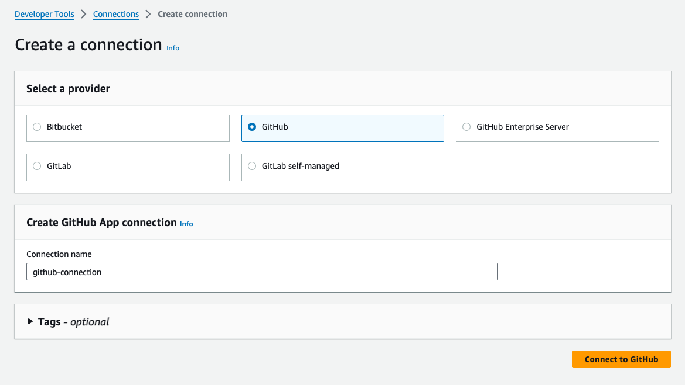
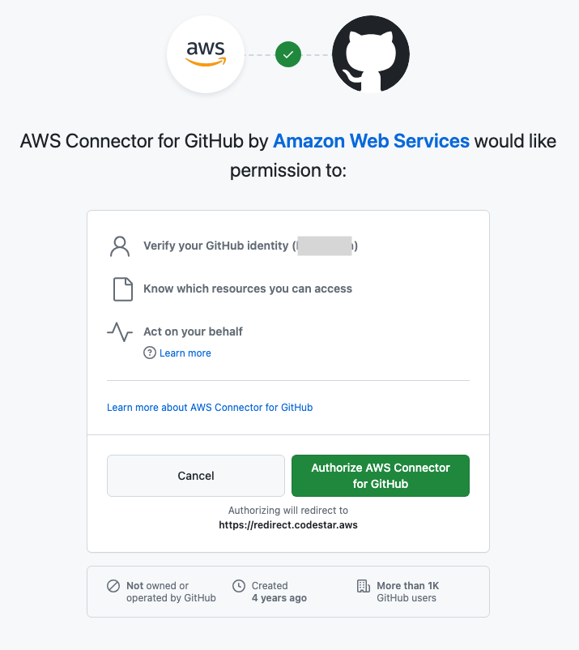
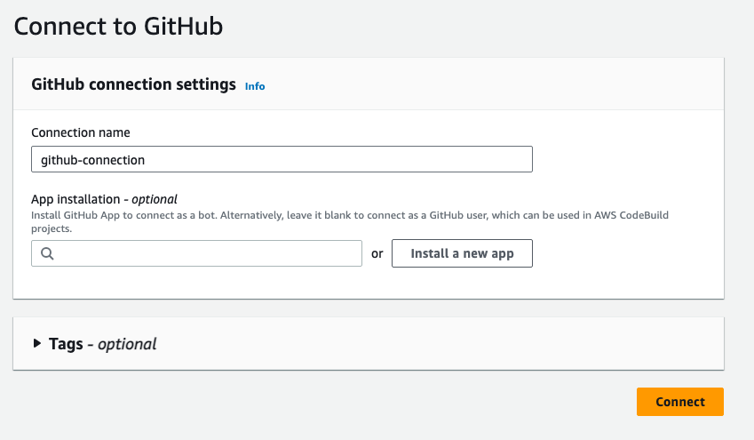
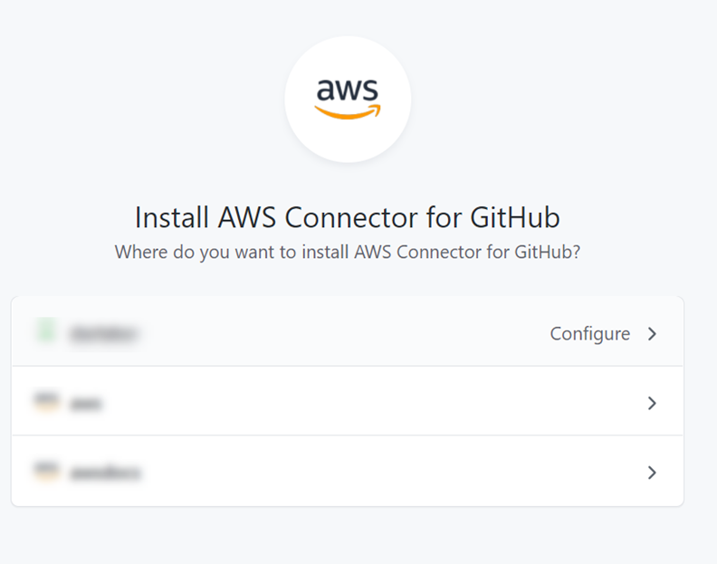
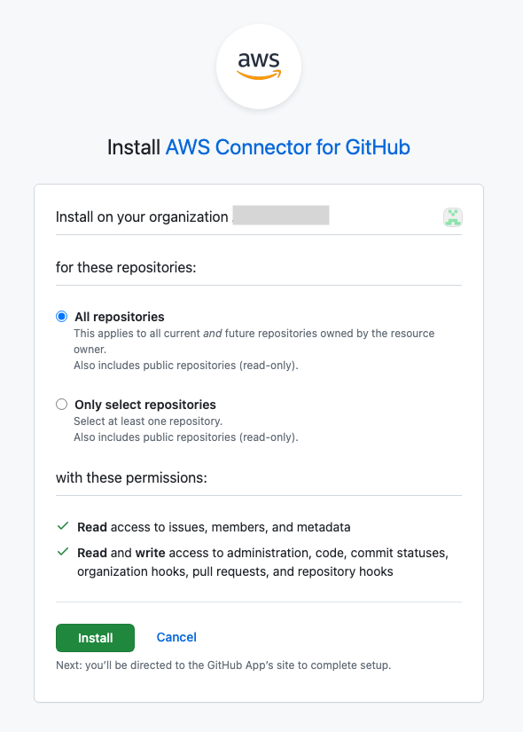
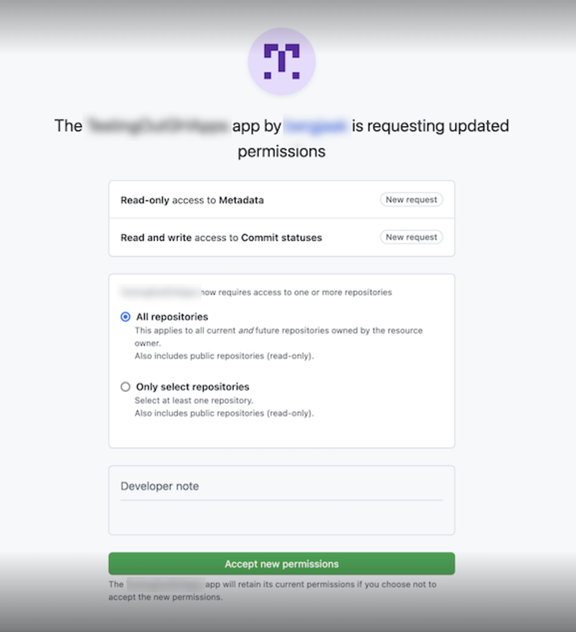
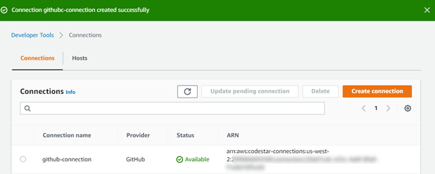

# Create a connection to GitHub

You can use the AWS Management Console or the AWS Command Line Interface (AWS CLI) to create a connection to
GitHub.

Before you begin:

- You must have already created an account with GitHub.
- You must have already created your third-party code repository.

###### Note

To create the connection, you must be the GitHub organization owner. For repositories
that are not under an organization, you must be the repository owner.

###### Topics

- [Create a connection to GitHub
  (console)](#connections-create-github-console "#connections-create-github-console")
- [Create a connection to GitHub
  (CLI)](#connections-create-github-cli "#connections-create-github-cli")

## Create a connection to GitHub

(console)

You can use the console to create a connection to GitHub.

###### Note

Beginning July 1, 2024, the console creates connections with `codeconnections` in the resource ARN. Resources with both service prefixes will continue to display in the console.

1. Sign in to the AWS Management Console, and open the Developer Tools console at [https://console.aws.amazon.com/codesuite/settings/connections](https://console.aws.amazon.com/codesuite/settings/connections "https://console.aws.amazon.com/codesuite/settings/connections").
2. Choose **Settings > Connections**, and then choose **Create connection**.
3. To create a connection to a GitHub or GitHub Enterprise Cloud repository,
   under **Select a provider**, choose
   **GitHub**. In **Connection name**, enter the
   name for the connection that you want to create. Choose **Connect to
   GitHub**, and proceed to Step 2.



###### To create a connection to GitHub

1. Under **GitHub connection settings**, your connection name
   appears in **Connection name**. Choose **Connect to
   GitHub**. The access request page appears.

 2. Choose **Authorize AWS Connector for GitHub**. The
connection page displays and shows the **GitHub Apps**
field.

 3. Under **GitHub Apps**, choose an app installation or choose
**Install a new app** to create one.

###### Note

You install one app for all of your connections to a particular provider.
If you have already installed the AWS Connector for GitHub app, choose it
and skip this step. 4. On the Install **AWS Connector for GitHub** page, choose
the account where you want to install the app.



###### Note

You only install the app once for each GitHub account. If you previously
installed the app, you can choose **Configure** to proceed
to a modification page for your app installation, or you can use the back
button to return to the console. 5. On the **Install AWS Connector for GitHub** page, leave the
defaults, and choose **Install**.



After this step, an updated permissions page might display in GitHub. 6. If a page displays showing that there are updated permissions for the AWS
Connector for GitHub app, choose **Accept new
permissions**.

 7. You are returned to the **Connect to GitHub** page. The
connection ID for your new installation appears in **GitHub
Apps**. Choose **Connect**.

### View your created

connection

- The created connection displays in the connections list.



## Create a connection to GitHub

(CLI)

You can use the AWS Command Line Interface (AWS CLI) to create a connection to GitHub.

To do this, use the **create-connection** command.

###### Important

A connection created through the AWS CLI or AWS CloudFormation is in `PENDING`
status by default. After you create a connection with the CLI or CloudFormation, use the
console to edit the connection to make its status `AVAILABLE`.

###### To create a connection to GitHub

1. Open a terminal (Linux, macOS, or Unix) or command prompt (Windows). Use the AWS CLI to run
   the **create-connection** command, specifying the
   `--provider-type` and `--connection-name` for your
   connection. In this example, the third-party provider name is
   `GitHub` and the specified connection name is
   `MyConnection`.

```
aws codeconnections create-connection --provider-type GitHub --connection-name MyConnection
```

If successful, this command returns the connection ARN information similar to
the following.

```
{
    "ConnectionArn": "arn:aws:codeconnections:us-west-2:`account_id`:connection/aEXAMPLE-8aad-4d5d-8878-dfcab0bc441f"
}
```

2. Use the console to complete the connection. For more information, see [Update a pending connection](connections-update.md "connections-update.md").
