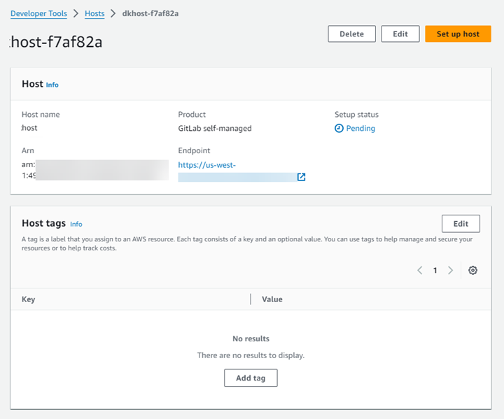
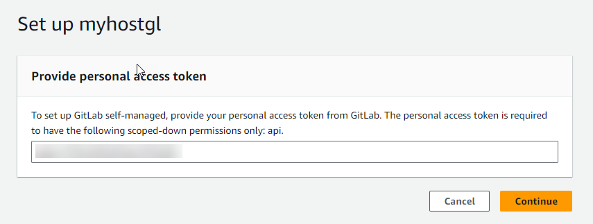
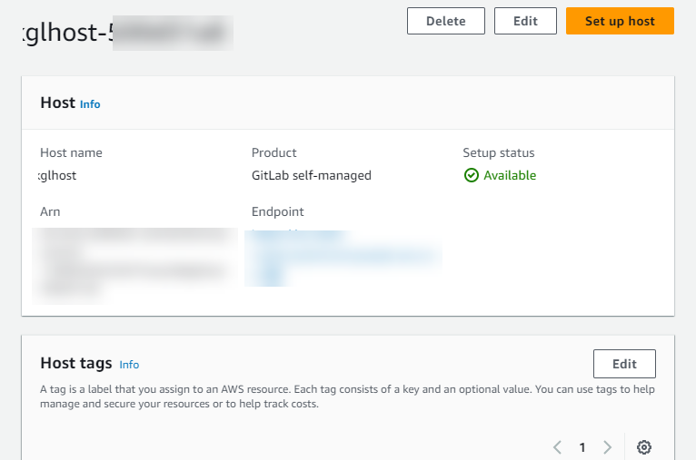
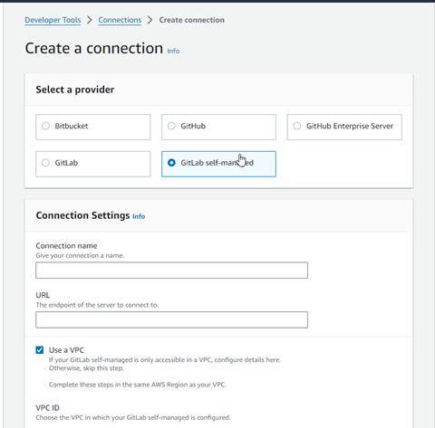

# Create a connection to GitLab

self-managed

You can create connections for GitLab Enterprise Edition or GitLab Community Edition with
a self-managed installation.

You can use the AWS Management Console or the AWS Command Line Interface (AWS CLI) to create a connection and host for
GitLab self-managed.

###### Note

By authorizing this connection application in GitLab self-managed, you grant our
service permissions to process your data, and you can revoke the permissions at any time
by uninstalling the application.

Before you create a connection to GitLab self-managed, you must create a host to use for
the connection, as detailed in these steps. For an overview of the host creation workflow
for installed providers, see [Workflow to create or update a host](welcome-hosts-workflow.md "welcome-hosts-workflow.md").

You can optionally configure your host with a VPC. For more information about network and
VPC configuration for your host resource, see the VPC prerequisites in [(Optional) Prerequisites: Network or
Amazon VPC configuration for your connection](connections-host-create.md#connections-create-host-prereq "connections-host-create.md#connections-create-host-prereq") and [Troubleshooting VPC configuration for
your host](troubleshooting-connections.md#troubleshooting-connections-host-vpc "troubleshooting-connections.md#troubleshooting-connections-host-vpc").

Before you begin:

- You must have already created an account with GitLab and have GitLab Enterprise
  Edition or GitLab Community Edition with a self-managed installation. For more
  information, see [https://docs.gitlab.com/ee/subscriptions/self_managed/](https://docs.gitlab.com/ee/subscriptions/self_managed/ "https://docs.gitlab.com/ee/subscriptions/self_managed/").

###### Note

Connections only provide access for the account that was used to create and
authorize the connection.

###### Note

You can create connections to a repository where you have the **Owner** role in GitLab, and then the connection can be
used with with resources such as CodePipeline. For repositories in groups, you do not
need to be the group owner.

- You must have already created a GitLab personal access token (PAT) with the
  following scoped-down permission only:
  `api`,
  `admin_mode`. For more information, see [https://docs.gitlab.com/ee/user/profile/personal_access_tokens.html](https://docs.gitlab.com/ee/user/profile/personal_access_tokens.html "https://docs.gitlab.com/ee/user/profile/personal_access_tokens.html").
  You must be an administrator to create and use the PAT.

###### Note

Your PAT is used to authorize the host and is not otherwise stored or used by
connections. To set up a host, you can create a temporary PAT and then after you
set up the host, you can delete the PAT.

###### Note

For organizations in GitHub Enterprise Server or GitLab self-managed, you don’t pass
an available host. You create a new host for each connection in your organization, and
you must be sure to enter the same information in the network fields (VPC ID, Subnet
IDs, and Security Group IDs) for the host. For more information, see [Connection and host setup for installed providers supporting organizations](troubleshooting-connections.md#troubleshooting-organization-host "troubleshooting-connections.md#troubleshooting-organization-host").

###### Topics

- [Create a connection to
  GitLab self-managed (console)](#connections-create-gitlab-managed-console "#connections-create-gitlab-managed-console")
- [Create a connection to GitLab
  self-managed (CLI)](#connections-create-gitlab-managed-cli "#connections-create-gitlab-managed-cli")

## Create a connection to

GitLab self-managed (console)

Use these steps to create a host and a connection to GitLab self-managed in the
console. For considerations for setting up a host in a VPC, see [(Optional) Prerequisites: Network or
Amazon VPC configuration for your connection](connections-host-create.md#connections-create-host-prereq "connections-host-create.md#connections-create-host-prereq").

###### Note

Beginning July 1, 2024, the console creates connections with `codeconnections` in the resource ARN. Resources with both service prefixes will continue to display in the console.

###### Note

You create a host for a single GitLab self-managed installation, and then you can
manage one or more GitLab self-managed connections to that host.

###### Step 1: Create your host

1. Sign in to the AWS Management Console, and then open the AWS Developer Tools console at
   [https://console.aws.amazon.com/codesuite/settings/connections](https://console.aws.amazon.com/codesuite/settings/connections "https://console.aws.amazon.com/codesuite/settings/connections").
2. On the **Hosts** tab, choose **Create
   host**.
3. In **Host name**, enter the name you want to use for your
   host.
4. In **Select a provider**, choose **GitLab
   self-managed**.
5. In **URL**, enter the endpoint for the infrastructure where
   your provider is installed.
6. If your server is configured within an Amazon VPC and you want to connect with
   your VPC, choose **Use a VPC**. Otherwise, choose **No
   VPC**.
7. (Optional) If you have launched your host into an Amazon VPC and you want to
   connect with your VPC, choose **Use a VPC** and complete the
   following.

###### Note

For organizations in GitHub Enterprise Server or GitLab self-managed, you
don’t pass an available host. You create a new host for each connection in
your organization, and you must be sure to enter the same information in the
network fields (VPC ID, Subnet IDs, and Security Group IDs) for the host.
For more information, see [Connection and host setup for installed providers supporting organizations](troubleshooting-connections.md#troubleshooting-organization-host "troubleshooting-connections.md#troubleshooting-organization-host").

    1. In **VPC ID**, choose your VPC ID. Make sure to
     choose the VPC for the infrastructure where your host is installed or a
     VPC with access to your instance through VPN or Direct Connect.
    2. If you have a private VPC configured, and you have configured your
     host to perform TLS validation using a non-public certificate authority,
     in **TLS certificate**, enter your certificate ID. The
     TLS Certificate value is the public key of the certificate.

8. Choose **Create host**.
9. After the host details page displays, the host status changes as the host is
   created.

###### Note

If your host setup includes a VPC configuration, allow several minutes for
provisioning of host network components.

Wait for your host to reach a **Pending** status, and then
complete the setup. For more information, see [Set up a pending host](connections-host-setup.md "connections-host-setup.md").



###### Step 2: Set up your pending host

1. Choose **Set up host**.
2. A **Set up `host_name`**
   page displays. In **Provide personal access token**, provide
   your GitLab PAT with the following scoped-down
   permissions
   only:
   `api`
   and `admin_mode`.

###### Note

Only an administrator can create and use the PAT.

 3. After your host is successfully registered, the host details page appears and
shows that the host status is **Available**.



###### Step 3: Create your connection

1. Sign in to the AWS Management Console, and then open the AWS Developer Tools console at
   [https://console.aws.amazon.com/codesuite/settings/connections](https://console.aws.amazon.com/codesuite/settings/connections "https://console.aws.amazon.com/codesuite/settings/connections").
2. Choose **Settings**, and then choose **Connections**. Choose **Create
   connection**.
3. To create a connection to a GitLab repository, under **Select a
   provider**, choose **GitLab self-managed**. In
   **Connection name**, enter the name for the connection that
   you want to create.

 4. In **URL**, enter the endpoint for your server. 5. If you have launched your server into an Amazon VPC and you want to connect
with your VPC, choose **Use a VPC** and complete the
following.

    1. In **VPC ID**, choose your VPC ID. Make sure to
     choose the VPC for the infrastructure where your host is installed or a
     VPC with access to your host through VPN or Direct Connect.
    2. Under **Subnet ID**, choose **Add**.
     In the field, choose the subnet ID you want to use for your host. You
     can choose up to 10 subnets.


    Make sure to choose the subnet for the infrastructure where your host
     is installed or a subnet with access to your installed host through VPN
     or Direct Connect.
    3. Under **Security group IDs**, choose
     **Add**. In the field, choose the security group
     you want to use for your host. You can choose up to 10 security
     groups.


    Make sure to choose the security group for the infrastructure where
     your host is installed or a security group with access to your installed
     host through VPN or Direct Connect.
    4. If you have a private VPC configured, and you have configured your
     host to perform TLS validation using a non-public certificate authority,
     in **TLS certificate**, enter your certificate ID. The
     TLS Certificate value should be the public key of the
     certificate.

6. Choose **Connect to GitLab self-managed**. The created
   connection is shown with a **Pending** status. A host resource
   is created for the connection with the server information you provided. For the
   host name, the URL is used.
7. Choose **Update pending connection.**
8. When the sign-in page for GitLab displays, log in with your credentials and
   then choose **Sign in**.
9. An authorization page displays with a message requesting authorization for the
   connection to access your GitLab account.

Choose **Authorize**. 10. The browser returns to the connections console page. Under **Create
GitLab connection**, the new connection is shown in
**Connection name**. 11. Choose **Connect to GitLab self-managed**.

After the connection is created successfully, a success banner displays. The
connection details are shown on the **Connection settings**
page.

## Create a connection to GitLab

self-managed (CLI)

You can use the AWS Command Line Interface (AWS CLI) to create a host and connection for GitLab
self-managed.

To do this, use the **create-host** and the
**create-connection** commands.

###### Important

A connection created through the AWS CLI or AWS CloudFormation is in `PENDING`
status by default. After you create a connection with the CLI or AWS CloudFormation, use the
console to edit the connection to make its status `AVAILABLE`.

###### Step 1: To create a host for GitLab self-managed (CLI)

1. Open a terminal (Linux, macOS, or Unix) or command prompt (Windows). Use the AWS CLI to run
   the **create-host** command, specifying the `--name`,
   `--provider-type`, and `--provider-endpoint` for your
   connection. In this example, the third-party provider name is
   `GitLabSelfManaged` and the endpoint is
   `my-instance.dev`.

```
aws codeconnections create-host --name MyHost --provider-type GitLabSelfManaged --provider-endpoint "https://my-instance.dev"
```

If successful, this command returns the host Amazon Resource Name (ARN)
information similar to the following.

```
{
    "HostArn": "arn:aws:codeconnections:us-west-2:`account_id`:host/My-Host-28aef605"
}
```

After this step, the host is in `PENDING` status. 2. Use the console to complete the host setup and move the host to an
`Available` status in the following step.

###### Step 2: To set up a pending host in the console

1. Sign in to the AWS Management Console and open the Developer Tools console at [https://console.aws.amazon.com/codesuite/settings/connections](https://console.aws.amazon.com/codesuite/settings/connections "https://console.aws.amazon.com/codesuite/settings/connections").
2. Use the console to complete the host setup and move the host to an
   `Available` status. See [Set up a pending host](connections-host-setup.md "connections-host-setup.md").

###### Step 3: To create a connection for GitLab self-managed (CLI)

1. Open a terminal (Linux, macOS, or Unix) or command prompt (Windows). Use the AWS CLI to run
   the **create-connection** command, specifying the
   `--host-arn` and `--connection-name` for your
   connection.

```
aws codeconnections create-connection --host-arn arn:aws:codeconnections:us-west-2:`account_id`:host/MyHost-234EXAMPLE --connection-name MyConnection
```

If successful, this command returns the connection ARN information similar to
the following.

```
{
    "ConnectionArn": "arn:aws:codeconnections:us-west-2:`account_id`:connection/aEXAMPLE-8aad"
}
```

2. Use the console to set up the pending connection in the following step.

###### Step 4: To complete a connection for GitLab self-managed in the console

1. Sign in to the AWS Management Console and open the Developer Tools console at [https://console.aws.amazon.com/codesuite/settings/connections](https://console.aws.amazon.com/codesuite/settings/connections "https://console.aws.amazon.com/codesuite/settings/connections").
2. Use the console to set up the pending connection and move the connection to an
   `Available` status. For more information, see [Update a pending connection](connections-update.md "connections-update.md").
