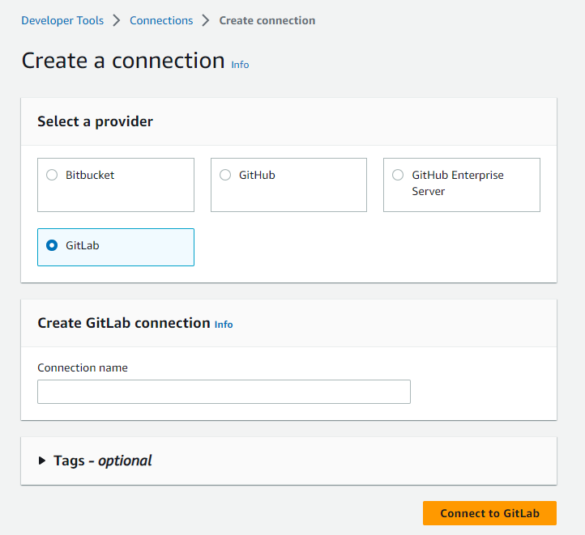
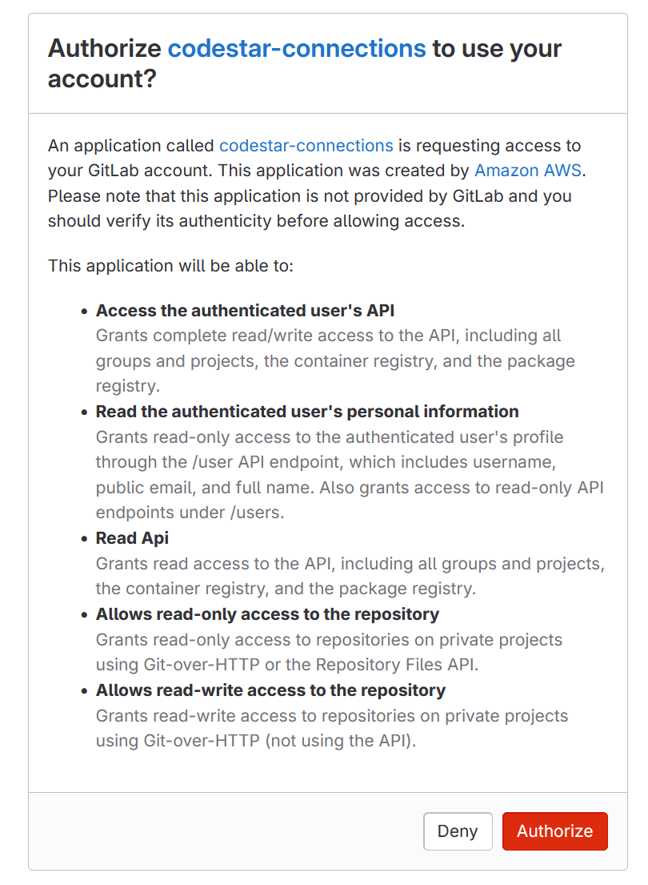

# Create a connection to GitLab

You can use the AWS Management Console or the AWS Command Line Interface (AWS CLI) to create a connection to a repository
hosted on gitlab.com.

###### Note

By authorizing this connection installation in GitLab, you grant our service
permissions to process your
data,
and you can revoke the permissions at any time by uninstalling the application.

Before you begin:

- You must have already created an account with GitLab.

###### Note

Connections only provide access
for
the account that was used to create and authorize the connection.

###### Note

You can create connections where you have the **Owner** role in GitLab, and then the connection can be used with
the repository with resources such as CodePipeline. For repositories in groups, you do
not need to be the group owner.

###### Topics

- [Create a connection to GitLab
  (console)](#connections-create-gitlab-console "#connections-create-gitlab-console")
- [Create a connection to GitLab
  (CLI)](#connections-create-gitlab-cli "#connections-create-gitlab-cli")

## Create a connection to GitLab

(console)

You can use the console to create a connection.

###### Note

Beginning July 1, 2024, the console creates connections with `codeconnections` in the resource ARN. Resources with both service prefixes will continue to display in the console.

###### Step 1: Create your connection

1. Sign in to the AWS Management Console, and then open the AWS Developer Tools console at
   [https://console.aws.amazon.com/codesuite/settings/connections](https://console.aws.amazon.com/codesuite/settings/connections "https://console.aws.amazon.com/codesuite/settings/connections").
2. Choose **Settings**, and then choose **Connections**. Choose **Create
   connection**.
3. To create a connection to a GitLab repository, under **Select a
   provider**, choose **GitLab**. In
   **Connection name**, enter the name for the connection that
   you want to create. Choose **Connect to GitLab**.

 4. When the sign-in page for GitLab displays, log in with your credentials and
then choose **Sign in**. 5. An authorization page displays with a message requesting authorization for the
connection to access your GitLab account.

Choose **Authorize**.

 6. The browser returns to the connections console page. Under **Create
GitLab connection**, the new connection is shown in
**Connection name**. 7. Choose **Connect to GitLab**.

After the connection is created successfully, a success banner displays. The
connection details are shown on the **Connection settings**
page.

## Create a connection to GitLab

(CLI)

You can use the AWS Command Line Interface (AWS CLI) to create a connection.

To do this, use the **create-connection** command.

###### Important

A connection created through the AWS CLI or AWS CloudFormation is in `PENDING`
status by default. After you create a connection with the CLI or CloudFormation, use the
console to edit the connection to make its status `AVAILABLE`.

###### To create a connection to GitLab

1. Open a terminal (Linux, macOS, or Unix) or command prompt (Windows). Use the AWS CLI to run
   the **create-connection** command, specifying the
   `--provider-type` and `--connection-name` for your
   connection. In this example, the third-party provider name is
   `GitLab` and the specified connection name is
   `MyConnection`.

```
aws codeconnections create-connection --provider-type GitLab --connection-name MyConnection
```

If successful, this command returns the connection ARN information similar to
the following.

```
{
    "ConnectionArn": "arn:aws:codeconnections:us-west-2:`account_id`:connection/aEXAMPLE-8aad-4d5d-8878-dfcab0bc441f"
}
```

2. Use the console to complete the connection. For more information, see [Update a pending connection](connections-update.md "connections-update.md").
