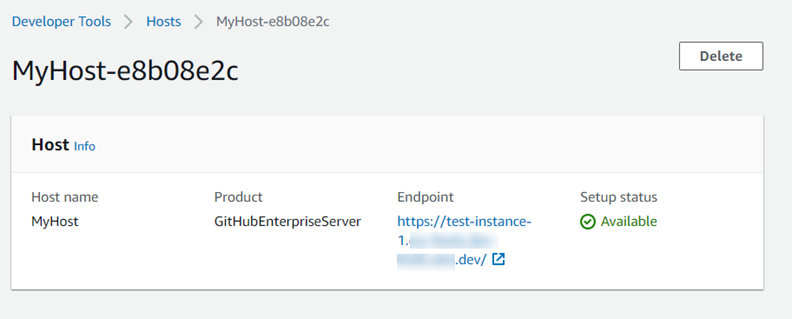

# View host details

You can use the Developer Tools console or the **get-host** command in the AWS Command Line Interface
(AWS CLI) to view details for a host.

###### To

view host details (console)

1.  Sign in to the AWS Management Console
    and
    open the Developer Tools console at [https://console.aws.amazon.com/codesuite/settings/connections](https://console.aws.amazon.com/codesuite/settings/connections "https://console.aws.amazon.com/codesuite/settings/connections").
2.  Choose **Settings > Connections**, and then choose the
    **Hosts** tab.
3.  Choose the button next to the host you want to view, and then choose
    **View details**.
4.  The following information appears for your host:
    - The host name.
    - The provider type for your connection.
    - The endpoint of the infrastructure where your provider is
      installed.
    - The setup status for your host. A host ready for a connection is in
      **Available** status. If your host was created but
      setup was not completed, the host might be in a different status.

    The following statuses are available:

        + PENDING - The host has completed creation and is ready to start
         the setup by registering the provider app on the host.
        + AVAILABLE - The host has completed creation and setup and is
         available for use with connections.
        + ERROR - There was an error during host creation or
         registration.
        + VPC\_CONFIG\_VPC\_INITIALIZING - The VPC configuration for the host
         is being created.
        + VPC\_CONFIG\_VPC\_FAILED\_INITIALIZATION - The VPC configuration for
         the host encountered and error and failed.
        + VPC\_CONFIG\_VPC\_AVAILABLE - The VPC configuration for the host has
         completed setup and is available.
        + VPC\_CONFIG\_VPC\_DELETING - The VPC configuration for the host is
         being deleted.

 5. To delete the host, choose **Delete**. 6. If the host is in **Pending** status, to complete the setup,
choose **Set up host**. For more information , see [Set up a pending host](connections-host-setup.md "connections-host-setup.md").

###### To view host details (CLI)

- Open a terminal (Linux, macOS, or Unix) or command prompt (Windows), and use the AWS CLI to run
  the **get-host** command, specifying the Amazon Resource Name (ARN)
  of the host that you want to view details for.

```
aws codeconnections get-host --host-arn arn:aws:codeconnections:us-west-2:`account_id`:host/My-Host-28aef605
```

This command returns the following output.

```
{
    "Name": "MyHost",
    "Status": "AVAILABLE",
    "ProviderType": "GitHubEnterpriseServer",
    "ProviderEndpoint": "https://test-instance-1.dev/"
}
```
