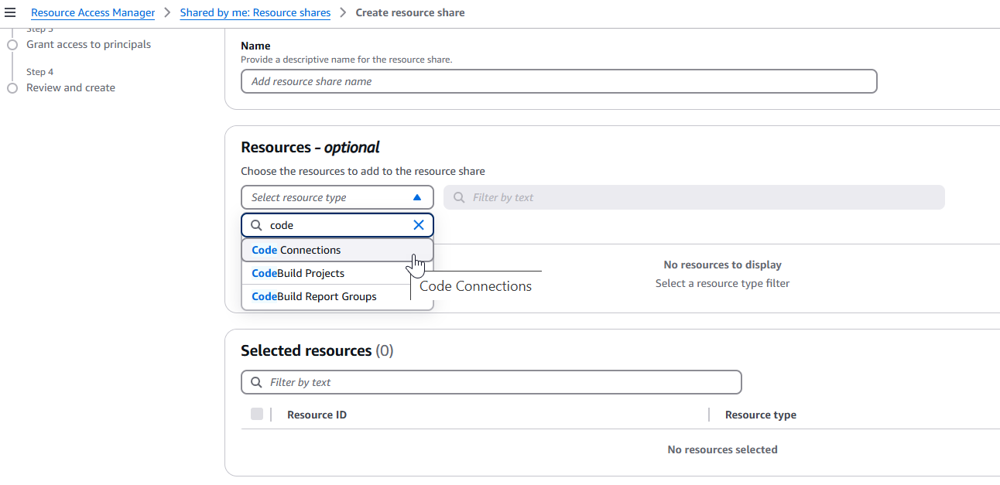

# Share connections with AWS accounts

You can use resource sharing with AWS RAM to share an existing connection with another
AWS account or with accounts in your organization. You can use your shared connection with
resources in AWS that you manage for third-party source connections, such as in
CodePipeline.

###### Important

Connection sharing is not supported for `codestar-connections` resources.
This is only supported for `codeconnections` resources.

Before you begin:

- You must have already created a connection with your AWS account.
- You must have resource sharing enabled.
- You must have the required permissions configured. For more information, see [Supported permissions
  for connection sharing](security-iam.md#permissions-reference-connections-sharing "security-iam.md#permissions-reference-connections-sharing").

###### Note

To share the connection, you must be the organization owner or the repository owner if
not under an organization. The account that you are sharing with will also need
permissions to the repository.

###### Topics

- [Share a connection (console)](#connections-share-console "#connections-share-console")
- [Share a connection (CLI)](#connections-share-cli "#connections-share-cli")
- [View shared connections (console)](#connections-view-console "#connections-view-console")
- [View shared connections (CLI)](#connections-view-cli "#connections-view-cli")

## Share a connection (console)

You can use the console to
create
shared connection resources.

1. Sign in to the AWS Management Console.

Choose **Create
resource
share** on the **[Shared by
me : Shared resources](https://console.aws.amazon.com/ram/home#OwnedResources: "https://console.aws.amazon.com/ram/home#OwnedResources:")** page in the AWS RAM
console. 2. Because AWS RAM resource shares exist in specific AWS Regions, choose the
appropriate AWS Region from the dropdown list in the upper-right corner of the
console. To create resource shares that contain global resources, you must set
the AWS Region to US East (N. Virginia),

For more information about sharing global resources, see [Sharing Regional resources compared to global resources](../../../ram/latest/userguide/working-with-regional-vs-global.md "../../../ram/latest/userguide/working-with-regional-vs-global.md"). 3. On the creation page, in **Name**, enter a name for your
resource share. Under **Resources**, choose **Code
Connections**.

 4. Choose
your connection resource and assign the principals with whom you want to
share. 5. Choose **Create**.

## Share a connection (CLI)

You can use the AWS Command Line Interface (AWS CLI) to share an existing connection with other accounts
and view connections that you own or have had shared with you.

To do this, use the **create-resource-share** and
`accept-resource-share-invitation` commands for AWS RAM.

###### To share a connection

1. Sign in with the account that will share the connection.
2. Open a terminal (Linux, macOS, or Unix) or command prompt (Windows). Use the AWS CLI to run
   the **create-resource-share** command, specifying the
   `--name`, `--resource-arns`, and
   `--principals` for your connection share. In this example, the
   name is `my-shared-resource` and the specified connection name is
   `MyConnection` in the resource ARN. In `principals`,
   provide the destination account or accounts that you are sharing with.

```
aws ram create-resource-share --name my-shared-resource --resource-arns `connection_ARN` --principals `destination_account`
```

If successful, this command returns the connection ARN information similar to
the following.

```
{
    "resourceShare": {
        "resourceShareArn": "arn:aws:ram:us-west-2:111111111111:resource-share/4476c27d-8feb-4b21-afe9-7de23EXAMPLE",
        "name": "MyNewResourceShare",
        "owningAccountId": "111111111111",
        "allowExternalPrincipals": true,
        "status": "ACTIVE",
        "creationTime": 1634586271.302,
        "lastUpdatedTime": 1634586271.302
    }
}
```

3. Requests to share can be accepted as detailed in the next procedure.

###### To authenticate and accept the connection share with the destination

account

The following procedure is optional for destination accounts that belong to the
same organization and have resource sharing enabled in Organizations.

1. Sign in with the destination account that will receive the invitation.
2. Open a terminal (Linux, macOS, or Unix) or command prompt (Windows). Use the AWS CLI to run
   the **get-resource-share-invitations** command.

```
aws ram get-resource-share-invitations
```

Capture the resource share invitation ARN for the next step. 3. Run the **accept-resource-share-invitation** command,
specifying the `--resource-share-invitation-arn`.

```
aws ram accept-resource-share-invitation --resource-share-invitation-arn `invitation_ARN`
```

If successful, this command returns the following output.

```
{
    "resourceShareInvitation": {
        "resourceShareInvitationArn": "arn:aws:ram:us-west-2:111111111111:resource-share-invitation/1e3477be-4a95-46b4-bbe0-c4001EXAMPLE",
        "resourceShareName": "MyResourceShare",
        "resourceShareArn": "arn:aws:ram:us-west-2:111111111111:resource-share/27d09b4b-5e12-41d1-a4f2-19dedEXAMPLE",
        "senderAccountId": "111111111111",
        "receiverAccountId": "222222222222",
        "invitationTimestamp": "2021-09-22T15:07:35.620000-07:00",
        "status": "ACCEPTED"
    }
}
```

## View shared connections (console)

You can use the console to view shared connection resources.

1. Sign in to the AWS Management Console.

Open the **[Shared by
me : Shared resources](https://console.aws.amazon.com/ram/home#OwnedResources: "https://console.aws.amazon.com/ram/home#OwnedResources:")** page in the AWS RAM
console. 2. Because AWS RAM resource shares exist in specific AWS Regions, choose the
appropriate AWS Region from the dropdown list in the upper-right corner of the
console. To see resource shares that contain global resources, you must set the
AWS Region to US East (N. Virginia),

For more information about sharing global resources, see [Sharing Regional resources compared to global resources](../../../ram/latest/userguide/working-with-regional-vs-global.md "../../../ram/latest/userguide/working-with-regional-vs-global.md"). 3. For each shared resource, the following information is available:

    * **Resource ID** – The ID of the resource.
     Choose the ID of a resource to open a new browser tab to view the
     resource in its native service console.
    * **Resource type** – The type of
     resource.
    * **Last share date** – The date on which
     the resource was last shared.
    * **Resource shares** – The number of
     resource shares that include the resource. To see the list of the
     resource shares, choose the number.
    * **Principals** – The number of principals
     who can access the resource. Choose the value to view the
     principals.

## View shared connections (CLI)

You can use the AWS CLI to view connections that you own or have had shared with
you.

To do this, use the **get-resource-shares** command.

###### To view shared connections

- Open a terminal (Linux, macOS, or Unix) or command prompt (Windows). Use the AWS CLI to run
  the **get-resource-shares** command.

```
aws ram get-resource-shares
```

The output returns a list of resource shares for your account.
