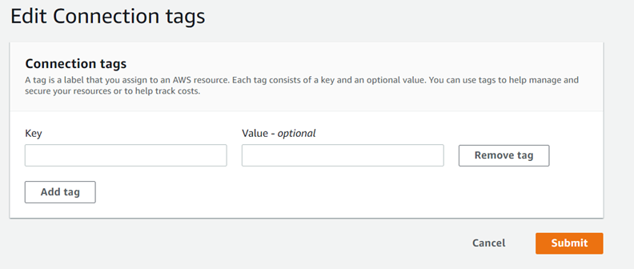
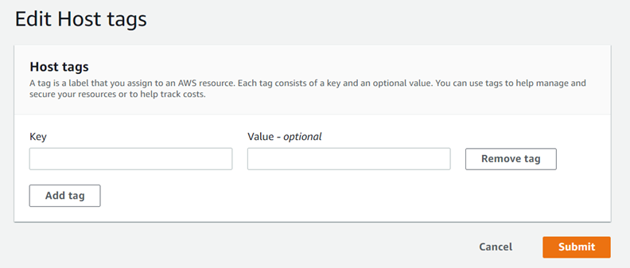

# Tag connections resources

A _tag_ is a custom attribute label that you or AWS assigns to an
AWS resource. Each AWS tag has two parts:

- A _tag key_ (for example, `CostCenter`,
  `Environment`,
  or
  `Project`).
  Tag keys are case sensitive.
- An optional field known as a _tag value_ (for example,
  `111122223333`, `Production`, or a team name).
  Omitting the tag value is the same as using an empty string. Like tag keys, tag
  values are case sensitive.
  Together these are known as _key-value pairs_.

You can use the console or the CLI to tag resources.

You can tag the following resource types
in AWS
CodeConnections:

- Connections
- Hosts
  These steps assume that you have already installed a recent version of the AWS CLI or
  updated to the current version. For more information, see [Installing the AWS CLI](../../../cli/latest/userguide/installing.md "../../../cli/latest/userguide/installing.md") in the
  _AWS Command Line Interface User Guide_.

In
addition to identifying, organizing, and tracking your resource with tags, you can use tags
in AWS Identity and Access Management (IAM) policies to help control who can view and interact with your
resource.
For examples of tag-based access policies, see [Using tags to control access to
AWS CodeConnections resources](connections-tag-based-access-control.md "connections-tag-based-access-control.md").

###### Topics

- [Tag resources (console)](#connections-tag-console "#connections-tag-console")
- [Tag resources (CLI)](#connections-tag-cli "#connections-tag-cli")

## Tag resources (console)

You can use the console to add, update, or remove tags on a connections
resource.

###### Topics

- [Add tags to a connections resource
  (console)](#connections-tag-console-add "#connections-tag-console-add")
- [View tags for a connections resource
  (console)](#connections-tag-console-view "#connections-tag-console-view")
- [Edit tags for a connections resource
  (console)](#connections-tag-console-edit "#connections-tag-console-edit")
- [Remove tags from a connections
  resource (console)](#connections-tag-console-remove "#connections-tag-console-remove")

### Add tags to a connections resource

(console)

You can use the console to add tags to an existing connection or host.

###### Note

When you create a connection for an installed provider such as GitHub
Enterprise Server, and a host resource is also created for you, the tags during
creation are added to the connection only. This allows you to tag a host
separately if you want to reuse it for a new connection. If you want to add tags
to the host, use the steps here.

###### **To add tags for a connection**

1. Sign in to the console. From the navigation pane, choose
   **Settings**.
2. Under **Settings**, choose
   **Connections**. Choose the
   **Connections** tab.
3. Choose the connection you want to edit. The connection settings page
   displays.
4. Under **Connection tags**, choose
   **Edit**. The **Edit Connection tags**
   page displays.
5. In the **Key** and **Value** fields,
   enter a key pair for each set of tags you want to add. (The
   **Value** field is optional.) For example, in
   **Key**, enter `Project`. In
   **Value**, enter
   `ProjectA`.

 6. (Optional) Choose **Add tag** to add more rows and enter
more tags. 7. Choose **Submit**. The tags are listed under connection
settings.

###### **To add tags for a host**

1. Sign in to the console. From the navigation pane, choose
   **Settings**.
2. Under **Settings**, choose
   **Connections**. Choose the **Hosts**
   tab.
3. Choose the host you want to edit. The host settings page displays.
4. Under **Host tags**, choose **Edit**.
   The **Host tags** page displays.
5. In the **Key** and **Value** fields,
   enter a key pair for each set of tags you want to add. (The
   **Value** field is optional.) For example, in
   **Key**, enter `Project`. In
   **Value**, enter
   `ProjectA`.

 6. (Optional) Choose **Add tag** to add more rows and enter
more tags for a host. 7. Choose **Submit**. The tags are listed under host
settings.

### View tags for a connections resource

(console)

You can use the console to view the tags for existing resources.

**To view tags for a connection**

1. Sign in to the console. From the navigation pane, choose
   **Settings**.
2. Under **Settings**, choose
   **Connections**. Choose the
   **Connections** tab.
3. Choose the connection you want to view. The connection settings page
   displays.
4. Under **Connection tags**, view the tags for the
   connection under the **Key** and **Value**
   columns.

**To view tags for a host**

1. Sign in to the console. From the navigation pane, choose
   **Settings**.
2. Under **Settings**, choose
   **Connections**. Choose the **Hosts**
   tab.
3. Choose the host you want to view.
4. Under **Host tags**, view the tags for the host under the
   **Key** and **Value** columns.

### Edit tags for a connections resource

(console)

You can use the console to edit tags that have been added to connections
resources.

**To edit tags for a connection**

1. Sign in to the console. From the navigation pane, choose
   **Settings**.
2. Under **Settings**, choose
   **Connections**. Choose the
   **Connections** tab.
3. Choose the connection you want to edit. The connection settings page
   displays.
4. Under **Connection tags**, choose
   **Edit**. The **Connection tags** page
   displays.
5. In the **Key** and **Value** fields,
   update the values in each field as needed. For example, for the
   `Project` key, in **Value**,
   change `ProjectA` to
   `ProjectB`.
6. Choose **Submit**.

**To edit tags for a host**

1. Sign in to the console. From the navigation pane, choose
   **Settings**.
2. Under **Settings**, choose
   **Connections**. Choose the **Hosts**
   tab.
3. Choose the host you want to edit. The host settings page displays.
4. Under **Host tags**, choose **Edit**.
   The **Host tags** page displays.
5. In the **Key** and **Value** fields,
   update the values in each field as needed. For example, for the
   `Project` key, in **Value**,
   change `ProjectA` to
   `ProjectB`.
6. Choose **Submit**.

### Remove tags from a connections

resource (console)

You can use the console to remove tags from connections resources. When you remove
tags from the associated resource, the tags are deleted.

**To remove tags for a connection**

1. Sign in to the console. From the navigation pane, choose
   **Settings**.
2. Under **Settings**, choose
   **Connections**. Choose the
   **Connections** tab.
3. Choose the connection you want to edit. The connection settings page
   displays.
4. Under **Connection tags**, choose
   **Edit**. The **Connection tags** page
   displays.
5. Next to the key and value for each tag you want to delete, choose
   **Remove tag**.
6. Choose **Submit**.

**To remove tags for a host**

1. Sign in to the console. From the navigation pane, choose
   **Settings**.
2. Under **Settings**, choose
   **Connections**. Choose the **Hosts**
   tab.
3. Choose the host you want to edit. The host settings page displays.
4. Under **Host tags**, choose **Edit**.
   The **Host tags** page displays.
5. Next to the key and value for each tag you want to delete, choose
   **Remove tag**.
6. Choose **Submit**.

## Tag resources (CLI)

You can use the CLI to view, add, update, or remove tags on a connections
resource.

###### Topics

- [Add tags to a connections resource
  (CLI)](#connections-tag-add "#connections-tag-add")
- [View tags for a connections resource
  (CLI)](#connections-tag-view "#connections-tag-view")
- [Edit tags for a connections resource
  (CLI)](#connections-tag-edit "#connections-tag-edit")
- [Remove tags from a connections resource
  (CLI)](#connections-tag-delete "#connections-tag-delete")

### Add tags to a connections resource

(CLI)

You can use the AWS CLI to tag resources in connections.

At the terminal or command line, run the **tag-resource** command,
specifying the Amazon Resource Name (ARN) of the resource where you want to add tags
and the key and value of the tag you want to add. You can add more than one tag.

###### **To add tags for a connection**

1. Get the ARN for your resource. Use the **list-connections**
   command shown in [List connections](connections-list.md "connections-list.md") to get the connection ARN.
2. In a terminal or at the command line, run the
   **tag-resource** command.

For example, use the following command to tag a connection with two tags,
a tag key named `Project` with the tag value of
`ProjectA`, and a tag key named
`ReadOnly` with the tag value of
`true`.

```
aws codestar-connections tag-resource --resource-arn arn:aws:codestar-connections:us-west-2:`account_id`:connection/aEXAMPLE-8aad-4d5d-8878-dfcab0bc441f --tags Key=`Project`,Value=`ProjectA` Key=`IscontainerBased`,Value=`true`
```

If successful, this command returns nothing.

###### **To add tags for a host**

1. Get the ARN for your resource. Use the **list-hosts**
   command shown in [List hosts](connections-host-list.md "connections-host-list.md") to get the host ARN.
2. In a terminal or at the command line, run the
   **tag-resource** command.

For example, use the following command to tag a host with two tags, a tag
key named `Project` with the tag value of
`ProjectA`, and a tag key named
`IscontainerBased` with the tag value of
`true`.

```
aws codestar-connections tag-resource --resource-arn arn:aws:codestar-connections:us-west-2:`account_id`:host/My-Host-28aef605 --tags Key=Project,Value=ProjectA Key=IscontainerBased,Value=true
```

If successful, this command returns nothing.

### View tags for a connections resource

(CLI)

You can use the AWS CLI to view the AWS tags for a connections resource. If no
tags have been added, the returned list is empty. Use the
**list-tags-for-resource** command to view tags that have been
added to a connection or a host.

###### **To view tags for a connection**

1. Get the ARN for your resource. Use the **list-connections**
   command shown in [List connections](connections-list.md "connections-list.md") to get the connection ARN.
2. In a terminal or at the command line, run the
   **list-tags-for-resource** command. For example, use the
   following command to view a list of tag keys and tag values for a
   connection.

```
aws codestar-connections list-tags-for-resource --resource-arn arn:aws:codestar-connections:us-west-2:`account_id`:connection/aEXAMPLE-8aad-4d5d-8878-dfcab0bc441f
```

This command returns the tags associated with the resource. This example
shows two key-value pairs returned for a connection.

```
{
    "Tags": [
        {
            "Key": "Project",
            "Value": "ProjectA"
        },
        {
            "Key": "ReadOnly",
            "Value": "true"
        }
    ]
}
```

###### **To view tags for a host**

1. Get the ARN for your resource. Use the **list-hosts**
   command shown in [List hosts](connections-host-list.md "connections-host-list.md") to get the host ARN.
2. In a terminal or at the command line, run the
   **list-tags-for-resource** command. For example, use the
   following command to view a list of tag keys and tag values for a
   host.

```
aws codestar-connections list-tags-for-resource --resource-arn arn:aws:codestar-connections:us-west-2:`account_id`:host/My-Host-28aef605
```

This command returns the tags associated with the resource. This example
shows two key-value pairs returned for a host.

```
{
    "Tags": [
        {
            "Key": "IscontainerBased",
            "Value": "true"
        },
        {
            "Key": "Project",
            "Value": "ProjectA"
        }
    ]
}
```

### Edit tags for a connections resource

(CLI)

You can use the AWS CLI to edit a tag for a resource. You can change the value for
an existing key or add another key.

At the terminal or command line, run the **tag-resource** command,
specifying the ARN of the resource where you want to update a tag and specify the
tag key and tag value to update.

When you edit tags, any tag keys not specified will be retained, while anything
with the same key but a new value will be updated. New keys that are added with the
edit command are added as a new key-value pair.

###### **To edit tags for a connection**

1. Get the ARN for your resource. Use the **list-connections**
   command shown in [List connections](connections-list.md "connections-list.md") to get the connection ARN.
2. In a terminal or at the command line, run the
   **tag-resource** command.

In this example, the value for the key `Project` is changed to
`ProjectB`.

```
aws codestar-connections tag-resource --resource-arn arn:aws:codestar-connections:us-west-2:`account_id`:connection/aEXAMPLE-8aad-4d5d-8878-dfcab0bc441f --tags Key=Project,Value=ProjectB
```

If successful, this command returns nothing. To verify the tags associated
with the connection, run the **list-tags-for-resource**
command.

###### **To edit tags for a host**

1. Get the ARN for your resource. Use the **list-hosts**
   command shown in [List hosts](connections-host-list.md "connections-host-list.md") to get the host ARN.
2. In a terminal or at the command line, run the
   **tag-resource** command.

In this example, the value for the key `Project` is changed to
`ProjectB`.

```
aws codestar-connections tag-resource --resource-arn arn:aws:codestar-connections:us-west-2:`account_id`:host/My-Host-28aef605 --tags Key=Project,Value=ProjectB
```

If successful, this command returns nothing. To verify the tags associated
with the host, run the **list-tags-for-resource**
command.

### Remove tags from a connections resource

(CLI)

Follow these steps to use the AWS CLI to remove a tag from a resource. When you
remove tags from the associated resource, the tags are deleted.

###### Note

If you delete a connection resource, all tag associations are removed from the
deleted resource. You do not have to remove tags before you delete a connection
resource.

At the terminal or command line, run the **untag-resource**
command, specifying the ARN of the resource where you want to remove tags and the
tag key of the tag you want to remove. For example, to remove multiple tags on a
connection with the tag keys `Project` and
`ReadOnly`, use the following command.

```
aws codestar-connections untag-resource --resource-arn arn:aws:codestar-connections:us-west-2:`account_id`:connection/aEXAMPLE-8aad-4d5d-8878-dfcab0bc441f --tag-keys `Project` `ReadOnly`
```

If successful, this command returns nothing. To verify the tags associated with
the resource, run the **list-tags-for-resource** command. The output
shows that all tags have been removed.

```
{
    "Tags": []
}
```
