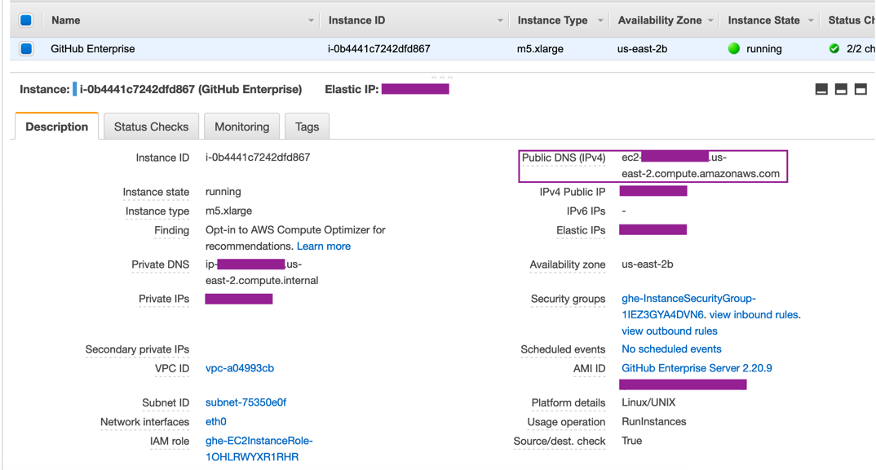
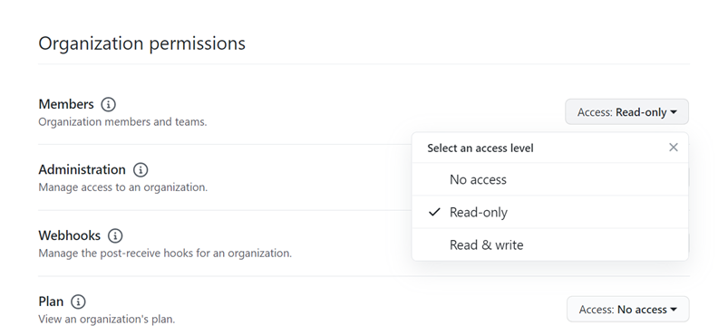

# Troubleshooting connections

The following information might help you troubleshoot common issues with connections to
resources in AWS CodeBuild, AWS CodeDeploy, and AWS CodePipeline.

###### Topics

- [I cannot create
  connections](#troubleshooting-connections-cannot-create "#troubleshooting-connections-cannot-create")
- [I get a permissions
  error when I try to create or complete a connection](#troubleshooting-connections-permissions-error-console "#troubleshooting-connections-permissions-error-console")
- [I get a
  permissions error when I try to use a connection](#troubleshooting-connections-permissions-error-useconnection "#troubleshooting-connections-permissions-error-useconnection")
- [Connection is not in available
  state or is no longer pending](#troubleshooting-connections-error-notpending "#troubleshooting-connections-error-notpending")
- [Add GitClone permissions
  for connections](#troubleshooting-connections-gitclone-permissions "#troubleshooting-connections-gitclone-permissions")
- [Host is not in available
  state](#troubleshooting-connections-host-pending "#troubleshooting-connections-host-pending")
- [Troubleshooting a host with
  connection errors](#troubleshooting-connections-host-errors "#troubleshooting-connections-host-errors")
- [I’m unable to create a
  connection for my host](#troubleshooting-connections-host-cannot-create "#troubleshooting-connections-host-cannot-create")
- [Troubleshooting VPC configuration for
  your host](#troubleshooting-connections-host-vpc "#troubleshooting-connections-host-vpc")
- [Troubleshooting webhook VPC
  endpoints (PrivateLink) for GitHub Enterprise Server connections](#troubleshooting-connections-host-vpc-webhook "#troubleshooting-connections-host-vpc-webhook")
- [Troubleshooting for a host
  created before November 24, 2020](#troubleshooting-connections-host-vpc-webhook-host "#troubleshooting-connections-host-vpc-webhook-host")
- [Unable to create the connection for
  a GitHub repository](#troubleshooting-connections-GitHub-admin "#troubleshooting-connections-GitHub-admin")
- [Edit your GitHub Enterprise Server
  connection app permissions](#troubleshooting-GHES-app-permissions "#troubleshooting-GHES-app-permissions")
- [Connections error when connecting
  to GitHub: "A problem occurred, make sure cookies are enabled in your browser" or "An
  organization owner must install the GitHub app"](#troubleshooting-GitHub-organization-owner "#troubleshooting-GitHub-organization-owner")
- [Connections service prefix in resources might
  need to be updated for IAM policies](#troubleshoot-service-prefix "#troubleshoot-service-prefix")
- [Permissions error due to service prefix in resources created using the console](#troubleshoot-service-prefix-console-permissions "#troubleshoot-service-prefix-console-permissions")
- [Connection and host setup for installed providers supporting organizations](#troubleshooting-organization-host "#troubleshooting-organization-host")
- [I want to increase my limits for
  connections](#troubleshooting-connections-limit-increase "#troubleshooting-connections-limit-increase")

## I cannot create

connections

You might not have permissions to create a connection. For more information, see [Permissions and
examples for AWS CodeConnections](security_iam_id-based-policy-examples-connections.md "security_iam_id-based-policy-examples-connections.md").

## I get a permissions

error when I try to create or complete a connection

The following error message might be returned when you try to create or view a connection
in the CodePipeline console.

**`User: `username`is not authorized to perform:
`permission`on resource:
`connection-ARN``**

If this message appears, make sure that you have sufficient permissions.

The permissions to create and view connections in the AWS Command Line Interface (AWS CLI) or the AWS Management Console
are only part of the permissions that you need to create and complete connections on the
console. The permissions required to simply view, edit, or create a connection and then
complete the pending connection should be scoped down for users who only need to perform
certain tasks. For more information, see [Permissions and
examples for AWS CodeConnections](security_iam_id-based-policy-examples-connections.md "security_iam_id-based-policy-examples-connections.md").

## I get a

permissions error when I try to use a connection

One or both of the following error messages might be returned if you try to use a
connection in the CodePipeline console, even though you have the permissions to list, get, and create
permissions.

**`You have failed to authenticate your account.`**

**`User: `username`is not authorized to perform:
 codestar-connections:UseConnection on resource:
`connection-ARN``**

If this occurs, make sure that you have sufficient permissions.

Make sure you have the permissions to use a connection, including listing the available
repositories in the provider location. For more information, see [Permissions and
examples for AWS CodeConnections](security_iam_id-based-policy-examples-connections.md "security_iam_id-based-policy-examples-connections.md").

## Connection is not in available

state or is no longer pending

If the console displays a message that a connection is not in an available state, choose
**Complete connection**.

If you choose to complete the connection and a message appears that the connection is not
in a pending state, you can cancel the request because the connection is already in an
available state.

## Add GitClone permissions

for connections

When you use an AWS CodeStar connection in a source action and a CodeBuild action, there are two ways
the input artifact can be passed to the build:

- The default: The source action produces a zip file that contains the code that CodeBuild
  downloads.
- Git clone: The source code can be directly downloaded to the build environment.

The Git clone mode allows you to interact with the source code as a working Git
repository. To use this mode, you must grant your CodeBuild environment permissions to use the
connection.

To add permissions to your CodeBuild service role policy, you create a customer managed policy
that you attach to your CodeBuild service role. The following steps create a policy where the
`UseConnection` permission is specified in the `action` field, and the
connection Amazon Resource Name (ARN) is specified in the `Resource` field.

###### To use the console to add the UseConnection permissions

1. To find the connection ARN for your pipeline, open your pipeline and choose the
   (**i**) icon on your source action. The Configuration pane opens, and
   the connection ARN appears next to **ConnectionArn**. You add the
   connection ARN to your CodeBuild service role policy.
2. To find your CodeBuild service role, open the build project used in your pipeline and
   navigate to the **Build details** tab.
3. In the Environment section, choose the **Service role** link. This
   opens the AWS Identity and Access Management (IAM) console, where you can add a new policy that grants access to
   your connection.
4. In the IAM console, choose **Attach policies**, and then choose
   **Create policy**.

Use the following sample policy template. Add your connection ARN in the
`Resource` field, as shown in this example.

JSON

```
`{
 "Version":"2012-10-17",
 "Statement": [
 {
 "Effect": "Allow",
 "Action": "codestar-connections:UseConnection",
 "Resource": "`arn:aws:iam::*:role/Service*`"
 }
 ]
}`

```

On the **JSON** tab, paste your policy. 5. Choose **Review policy**. Enter a name for the policy (for example,
`connection-permissions`), and then choose **Create
policy**. 6. Return to the service role **Attach Permissions** page, refresh the
policy list, and select the policy you just created. Choose **Attach
policies**.

## Host is not in available

state

If the console displays a message that a host is not in an `Available` state,
choose **Set up host**.

The first step for host creation results in the created host now in a `Pending`
state. To move the host to an `Available` state, you must choose to set up the host
in the console. For more information, see [Set up a pending host](connections-host-setup.md "connections-host-setup.md").

###### Note

You cannot use the AWS CLI to set up a `Pending` host.

## Troubleshooting a host with

connection errors

Connections and hosts can move into the error state if the underlying GitHub app is
deleted or modified. Hosts and connections in the error state cannot be recovered and the host
must be recreated.

- Actions such as changing the app pem key, changing the app name (after initial
  creation) will cause the host and all associated connections to go into the error
  state.

If the console or CLI returns a host or a connection related to a host with an
`Error` state, you might need to perform the following step:

- Delete and recreate the host resource and then reinstall the host registration app.
  For more information, see [Create a host](connections-host-create.md "connections-host-create.md").

## I’m unable to create a

connection for my host

To create a connection or host, the following conditions are required.

- Your host must be in the **AVAILABLE** state. For more
  information, see
- Connections must be created in the same Region as the host.

## Troubleshooting VPC configuration for

your host

When you create a host resource, you must provide network connection or VPC information
for the infrastructure where your GitHub Enterprise Server instance is installed. For
troubleshooting your VPC or subnet configuration for your host, use the example VPC
information shown here as a reference.

###### Note

Use this section for troubleshooting that is related to your GitHub Enterprise Server
host configuration within an Amazon VPC. For troubleshooting that is related to your
connection that is configured to use the webhook endpoint for VPC (PrivateLink), see [Troubleshooting webhook VPC
endpoints (PrivateLink) for GitHub Enterprise Server connections](#troubleshooting-connections-host-vpc-webhook "#troubleshooting-connections-host-vpc-webhook").

For this example, you would use the following process to configure the VPC and server
where your GitHub Enterprise Server instance will be installed:

1. Create a VPC. For more information, see [https://docs.aws.amazon.com/vpc/latest/userguide/working-with-vpcs.html#Create-VPC](../../../vpc/latest/userguide/working-with-vpcs.md#Create-VPC "../../../vpc/latest/userguide/working-with-vpcs.md#Create-VPC").
2. Create a subnet in your VPC. For more information, see [https://docs.aws.amazon.com/vpc/latest/userguide/working-with-vpcs.html#AddaSubnet](../../../vpc/latest/userguide/working-with-vpcs.md#AddaSubnet "../../../vpc/latest/userguide/working-with-vpcs.md#AddaSubnet").
3. Launch an instance into your VPC. For more information, see [https://docs.aws.amazon.com/vpc/latest/userguide/working-with-vpcs.html#VPC_Launch_Instance](../../../vpc/latest/userguide/working-with-vpcs.md#VPC_Launch_Instance "../../../vpc/latest/userguide/working-with-vpcs.md#VPC_Launch_Instance").

###### Note

Each VPC can only be associated with one host (GitHub Enterprise Server instance) at a
time.

The following image shows an EC2 instance launched using the GitHub Enterprise AMI.



When you use a VPC for a GitHub Enterprise Server connection, you must provide the
following for your infrastructure when you set up your host:

- **VPC ID:** The VPC for the server where your GitHub
  Enterprise Server instance is installed or a VPC which has access to your installed GitHub
  Enterprise Server instance through VPN or Direct Connect.
- **Subnet ID or IDs:** The subnet for the server where
  your GitHub Enterprise Server instance is installed or a subnet with access to your
  installed GitHub Enterprise Server instance through VPN or Direct Connect.
- **Security group or groups:** The security group for the
  server where your GitHub Enterprise Server instance is installed or a security group with
  access to your installed GitHub Enterprise Server instance through VPN or Direct
  Connect.
- **Endpoint:** Have your server endpoint ready and
  continue to the next step.

For more information about working with VPCs and subnets, see [VPC
and Subnet Sizing for IPv4](../../../vpc/latest/userguide/VPC_Subnets.md#vpc-sizing-ipv4 "../../../vpc/latest/userguide/VPC_Subnets.md#vpc-sizing-ipv4") in the _Amazon VPC User
Guide_.

###### Topics

- [I’m unable to get a host in
  pending state](#troubleshooting-connections-host-vpc-failed "#troubleshooting-connections-host-vpc-failed")
- [I’m unable to get a host in
  available state](#troubleshooting-connections-host-vpc-app "#troubleshooting-connections-host-vpc-app")
- [My connection/host was
  working and has stopped working now](#troubleshooting-connections-host-vpc-stopped "#troubleshooting-connections-host-vpc-stopped")
- [I’m unable to delete my
  network interfaces](#troubleshooting-connections-host-vpc-delete "#troubleshooting-connections-host-vpc-delete")

### I’m unable to get a host in

pending state

If your host enters the VPC_CONFIG_FAILED_INITIALIZATION state, this is likely because
of an issue with the VPC, subnets, or security groups that you have selected for your
host.

- The VPC, subnets, and security groups must all belong to the account creating the
  host.
- The subnets and security groups must belong to the selected VPC.
- Each provided subnet must be in different Availability Zones.
- The user creating the host must have the following IAM permissions:

```
ec2:CreateNetworkInterface
ec2:CreateTags
ec2:DescribeDhcpOptionsec2:DescribeNetworkInterfaces
ec2:DescribeSubnets
ec2:DeleteNetworkInterface
ec2:DescribeVpcs
ec2:CreateVpcEndpoint
ec2:DeleteVpcEndpoints
ec2:DescribeVpcEndpoints
```

### I’m unable to get a host in

available state

If you are unable to complete the CodeConnections app setup for your host, it may be because of an
issue with your VPC configurations or your GitHub Enterprise Server instance.

- If you are not using a public certificate authority, you will need to provide a TLS
  certificate to your host that is used by your GitHub Enterprise Instance. The TLS
  Certificate value should be the public key of the certificate.
- You need to be an administrator of the GitHub Enterprise Server instance in order to
  create GitHub apps.

### My connection/host was

working and has stopped working now

If a connection/host was working before and is not working now, it could be due to a
configuration change in your VPC or the GitHub app has been modified. Check the
following:

- The security group attached to the host resource you created for your connection has
  now changed or no longer has access to the GitHub Enterprise Server. CodeConnections requires a
  security group which has connectivity to the GitHub Enterprise Server instance.
- DNS Server IP has recently changed. You can verify this by checking the DHCP options
  attached to the VPC specified in the host resource you created for your connection. Note
  that if you’ve recently moved from AmazonProvidedDNS to custom DNS Server or started
  using a new custom DNS Server, the host/connection would stop working. In order to fix
  this, delete your existing host and re-create it, which would store the latest DNS
  settings in our database.
- The network ACLs settings have changed and are no longer allowing HTTP connections
  to the subnet where your GitHub Enterprise Server infrastructure is located.
- Any configurations of the CodeConnections app on your GitHub Enterprise Server have changed.
  Modifications to any of the configurations, such as URLs or app secrets, can break the
  connectivity between your installed GitHub Enterprise Server instance and CodeConnections.

### I’m unable to delete my

network interfaces

If you are unable to detect your network interfaces, check the following:

- The Network Interfaces created by CodeConnections can only be deleted by deleting the host.
  They cannot be deleted manually by the user.
- You must have the following permissions:

```
ec2:DescribeNetworkInterfaces
ec2:DeleteNetworkInterface
```

## Troubleshooting webhook VPC

endpoints (PrivateLink) for GitHub Enterprise Server connections

When you create a host with VPC configuration, the webhook VPC endpoint is created for
you.

###### Note

Use this section for troubleshooting that is related to your connection that is
configured to use the webhook endpoint for VPC (PrivateLink). For troubleshooting that is
related to your GitHub Enterprise Server host configuration within an Amazon VPC, see [Troubleshooting VPC configuration for
your host](#troubleshooting-connections-host-vpc "#troubleshooting-connections-host-vpc").

When you create a connection to an installed provider type, and you have specified that
your server is configured within a VPC, then AWS CodeConnections creates your host, and the VPC endpoint
(PrivateLink) for webhooks is created for you. This enables the host to send event data via
webhooks to your integrated AWS services over the Amazon network. For more information, see
[AWS CodeConnections and interface VPC endpoints
(AWS PrivateLink)](vpc-interface-endpoints.md "vpc-interface-endpoints.md").

###### Topics

- [I’m unable to delete
  my webhook VPC endpoints](#troubleshooting-connections-host-vpc-webhook-delete "#troubleshooting-connections-host-vpc-webhook-delete")

### I’m unable to delete

my webhook VPC endpoints

AWS CodeConnections manages the lifecycle of the webhook VPC endpoints for your host. If you want
to delete the endpoint, you must do this by deleting the corresponding host resource.

- The webhook VPC endpoints (PrivateLink) created by CodeConnections can only be deleted by
  [deleting](connections-host-delete.md "connections-host-delete.md") the
  host. They cannot be deleted manually.
- You must have the following permissions:

```
ec2:DescribeNetworkInterfaces
ec2:DeleteNetworkInterface
```

## Troubleshooting for a host

created before November 24, 2020

As of November 24, 2020, when AWS CodeConnections sets up your host, an additional VPC endpoint
(PrivateLink) support is set up for you. For hosts created before this update, use this
troubleshooting section.

For more information, see [AWS CodeConnections and interface VPC endpoints
(AWS PrivateLink)](vpc-interface-endpoints.md "vpc-interface-endpoints.md").

###### Topics

- [I have a host that was
  created before November 24, 2020 and I want to use VPC endpoints (PrivateLink) for
  webhooks](#troubleshooting-connections-host-vpc-webhook-create "#troubleshooting-connections-host-vpc-webhook-create")
- [I’m unable to get a
  host in available state (VPC error)](#troubleshooting-connections-host-vpc-error-pre-webhook "#troubleshooting-connections-host-vpc-error-pre-webhook")

### I have a host that was

created before November 24, 2020 and I want to use VPC endpoints (PrivateLink) for
webhooks

When you set up your host for GitHub Enterprise Server, the webhook endpoint is created
for you. Connections now use VPC PrivateLink webhook endpoints. If you created your host
before November 24, 2020, and you want to use VPC PrivateLink webhook endpoints, you must
first [delete](connections-host-delete.md "connections-host-delete.md") your host and
then [create](connections-host-create.md "connections-host-create.md") a new
host.

### I’m unable to get a

host in available state (VPC error)

If your host was created before November 24, 2020, and you are unable to complete the
CodeConnections app setup for your host, it may be because of an issue with your VPC configurations or
your GitHub Enterprise Server instance.

Your VPC will need a NAT Gateway (or outbound internet access) so that your GitHub
Enterprise Server instance can send egress network traffic for GitHub webhooks.

## Unable to create the connection for

a GitHub repository

**Problem:**

Because a connection to a GitHub repository uses the AWS Connector for GitHub, you need
organization owner permissions or admin permissions to the repository to create the
connection.

**Possible fixes:** For information about permission levels
for a GitHub repository, see [https://docs.github.com/en/free-pro-team@latest/github/setting-up-and-managing-organizations-and-teams/permission-levels-for-an-organization](https://docs.github.com/en/free-pro-team@latest/github/setting-up-and-managing-organizations-and-teams/permission-levels-for-an-organization "https://docs.github.com/en/free-pro-team@latest/github/setting-up-and-managing-organizations-and-teams/permission-levels-for-an-organization").

## Edit your GitHub Enterprise Server

connection app permissions

If you installed the app for GitHub Enterprise Server on or before December 23, 2020, you
might need to give the app Read-only access to members of the organization. If you are the
GitHub app owner, follow these steps to edit the permissions for the app that was installed
when your host was created.

###### Note

You must complete these steps on your GitHub Enterprise Server instance, and you must be
the GitHub app owner.

1. In GitHub Enterprise Server, from the drop-down option on your profile photo, choose
   **Settings**.
2. Choose **Developer settings**, and then choose **GitHub
   Apps**.
3. In the list of apps, choose the name of the app for your connection, and then choose
   **Permissions and events** in the settings display.
4. Under **Organization permissions**, for **Members**,
   choose **Read-only** from the **Access**
   drop-down.

 5. In **Add a note to users**, add a description of the reason for the
update. Choose **Save changes**.

## Connections error when connecting

to GitHub: "A problem occurred, make sure cookies are enabled in your browser" or "An
organization owner must install the GitHub app"

**Problem:**

To create the connection for a GitHub repository, you must be the GitHub organization
owner. For repositories that are not under an organization, you must be the repository owner.
When a connection is created by someone other than the organization owner, a request is
created for the organization owner, and one of the following errors display:

A problem occurred, make sure cookies are enabled in your browser

OR

An organization owner must install the GitHub app

**Possible fixes:** For repositories in a GitHub
organization, the organization owner must create the connection to the GitHub repository. For
repositories that are not under an organization, you must be the repository owner.

## Connections service prefix in resources might

need to be updated for IAM policies

On March 29, 2024, the service was renamed from AWS CodeStar Connections to AWS CodeConnections.
Beginning July 1, 2024, the console creates connections with `codeconnections`
in the resource ARN. Resources with both service prefixes will continue to display in the
console. The service prefix for resources created using the console is
`codeconnections`. New SDK/CLI resources are created with
`codeconnections` in the resource ARN. Resources created will automatically have
the new service prefix.

The following are the resources that are created in AWS CodeConnections:

- Connections
- Hosts

**Problem:**

Resources that have been created with `codestar-connections` in the ARN will
not automatically be renamed to the new service prefix in the resource ARN. Creating a new
resource will create a resource that has the connections service prefix. However, IAM policies
with the `codestar-connections` service prefix will not work for resources with the
new service prefix.

**Possible fixes:** To avoid access or permissions issues for
the resources, complete the following actions:

- Update IAM policies for the new service prefix. Otherwise, resources renamed or
  created will not be able to use the IAM policies.
- Update resources for the new service prefix by creating them using the console or
  CLI/CDK/CFN.

Update the actions, resources, and conditions in the policy as appropriate. In the
following example, the `Resource` field has been updated for both service
prefixes.

JSON

```
`{
 "Version":"2012-10-17",
 "Statement": {
 "Effect": "Allow",
 "Action": [
 "codeconnections:UseConnection"
 ],
 "Resource": [
 "arn:aws:codestar-connections:*:*:connection/*",
 "arn:aws:codeconnections:*:*:connection/*"
 ]
 }
}`

```

## Permissions error due to service prefix in resources created using the console

Currently, connections resources that are created using the console will only have the
`codestar-connections` service prefix. For resources created using the console,
policy statement actions must include `codestar-connections` as the service prefix.

###### Note

Beginning July 1, 2024, the console creates connections with `codeconnections` in the resource ARN. Resources with both service prefixes will continue to display in the console.

**Problem:**

When creating a connections resource using the console, the
`codestar-connections` service prefix must be used in the policy. When using a
policy with the `codeconnections` service prefix in the policy, connections
resources created using the console receive the following error message:

```
User: `user_ARN` is not authorized to perform: codestar-connections:`action` on resource: `resource_ARN` because no identity-based policy allows the codestar-connections:`action` action
```

**Possible fixes:** For resources created using the console,
policy statement actions must include `codestar-connections` as the service prefix,
as shown in the policy example in [Example: A policy for creating AWS CodeConnections with the console](security_iam_id-based-policy-examples-connections.md#security_iam_id-based-policy-examples-connections-console "security_iam_id-based-policy-examples-connections.md#security_iam_id-based-policy-examples-connections-console").

## Connection and host setup for installed providers supporting organizations

For installed providers that support organizations, such as GitHub Organizations, you
don’t pass an available host. You create a new host for each connection in your organization
and be sure to enter the same information in the following network fields:

- **VPC ID**
- **Subnet ID**
- **Security group IDs**

See the related steps to create a [GHES connection](connections-create-gheserver.md "connections-create-gheserver.md") or a [GitLab self-managed connection](connections-create-gitlab-managed.md "connections-create-gitlab-managed.md").

## I want to increase my limits for

connections

You can request a limit increase for certain limits in CodeConnections. For more information, see
[Quotas for connections](limits-connections.md "limits-connections.md").
