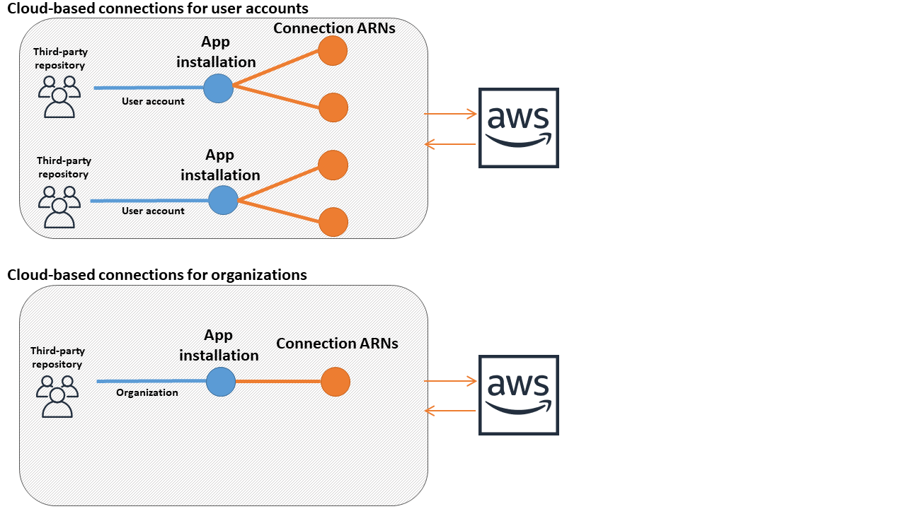
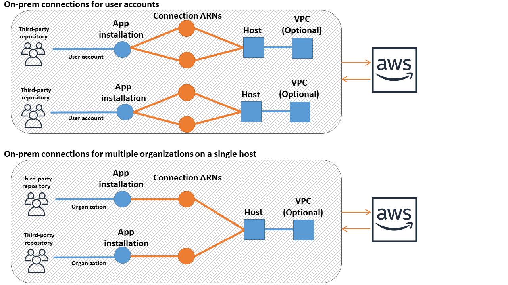

# How do connections work?

Before you can create a connection, you must first install, or provide access to, the
AWS authentication app on your third-party account. After a connection is installed, it can
be updated to use this installation. When you create a connection, you provide access to the
AWS resource in your third-party account. This allows the connection to access content, such
as source repositories, in the third-party account, on behalf of your AWS resources. You can
then share that connection with other AWS services to provide secure OAuth connections
between the resources.

Cloud-based connections are configured as follows with differences called out between user
accounts or organizations.

- **User accounts:** Each cloud-based third-party user
  account has a connector app installation. Multiple connections can be associated with the
  app installation.
- **Organizations:** Each cloud-based third party
  organization has a connector app installation. For connections in organizations, your
  connection mapping to each Organization account in the organization is 1:1. Multiple
  connections cannot be associated with the app installation. For more details about how
  organizations work with connections, see [How connections in
  AWS CodeConnections work with organizations](welcome-connections-how-it-works-github-organizations.md "welcome-connections-how-it-works-github-organizations.md").
  The following diagram shows how cloud-based connections work with user accounts or
  organizations.

Connections are owned by the AWS account that creates them. Connections are identified
by an ARN containing a connection ID. The connection ID is a UUID that cannot be changed or
remapped. Deleting and re-establishing a connection results in a new connection ID, and
therefore a new connection ARN. This means that connection ARNs are never reused.

A newly created connection is in a `Pending` state. A third-party handshake
(OAuth flow) process is required to complete setup of the connection and for it to move from
`Pending` to an `Available` state. After this is complete, a
connection is `Available` and can be used with AWS services, such as
CodePipeline.

If you want to create a connection to an installed provider type (on-prem), such as GitHub
Enterprise Server or GitLab self-managed, you use a host resource with your connection.

On-prem connections are configured as follows with differences called out between user
accounts or organizations.

- **User accounts:** Each on-prem third-party user account
  has a connector app installation. Multiple connections for an on-prem provider can be
  associated with one host.
- **Organizations:** Each on-prem third-party organization
  has a connector app installation. For on-prem connections in organizations, such as GitHub
  Organizations for GitHub Enterprise Server, you create a new host for each connection in
  your organization and be sure to enter the same information in the network fields (VPC,
  Subnet IDs, and Security Group IDs) for the host. For more details about how organizations
  work with connections, see [How connections in
  AWS CodeConnections work with organizations](welcome-connections-how-it-works-github-organizations.md "welcome-connections-how-it-works-github-organizations.md").
- **All:** For each on-prem connection, each VPC can only
  be associated with one host at a time.
  In all cases, you will need to provide the URL for your on-prem server. Additionally, if
  the server is within a private VPC (i.e., not accessible via the internet), you will need to
  provide VPC information along with optional TLS certificate information. These configurations
  allow CodeConnections to communicate with the instance and are shared by all connections created for
  this host. For example, for a single GitHub Enterprise Server instance, you would create a
  single app represented by a Host. Then, for user account configuration, you could create
  multiple connections for that host, which correspond to your app installation as shown in the
  following diagram. Otherwise, for an organization, you create a single app installation and
  connection for that host.

The following diagram shows how on-prem connections work with user accounts or
organizations.

A newly created host is in a `Pending` state. A third-party registration
process is required to complete setup of the host and for it to move from `Pending`
to an `Available` state. After this is complete, a host is `Available`
and can be used for connections to installed provider types.

For an overview of the connections workflow, see [Workflow to create or update
connections](welcome-connections-workflow.md "welcome-connections-workflow.md"). For
an overview of the host creation workflow for installed providers, see [Workflow to create or update a host](welcome-hosts-workflow.md "welcome-hosts-workflow.md"). For the
high-level steps to create a connection by provider type, see [Working with connections](connections.md "connections.md").
