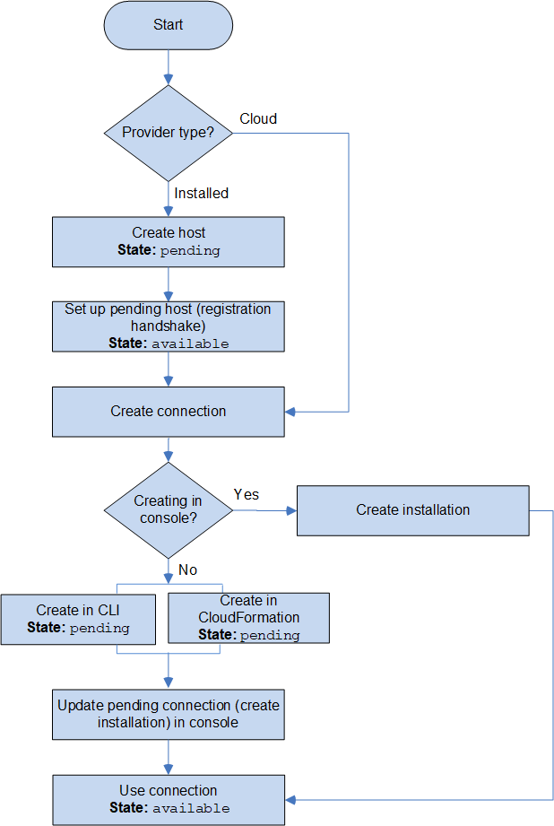

# Workflow to create or update

connections

When you create a connection, you also create or use an existing connector app
installation for the auth handshake with the third-party provider.

Connections can have the following states:

- `Pending` - A `pending` connection is a connection that must
  be completed (moved to `available`) before it can be used.
- `Available` - You can use or pass an `available` connection to
  other resources and users in your account.
- `Error` - A connection that has an `error` state is retried
  automatically. It cannot be used until it is `available`.
  **Workflow: Creating or updating a connection with the CLI, SDK, or
  AWS CloudFormation**

You use the [CreateConnection](../../../codeconnections/latest/APIReference/API_CreateConnection.md "../../../codeconnections/latest/APIReference/API_CreateConnection.md") API to create a connection using the AWS Command Line Interface (AWS CLI), SDK, or
CloudFormation. After it is created, the connection is in a `pending` state. You complete
the process by using the console **Set up pending connection** option. The
console prompts you to create an installation or use an existing installation for the
connection. You then use the console to complete the handshake and move the connection to an
`available` state by choosing **Complete connection** on the
console.

**Workflow: Creating or updating a connection with the
console**

If you are creating a connection to an installed provider type, such as GitHub
Enterprise Server, you first create a host. If you are connecting to a cloud provider type,
such as Bitbucket, you skip creating the host and continue to creating a connection.

To create or update a connection using the console, you use the CodePipeline edit action page
on the console to choose your third-party provider. The console prompts you to create an
installation or use an existing installation for the connection, and then use the console to
create the connection. The console completes the handshake and moves the connection from
`pending` to an `available` state automatically.

