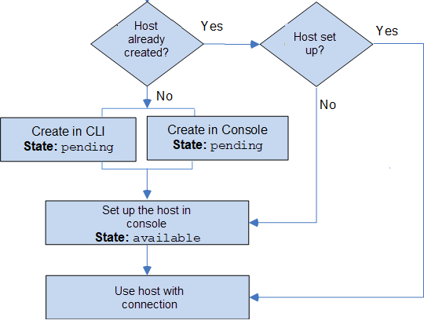

# Workflow to create or update a host

When you create a connection for an installed provider (on-prem), you use a host
resource.

###### Note

For organizations in GitHub Enterprise Server or GitLab self-managed, you don’t pass
an available host. You create a new host for each connection in your organization, and you
must be sure to enter the same information in the network fields (VPC ID, Subnet IDs, and
Security Group IDs) for the host. For more information, see [Connection and host setup for installed providers supporting organizations](troubleshooting-connections.md#troubleshooting-organization-host "troubleshooting-connections.md#troubleshooting-organization-host").

Hosts can have the following states:

- `Pending` - A `pending` host is a host that has been created
  and must be set up (moved to `available`) before it can be used.
- `Available` - You can use or pass an `available` host to your
  connection.
  **Workflow: Creating or updating a host with the CLI, SDK, or
  AWS CloudFormation**

You use the [CreateHost](../../../codeconnections/latest/APIReference/API_CreateHost.md "../../../codeconnections/latest/APIReference/API_CreateHost.md") API to
create a host using the AWS Command Line Interface (AWS CLI), SDK, or AWS CloudFormation. After it is created, the host is
in a `pending` state. You complete the process by using the console **Set
up** option in the console.

**Workflow: Creating or updating a host with the
console**

If you are creating a connection to an installed provider type, such as GitHub
Enterprise Server or GitLab self-managed, you create a host or use an existing host. If you
are connecting to a cloud provider type, such as Bitbucket, you skip creating the host and
continue to creating a connection.

Use the console to set up the host and change its status from `pending` to
`available`.

