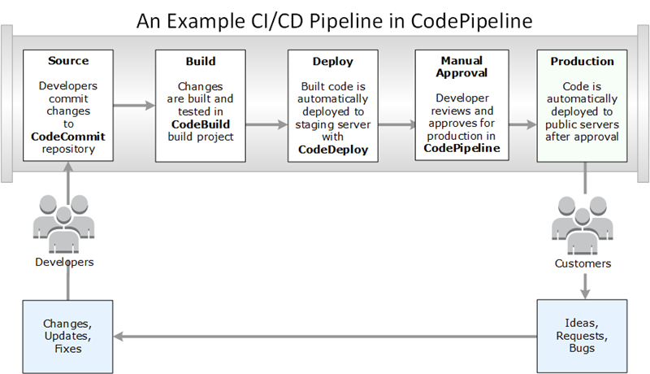

# What is the Developer Tools console?

The Developer Tools console is home to a set of services and features that you can use individually or
collectively to help you develop software, either individually or as a team. The developer tools
can help you securely store, build, test, and deploy your software. Used individually or
collectively, these tools provide support for DevOps, continuous integration, and continuous
delivery (CI/CD).

The Developer Tools console includes the following services:

- [AWS CodeCommit](../../../codecommit/latest/userguide.md "../../../codecommit/latest/userguide.md") is a fully managed source control service
  that hosts private Git repositories. You can use repositories to privately store and manage
  assets (such as documents, source code, and binary files) in the AWS Cloud. Your repositories
  store your project history from the first commit through the latest changes. You can work
  collaboratively on code in repositories by commenting on code and creating pull requests to help
  ensure code quality.
- [AWS CodeBuild](../../../codebuild/latest/userguide.md "../../../codebuild/latest/userguide.md") is a fully managed build service that
  compiles your source code, runs unit tests, and produces artifacts that are ready to deploy. It
  provides prepackaged build environments for popular programming languages and build tools such
  as Apache Maven, Gradle, and more. You can also customize build environments in CodeBuild to use
  your own build tools.
- [AWS CodeDeploy](../../../codedeploy/latest/userguide.md "../../../codedeploy/latest/userguide.md") is a fully managed deployment service that
  automates software deployments to compute services such as Amazon EC2, AWS Lambda, and your
  on-premises servers. It can help you rapidly release new features, avoid downtime during
  application deployment, and handle the complexity of updating your applications.
- [AWS CodePipeline](../../../codepipeline/latest/userguide.md "../../../codepipeline/latest/userguide.md") is a continuous integration and continuous
  delivery service you can use to model, visualize, and automate the steps required to release
  your software. You can quickly model and configure the different stages of a software release
  process. You can build, test, and deploy your code every time there is a code change, based on
  the release process models you define.
  Here's an example of how you can use the services in the Developer Tools console together to help you
  develop software.

In this example, developers create a repository in CodeCommit and use it to develop and
collaborate on their code. They create a build project in CodeBuild to build and test their code, and
use CodeDeploy to deploy their code to test and production environments. They want to iterate quickly,
so they create a pipeline in CodePipeline to detect the changes in the CodeCommit repository. Those
changes are built, tests are run, and successfully built and tested code is deployed to the test
server. The team adds test stages to the pipeline to run more tests on the staging server, such as
integration or load tests. Upon the successful completion of those tests, a team member reviews
the results and if satisfied, manually approves the changes for production. CodePipeline deploys
the tested and approved code to production instances.

This is just one simple example of how you can use one or more of the services available in
the Developer Tools console to help you develop software. Each of the services can be customized to meet your
needs. They offer many integrations with other products and services, both in AWS and with other
third-party tools. For more information, see the following topics:

- CodeCommit: [Product and service
  integrations](../../../codecommit/latest/userguide/integrations.md "../../../codecommit/latest/userguide/integrations.md")
- CodeBuild: [Use CodeBuild with Jenkins](../../../codebuild/latest/userguide/jenkins-plugin.md "../../../codebuild/latest/userguide/jenkins-plugin.md")
- CodeDeploy: [Product and service
  integrations](../../../codedeploy/latest/userguide/integrations.md "../../../codedeploy/latest/userguide/integrations.md")
- CodePipeline: [Product and service
  integrations](../../../codepipeline/latest/userguide/integrations.md "../../../codepipeline/latest/userguide/integrations.md")

## Are you a first-time user?

If you are a first-time user of one or more of the services available in the Developer Tools console, we
recommend that you begin by reading the following topics:

- [Getting started with
  CodeCommit](../../../codecommit/latest/userguide/getting-started-cc.md "../../../codecommit/latest/userguide/getting-started-cc.md")
- [Getting started with CodeBuild](../../../codebuild/latest/userguide/getting-started.md "../../../codebuild/latest/userguide/getting-started.md"), [Concepts](../../../codebuild/latest/userguide/concepts.md "../../../codebuild/latest/userguide/concepts.md")
- [Getting started with
  CodeDeploy](../../../codedeploy/latest/userguide/getting-started-codedeploy.md "../../../codedeploy/latest/userguide/getting-started-codedeploy.md"), [Primary components](../../../codedeploy/latest/userguide/primary-components.md "../../../codedeploy/latest/userguide/primary-components.md")
- [Getting started with
  CodePipeline](../../../codepipeline/latest/userguide/getting-started-codepipeline.md "../../../codepipeline/latest/userguide/getting-started-codepipeline.md"), [Concepts](../../../codepipeline/latest/userguide/concepts.md "../../../codepipeline/latest/userguide/concepts.md")

## Features of the developer tools console

The Developer Tools console includes the following features:

- The Developer Tools console includes a notifications manager feature that you can use to subscribe
  to events in AWS CodeBuild, AWS CodeCommit, AWS CodeDeploy, and AWS CodePipeline. This feature has its own API,
  AWS CodeStar Notifications. You can use the notifications feature to quickly notify users about events in
  the repositories, build projects, deployment applications, and pipelines that are most
  important to their work. A notifications manager helps make users aware of events that
  occur on repositories, builds, deployments, or pipelines so that they can quickly take
  action, such as approving changes or correcting errors. For more information, see [What are notifications?](welcome.md "welcome.md")
- The Developer Tools console includes a connections feature that you can use to associate your AWS
  resources with third-party source code providers. This feature has its own API, AWS CodeConnections.
  You can use the connections feature to set up an authorized connection with a third-party
  provider and use the connection resource with other AWS services. For more information,
  see [What are connections?](welcome-connections.md "welcome-connections.md")
