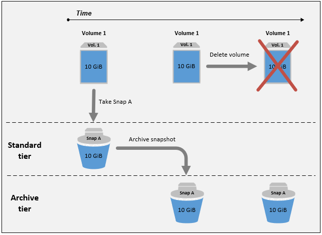
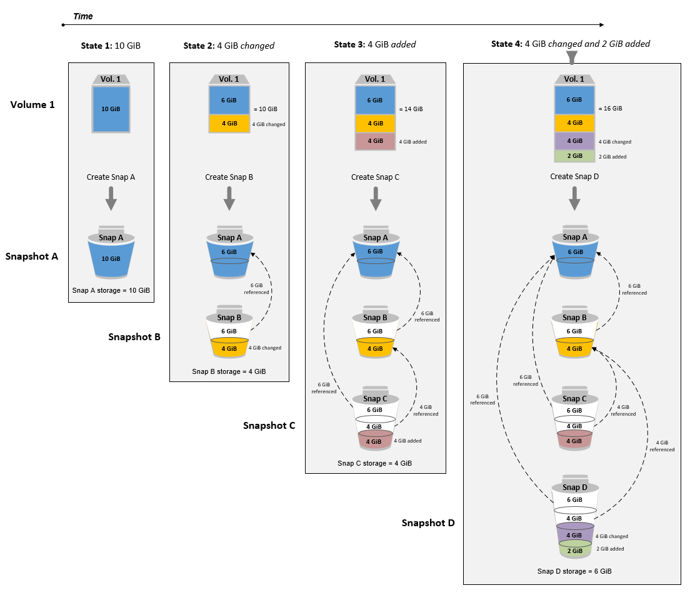

# Guidelines and best practices for archiving Amazon EBS snapshots

This section provides some guidelines and best practices for archiving snapshots.

###### Topics

- [Archiving the only snapshot of a volume](#guidelines-single-snapshot "#guidelines-single-snapshot")
- [Archiving incremental snapshots of a single volume](#guidelines-incremental-snapshot "#guidelines-incremental-snapshot")
- [Archiving full snapshots for compliance reasons](#guidelines-full-snapshot "#guidelines-full-snapshot")
- [Determining the reduction in standard tier storage costs](#archive-guidelines "#archive-guidelines")

## Archiving the only snapshot of a volume

When you have only one snapshot of a volume, the snapshot is always the same size as the blocks
written to the volume at the time the snapshot was created. When you archive such a snapshot, the
snapshot in the standard tier is converted to an equivalent-sized full snapshot and it is moved from
the standard tier to the archive tier.

Archiving these snapshots can help you save with lower storage costs. If you no longer need the
source volume, you can delete the volume for further storage cost savings.



## Archiving incremental snapshots of a single volume

When you archive an incremental snapshot, the snapshot is converted to a full snapshot
and it is moved to the archive tier. For example, in the following image, if you archive
**Snap B**, the snapshot is converted to a full snapshot that
is 10 GiB in size and moved to the archive tier. Similarly, if you archive **Snap C**, the size of the full snapshot in the archive tier is 14
GiB.



If you are archiving snapshots to reduce your storage costs in the standard tier, you should not
archive the first snapshot in a set of incremental snapshots. These snapshots are referenced by subsequent
snapshots in the snapshot lineage. In most cases, archiving these snapshots will not reduce storage
costs.

###### Note

You should not archive the last snapshot in a set of incremental snapshots. The last snapshot
is the most recent snapshot taken of a volume. You will need this snapshot in the standard tier
if you want to create volumes from it in the case of a volume corruption or loss.

If you archive a snapshot that contains data that is referenced by a later snapshot in
the lineage, the data storage and storage costs associated with the referenced data are
allocated to the later snapshot in the lineage. In this case, archiving the snapshot will
not reduce data storage or storage costs. For example, in the preceding image, if you
archive **Snap B**, its 4 GiB of data is attributed to
**Snap C**. In this case, your overall storage costs will
increase because you incur storage costs for the full version of **Snap
B** in the archive tier, and your storage costs for the standard tier remain
unchanged.

If you archive **Snap C**, your standard tier storage will decrease by 4
GiB because the data is not referenced by any other snapshots later in the lineage. And your archive tier
storage will increase by 14 GiB because the snapshot is converted to a full snapshot.

## Archiving full snapshots for compliance reasons

You might need to create full backups of volumes on a monthly, quarterly, or yearly basis for
compliance reasons. For these backups, you might need standalone snapshots without backward or forward
references to other snapshots in the snapshot lineage. Snapshots archived with EBS Snapshots Archive
are full snapshots, and they do not have any references to other snapshots in the lineage. Additionally,
you will likely need to retain these snapshots for compliance reasons for several years. EBS Snapshots
Archive makes it cost-effective to archive these full snapshots for long-term retention.

## Determining the reduction in standard tier storage costs

If you want to archive an incremental snapshot to reduce your storage costs, you should consider the size
of the full snapshot in the archive tier and the reduction in storage in the standard tier. This section
explains how to do this.

###### Important

The API responses are data accurate at the point-in-time when the APIs are called. API responses can
differ as the data associated with a snapshot changes as a result of changes in the snapshot lineage.

To determine the reduction in storage and storage costs in the standard tier, use the following steps.

1. For the snapshot that you want to archive, check the full snapshot size and the source
   volume from which it was created. Use the [describe-snapshots](../../../cli/latest/reference/ec2/describe-snapshots.md "../../../cli/latest/reference/ec2/describe-snapshots.md") command, and for `--snapshot-id`, specify the ID of
   the snapshot that you want to archive.

```
`$` aws ec2 describe-snapshots --snapshot-id `snapshot_id`
```

The `FullSnapshotSizeInBytes` reponse value indicates the full snapshot size,
in bytes, and the `VolumeId` response value indicates the ID of the source volume.

For example, the following command returns information about snapshot `snap-09c9114207084f0d9`.

```
`$` aws ec2 describe-snapshots --snapshot-id snap-09c9114207084f0d9
```

The following example output shows that the full snapshot size is `5678912341`
bytes (5.28 GiB), and the source volume is `vol-0f3e2c292c52b85c3`.

```
{
    "Snapshots": [
        {
            "Description": "",
            "Tags": [],
            "Encrypted": false,
            **"VolumeId": "vol-0f3e2c292c52b85c3"**,
            "State": "completed",
            "VolumeSize": 8,
            "StartTime": "2021-11-16T08:29:49.840Z",
            "Progress": "100%",
            "OwnerId": "123456789012",
            **"FullSnapshotSizeInBytes" : "5678912341"**,
            "SnapshotId": "snap-09c9114207084f0d9"
        }
    ]
}
```

2. Find all of the snapshots created from the source volume. Use the [describe-snapshots](../../../cli/latest/reference/ec2/describe-snapshots.md "../../../cli/latest/reference/ec2/describe-snapshots.md") command. Specify the
   `volume-id` filter, and for the filter value, specify the volume ID from the previous step.

```
`$` aws ec2 describe-snapshots --filters "Name=volume-id, Values=`volume_id`"
```

For example, the following command returns all snapshots created from volume `vol-0f3e2c292c52b85c3`.

```
`$` aws ec2 describe-snapshots --filters "Name=volume-id, Values=vol-0f3e2c292c52b85c3"
```

The following is the command output, which indicates that three snapshots were created from volume
`vol-0f3e2c292c52b85c3`.

```
{
    "Snapshots": [
        {
            "Description": "",
            "Tags": [],
            "Encrypted": false,
            "VolumeId": "vol-0f3e2c292c52b85c3",
            "State": "completed",
            "VolumeSize": 8,
            "StartTime": "2021-11-14T08:57:39.300Z",
            "Progress": "100%",
            "OwnerId": "123456789012",
            "SnapshotId": "snap-08ca60083f86816b0"
        },
        {
            "Description": "",
            "Tags": [],
            "Encrypted": false,
            "VolumeId": "vol-0f3e2c292c52b85c3",
            "State": "completed",
            "VolumeSize": 8,
            "StartTime": "2021-11-15T08:29:49.840Z",
            "Progress": "100%",
            "OwnerId": "123456789012",
            "SnapshotId": "snap-09c9114207084f0d9"
        },
        {
            "Description": "01",
            "Tags": [],
            "Encrypted": false,
            "VolumeId": "vol-0f3e2c292c52b85c3",
            "State": "completed",
            "VolumeSize": 8,
            "StartTime": "2021-11-16T07:50:08.042Z",
            "Progress": "100%",
            "OwnerId": "123456789012",
            "SnapshotId": "snap-024f49fe8dd853fa8"
        }
    ]
}
```

3. Using the output from the previous command, sort the snapshots by their creation
   times, from oldest to newest. The `StartTime` response parameter for each
   snapshot indicates its creation time, in UTC time format.

For example, the snapshots returned in the previous step arranged by creation
time, from oldest to newest, is as follows:

    1. `snap-08ca60083f86816b0` (oldest – created before the snapshot that you want to
     archive)
    2. `snap-09c9114207084f0d9` (the snapshot to archive)
    3. `snap-024f49fe8dd853fa8` (newest – created after the snapshot that you that want to
     archive)

4. Identify the snapshots that were created immediately before and after the snapshot that you
   want to archive. In this case, you want to archive snapshot `snap-09c9114207084f0d9`,
   which was the second incremental snapshot created in the set of three snapshots. Snapshot
   `snap-08ca60083f86816b0` was created immediately before, and snapshot
   `snap-024f49fe8dd853fa8` was created immediately after.
5. Find the unreferenced data in the snapshot that you want to archive. First, find the blocks
   that are different between the snapshot that was created immediately before the snapshot that you
   want to archive, and the snapshot that you want to archive. Use the [list-changed-blocks](../../../cli/latest/reference/ebs/list-changed-blocks.md "../../../cli/latest/reference/ebs/list-changed-blocks.md") command. For
   `--first-snapshot-id`, specify the ID of the snapshot that was created immediately
   before the snapshot that you want to archive. For `--second-snapshot-id`, specify the
   ID of the snapshot that you want to archive.

```
`$` aws ebs list-changed-blocks --first-snapshot-id `snapshot_created_before` --second-snapshot-id `snapshot_to_archive`
```

For example, the following command shows the block indexes for the blocks that are different
between snapshot `snap-08ca60083f86816b0` (the snapshot created before the snapshot
you want to archive), and snapshot `snap-09c9114207084f0d9` (the snapshot you want to
archive).

```
`$` aws ebs list-changed-blocks --first-snapshot-id snap-08ca60083f86816b0 --second-snapshot-id snap-09c9114207084f0d9
```

The following shows the command output, with some blocks omitted.

```
{
    "BlockSize": 524288,
    "ChangedBlocks": [
        {
            "FirstBlockToken": "ABgBAX6y+WH6Rm9y5zq1VyeTCmEzGmTT0jNZG1cDirFq1rOVeFbWXsH3W4z/",
            "SecondBlockToken": "ABgBASyx0bHHBnTERu+9USLxYK/81UT0dbHIUFqUjQUkwTwK5qkjP8NSGyNB",
            "BlockIndex": 4
        },
        {
            "FirstBlockToken": "ABgBAcfL+EfmQmlNgstqrFnYgsAxR4SDSO4LkNLYOOChGBWcfJnpn90E9XX1",
            "SecondBlockToken": "ABgBAdX0mtX6aBAt3EBy+8jFCESMpig7csKjbO2Ocd08m2iNJV2Ue+cRwUqF",
            "BlockIndex": 5
        },
        {
            "FirstBlockToken": "ABgBAVBaFJmbP/eRHGh7vnJlAwyiyNUi3MKZmEMxs2wC3AmM/fc6yCOAMb65",
            "SecondBlockToken": "ABgBAdewWkHKTcrhZmsfM7GbaHyXD1Ctcn2nppz4wYItZRmAo1M72fpXU0Yv",
            "BlockIndex": 13
        },
        {
            "FirstBlockToken": "ABgBAQGxwuf6z095L6DpRoVRVnOqPxmx9r7Wf6O+i+ltZ0dwPpGN39ijztLn",
            "SecondBlockToken": "ABgBAUdlitCVI7c6hGsT4ckkKCw6bMRclnV+bKjViu/9UESTcW7CD9w4J2td",
            "BlockIndex": 14
        },
        {
            "FirstBlockToken": "ABgBAZBfEv4EHS1aSXTXxSE3mBZG6CNeIkwxpljzmgSHICGlFmZCyJXzE4r3",
            "SecondBlockToken": "ABgBAVWR7QuQQB0AP2TtmNkgS4Aec5KAQVCldnpc91zBiNmSfW9ouIlbeXWy",
            "BlockIndex": 15
        },
        .....
        {
            "SecondBlockToken": "ABgBAeHwXPL+z3DBLjDhwjdAM9+CPGV5VO5Q3rEEA+ku50P498hjnTAgMhLG",
            "BlockIndex": 13171
        },
        {
            "SecondBlockToken": "ABgBAbZcPiVtLx6U3Fb4lAjRdrkJMwW5M2tiCgIp6ZZpcZ8AwXxkjVUUHADq",
            "BlockIndex": 13172
        },
        {
            "SecondBlockToken": "ABgBAVmEd/pQ9VW9hWiOujOAKcauOnUFCO+eZ5ASVdWLXWWC04ijfoDTpTVZ",
            "BlockIndex": 13173
        },
        {
            "SecondBlockToken": "ABgBAT/jeN7w+8ALuNdaiwXmsSfM6tOvMoLBLJ14LKvavw4IiB1d0iykWe6b",
            "BlockIndex": 13174
        },
        {
            "SecondBlockToken": "ABgBAXtGvUhTjjUqkwKXfXzyR2GpQei/+pJSG/19ESwvt7Hd8GHaUqVs6Zf3",
            "BlockIndex": 13175
        }
    ],
    "ExpiryTime": 1637648751.813,
    "VolumeSize": 8
}

```

Next, use the same command to find blocks that are different between the snapshot that you want
to archive and the snapshot that was created immediately after it. For `--first-snapshot-id`,
specify the ID of the snapshot that you want to archive. For `--second-snapshot-id`, specify
the ID of the snapshot that was created immediately after the snapshot that you want to archive.

```
`$` aws ebs list-changed-blocks --first-snapshot-id `snapshot_to_archive` --second-snapshot-id `snapshot_created_after`
```

For example, the following command shows the block indexes of the blocks that are
different between snapshot `snap-09c9114207084f0d9` (the snapshot that you
want to archive) and snapshot `snap-024f49fe8dd853fa8` (the snapshot created
after the snapshot that you want to archive).

```
`$` aws ebs list-changed-blocks --first-snapshot-id snap-09c9114207084f0d9 --second-snapshot-id snap-024f49fe8dd853fa8
```

The following shows the command output, with some blocks omitted.

```
{
    "BlockSize": 524288,
    "ChangedBlocks": [
        {
            "FirstBlockToken": "ABgBAVax0bHHBnTERu+9USLxYK/81UT0dbSnkDk0gqwRFSFGWA7HYbkkAy5Y",
            "SecondBlockToken": "ABgBASEvi9x8Om7Htp37cKG2NT9XUzEbLHpGcayelomSoHpGy8LGyvG0yYfK",
            "BlockIndex": 4
        },
        {
            "FirstBlockToken": "ABgBAeL0mtX6aBAt3EBy+8jFCESMpig7csfMrI4ufnQJT3XBm/pwJZ1n2Uec",
            "SecondBlockToken": "ABgBAXmUTg6rAI+v0LvekshbxCVpJjWILvxgC0AG0GQBEUNRVHkNABBwXLkO",
            "BlockIndex": 5
        },
        {
            "FirstBlockToken": "ABgBATKwWkHKTcrhZmsfM7GbaHyXD1CtcnjIZv9YzisYsQTMHfTfh4AhS0s2",
            "SecondBlockToken": "ABgBAcmiPFovWgXQio+VBrxOqGy4PKZ9SAAHaZ2HQBM9fQQU0+EXxQjVGv37",
            "BlockIndex": 13
        },
        {
            "FirstBlockToken": "ABgBAbRlitCVI7c6hGsT4ckkKCw6bMRclnARrMt1hUbIhFnfz8kmUaZOP2ZE",
            "SecondBlockToken": "ABgBAXe935n544+rxhJ0INB8q7pAeoPZkkD27vkspE/qKyvOwpozYII6UNCT",
            "BlockIndex": 14
        },
        {
            "FirstBlockToken": "ABgBAd+yxCO26I+1Nm2KmuKfrhjCkuaP6LXuol3opCNk6+XRGcct4suBHje1",
            "SecondBlockToken": "ABgBAcPpnXz821NtTvWBPTz8uUFXnS8jXubvghEjZulIjHgc+7saWys77shb",
            "BlockIndex": 18
        },
        .....
        {
            "SecondBlockToken": "ABgBATni4sDE5rS8/a9pqV03lU/lKCW+CTxFl3cQ5p2f2h1njpuUiGbqKGUa",
            "BlockIndex": 13190
        },
        {
            "SecondBlockToken": "ABgBARbXo7zFhu7IEQ/9VMYFCTCtCuQ+iSlWVpBIshmeyeS5FD/M0i64U+a9",
            "BlockIndex": 13191
        },
        {
            "SecondBlockToken": "ABgBAZ8DhMk+rROXa4dZlNK45rMYnVIGGSyTeiMli/sp/JXUVZKJ9sMKIsGF",
            "BlockIndex": 13192
        },
        {
            "SecondBlockToken": "ABgBATh6MBVE904l6sqOC27s1nVntFUpDwiMcRWGyJHy8sIgGL5yuYXHAVty",
            "BlockIndex": 13193
        },
        {
            "SecondBlockToken": "ABgBARuZykaFBWpCWrJPXaPCneQMbyVgnITJqj4c1kJWPIj5Gn61OQyy+giN",
            "BlockIndex": 13194
        }
    ],
    "ExpiryTime": 1637692677.286,
    "VolumeSize": 8
}
```

6. Compare the output returned by both commands in the previous step. If the same
   block index appears in both command outputs, it indicates that the block contains
   unreferenced data.

For example, the command output in the previous step indicates that blocks 4, 5,
13, and 14 are unique to snapshot `snap-09c9114207084f0d9` and that they are
not referenced by any other snapshots in the snapshot lineage.

To determine the reduction in standard tier storage, multiply the number of blocks
that appear in both command outputs by 512 KiB, which is the snapshot block size.

For example, if 9,950 block indexes appear in both command outputs, it indicates that
you will decrease standard tier storage by around 4.85 GiB (9,950 blocks \* 512 KiB = 4.85
GiB). 7. Determine the storage costs for storing the unreferenced blocks in the standard
tier for 90 days. Compare this value with the cost of storing the full snapshot,
described in step 1, in the archive tier. You can determine your costs savings by
comparing the values, assuming that you do not restore the full snapshot from the
archive tier during the minimum 90-day period. For more information, see
[Pricing and billing for archiving Amazon EBS snapshots](snapshot-archive-pricing.md "snapshot-archive-pricing.md").
