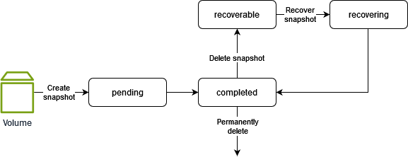

# View Amazon EBS snapshot information

You can view detailed information about your snapshots.

Console

###### To view snapshot information

1. Open the Amazon EC2 console at
   [https://console.aws.amazon.com/ec2/](https://console.aws.amazon.com/ec2/ "https://console.aws.amazon.com/ec2/").
2. In the navigation pane, choose **Snapshots**.
3. To view only your snapshots that you own, in the top-left corner of the screen,
   choose **Owned by me**. You can also filter the list of snapshots
   using tags and other snapshot attributes. In the **Filter** field, select the attribute field, and then select or enter the
   attribute value. For example, to view only encrypted snapshots, select
   **Encryption**, and then enter `true`.
4. To view more information about a specific snapshot, choose its ID in the list.

###### Note

The **Full snapshot size** field shows the full size of
the snapshot, in bytes. This is **not** the incremental size
of the snapshot. Instead, it represents the size of all the blocks that were written to
the source volume at the time the snapshot was created.

The **Volume size** field shows the size of the EBS volume
that will created from the snapshot if no other size is specified.

AWS CLI

###### To view snapshot information

Use the [describe-snapshots](../../../cli/latest/reference/ec2/describe-snapshots.md "../../../cli/latest/reference/ec2/describe-snapshots.md") command.

###### Example 1: Filter based on tags

The following example describes the snapshots with the tag Stack=production.

```
aws ec2 describe-snapshots --filters Name=tag:`Stack`,Values=`production`
```

###### Example 2: Filter based on volume

The following example describes the snapshots created from the specified volume.

```
aws ec2 describe-snapshots --filters Name=volume-id,Values=`vol-049df61146c4d7901`
```

###### Example 3: Filter based on snapshot age

You can use JMESPath to filter results using expressions. For example,
the following command displays the IDs of all snapshots created by your
account before the specified date. If you do not specify the owner, the
results include all public snapshots.

```
aws ec2 describe-snapshots \
    --filters Name=owner-id,Values=`123456789012` \
    --query "Snapshots[?(StartTime<='`2024-03-31`')].[SnapshotId]" \
    --output text
```

The following command displays the IDs of all snapshots created in the specified date range.

```
aws ec2 describe-snapshots \
    --filters Name=owner-id,Values=`123456789012` \
    --query "Snapshots[?(StartTime>='`2024-01-01`') && (StartTime<='`2024-12-31`')].[SnapshotId]" \
    --output text
```

PowerShell

###### To view snapshot information

Use the [Get-EC2Snapshot](../../../powershell/latest/reference/items/Get-EC2Snapshot.md "../../../powershell/latest/reference/items/Get-EC2Snapshot.md") cmdlet.

###### Example 1: Describe a snapshot

The following example describes the specified snapshot.

```
Get-EC2Snapshot -SnapshotId `snap-0abcdef1234567890`
```

###### Example 2: Filter based on volume

The following example describes the snapshots created from the specified volume.

```
Get-EC2Snapshot`
    -Filter @{Name="volume-id"; Values="`vol-01234567890abcdef`"}
```

## Snapshot states

An Amazon EBS snapshot transitions through different states from the moment it is created
until it is permanently deleted.

The following illustration shows the transitions between snapshot states. When you
create a snapshot, it enters the `pending` state. After the snapshot is ready
for use, it enters the `completed` state. When you've decided that you no longer
need a snapshot, you can delete it. If you delete a snapshot that matches a Recycle Bin
retention rule, it is retained in the Recycle Bin and it enters the `recoverable`
state. If you recover a snapshot from the Recycle Bin, it enters the `recovering`
state and then the `completed` state. Otherwise, it is permanently deleted.



The following table summarizes the snapshot states.

| Status        | Description                                                                                                                                                           |
| ------------- | --------------------------------------------------------------------------------------------------------------------------------------------------------------------- |
| `pending`     | The snapshot creation process is still in progress. A snapshot can't<br>be used while it is in the `pending` state.                                                   |
| `completed`   | The snapshot creation process has completed and the snapshot is<br>ready for use.                                                                                     |
| `recoverable` | The snapshot is currently in the Recycle Bin. To use the snapshot,<br>you must first recover it from the Recycle Bin.                                                 |
| `recovering`  | The snapshot is being recovered from the Recycle Bin. After the snapshot<br>has been recovered, it transitions to the `completed` state and<br>becomes ready for use. |
| `error`       | The snapshot creation process has failed. A snapshot can't be used<br>if it is in the `error` state.                                                                  |
