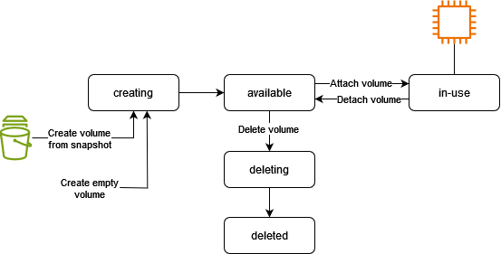

# View information about an Amazon EBS volume

You can view descriptive information about your EBS volumes. For example, you can view
information about all volumes in a specific Region or view detailed information about a single
volume, including its size, volume type, whether the volume is encrypted, which KMS key was
used to encrypt the volume, and the specific instance to which the volume is attached.

You can get additional information about your EBS volumes, such as how much disk space is
available, from the operating system on the instance.

###### Contents

- [View volume information](#ebs-view-information-console "#ebs-view-information-console")
- [Volume states](#volume-state "#volume-state")
- [View volume metrics](#ebs-view-volume-metrics "#ebs-view-volume-metrics")
- [View free disk space](#ebs-view-free-disk-space-lin "#ebs-view-free-disk-space-lin")

## View volume information

You can view information about your EBS volumes.

Console

###### To view information about a volume

1. Open the Amazon EC2 console at
   [https://console.aws.amazon.com/ec2/](https://console.aws.amazon.com/ec2/ "https://console.aws.amazon.com/ec2/").
2. In the navigation pane, choose **Volumes**.
3. To reduce the list, you can filter your volumes using tags and volume attributes.
   Choose the filter field, select a tag or volume attribute, and then select the filter
   value.
4. To view more information about a volume, choose its ID.

###### To view the EBS volumes that are attached to an instance

1. Open the Amazon EC2 console at
   [https://console.aws.amazon.com/ec2/](https://console.aws.amazon.com/ec2/ "https://console.aws.amazon.com/ec2/").
2. In the navigation pane, choose **Instances**.
3. Select the instance.
4. On the **Storage** tab, the **Block
   devices** section lists the volumes that are attached to the instance.
   To view information about a specific volume, choose its ID in the **Volume
   ID** column.

Amazon EC2 Global View
You can use [Amazon EC2 Global View](../../../AWSEC2/latest/UserGuide/global-view.md "../../../AWSEC2/latest/UserGuide/global-view.md")
to view your volumes across all Regions for which your AWS account is enabled.

###### To get a summary of your EBS volumes across all Regions

1. Open the Amazon EC2 Global View console at [https://console.aws.amazon.com/ec2globalview/home](https://console.aws.amazon.com/ec2globalview/home "https://console.aws.amazon.com/ec2globalview/home").
2. On the **Region explorer** tab, under **Summary**,
   check the resource count for **Volumes**, which includes
   the number of volumes and the number of Regions. Click the underlined text
   to see how the volume count is spread across Regions.
3. On the **Global search** tab, select the client filter
   **Resource type = Volume**. You can filter the results
   further by specifying a Region or a tag.

AWS CLI

###### To view information about an EBS volume

Use the [describe-volumes](../../../cli/latest/reference/ec2/describe-volumes.md "../../../cli/latest/reference/ec2/describe-volumes.md")
command. The following example counts the volumes in the current Region.

```
aws ec2 describe-volumes --query "length(Volumes[*])"
```

The following example lists the volumes attached to the specified instance.

```
aws ec2 describe-volumes \
    --filters "Name=attachment.instance-id,Values=`i-1234567890abcdef0`" \
    --query Volumes[*].VolumeId \
    --output text
```

The following example describes the specified volume.

```
aws ec2 describe-volumes --volume-ids `vol-01234567890abcdef`
```

The following is example output.

```
{
    "Volumes": [
        {
            "Iops": 3000,
            "VolumeType": "gp3",
            "MultiAttachEnabled": false,
            "Throughput": 125,
            "Operator": {
                "Managed": false
            },
            "VolumeId": "vol-01234567890abcdef",
            "Size": 8,
            "SnapshotId": "snap-0abcdef1234567890",
            "AvailabilityZone": "us-west-2b",
            "State": "in-use",
            "CreateTime": "2024-05-17T23:23:00.400000+00:00",
            "Attachments": [
                {
                    "DeleteOnTermination": true,
                    "VolumeId": "vol-01234567890abcdef",
                    "InstanceId": "i-1234567890abcdef0",
                    "Device": "/dev/xvda",
                    "State": "attached",
                    "AttachTime": "2024-05-17T23:23:00+00:00"
                }
            ],
            "Encrypted": false
        }
    ]
}
```

PowerShell

###### To view information about an EBS volume

Use the [Get-EC2Volume](../../../powershell/latest/reference/items/Get-EC2Volume.md "../../../powershell/latest/reference/items/Get-EC2Volume.md")
cmdlet. The following example counts the volumes in the current Region.

```
(Get-EC2Volume).Count
```

The following example lists the volumes attached to the specified instance.

```
(Get-EC2Volume `
    -Filters @{Name="attachment.instance-id";Values="`i-1234567890abcdef0`"}).VolumeId
```

The following example describes the specified volume.

```
Get-EC2Volume -VolumeId `vol-01234567890abcdef`
```

The following is example output.

```
Attachments        : {i-1234567890abcdef0}
AvailabilityZone   : us-west-2b
CreateTime         : 5/17/2024 11:23:00 PM
Encrypted          : False
FastRestored       : False
Iops               : 3000
KmsKeyId           :
MultiAttachEnabled : False
Operator           : Amazon.EC2.Model.OperatorResponse
OutpostArn         :
Size               : 8
SnapshotId         : snap-0abcdef1234567890
SseType            :
State              : in-use
Tags               : {}
Throughput         : 125
VolumeId           : vol-01234567890abcdef
VolumeType         : gp3
```

## Volume states

Volume state describes the availability of an Amazon EBS volume. You can view the volume
state in the **State** column on the **Volumes** page in
the console, or by using the [describe-volumes](../../../cli/latest/reference/ec2/describe-volumes.md "../../../cli/latest/reference/ec2/describe-volumes.md") AWS CLI command.

An Amazon EBS volume transitions through different states from the moment it is created
until it is deleted.

The following illustration shows the transitions between volume states. You can create
a volume from an Amazon EBS snapshot or create an empty volume. When you create a volume, it
enters the `creating` state. After the volume is ready for use, it enters the
`available` state. You can attach an available volume to an instance in the
same Availability Zone as the volume. You must detach the volume before you can attach it
to a different instance or delete it. You can delete a volume when you no longer need it.



The following table summarizes the volume states.

| State       | Description                                                                                                                                                                                                                                                                                                                                                                               |
| ----------- | ----------------------------------------------------------------------------------------------------------------------------------------------------------------------------------------------------------------------------------------------------------------------------------------------------------------------------------------------------------------------------------------- |
| `creating`  | The volume is being created.                                                                                                                                                                                                                                                                                                                                                              |
| `available` | The volume is not attached to an instance.                                                                                                                                                                                                                                                                                                                                                |
| `in-use`    | The volume is attached to an instance.                                                                                                                                                                                                                                                                                                                                                    |
| `deleting`  | The volume is being deleted.                                                                                                                                                                                                                                                                                                                                                              |
| `deleted`   | The volume is deleted.                                                                                                                                                                                                                                                                                                                                                                    |
| `error`     | The underlying hardware related to your EBS volume has failed, and the data<br>associated with the volume is unrecoverable. For information about how to restore<br>the volume or recover the data on the volume, see [Why does my EBS volume have a status<br>of "error"?](https://repost.aws/knowledge-center/ebs-error-status "https://repost.aws/knowledge-center/ebs-error-status"). |

## View volume metrics

You can get additional information about your EBS volumes from Amazon CloudWatch. For more
information, see [Amazon CloudWatch metrics for Amazon EBS](using_cloudwatch_ebs.md "using_cloudwatch_ebs.md").

## View free disk space

You can get additional information about your EBS volumes, such as how much disk space
is available, from the operating system on the instance.

Use the **df -hT** command and specify the device name:

````
`[ec2-user ~]$` `df -hT `/dev/xvda1```Filesystem Type Size Used Avail Use% Mounted on
/dev/xvda1 xfs 8.0G 1.2G 6.9G 15% /`
````

You can view the free disk space by opening File Explorer and selecting **This
PC**.

You can also view the free disk space using the following `dir` command and
examining the last line of the output:

```
`C:\>` `dir C:``Volume in drive C has no label.
 Volume Serial Number is 68C3-8081

 Directory of C:\

03/25/2018 02:10 AM <DIR> .
03/25/2018 02:10 AM <DIR> ..
03/25/2018 03:47 AM <DIR> Contacts
03/25/2018 03:47 AM <DIR> Desktop
03/25/2018 03:47 AM <DIR> Documents
03/25/2018 03:47 AM <DIR> Downloads
03/25/2018 03:47 AM <DIR> Favorites
03/25/2018 03:47 AM <DIR> Links
03/25/2018 03:47 AM <DIR> Music
03/25/2018 03:47 AM <DIR> Pictures
03/25/2018 03:47 AM <DIR> Saved Games
03/25/2018 03:47 AM <DIR> Searches
03/25/2018 03:47 AM <DIR> Videos
 0 File(s) 0 bytes
 13 Dir(s) 18,113,662,976 bytes free`
```

You can also view the free disk space using the following `fsutil`
command:

```
`C:\>` `fsutil volume diskfree C:``Total # of free bytes : 18113204224
Total # of bytes : 32210153472
Total # of avail free bytes : 18113204224`
```

###### Tip

You can also use the CloudWatch agent to collect disk space usage metrics from an Amazon EC2 instance without connecting
to the instance. For more information, see [Create the CloudWatch agent configuration file](../../../AmazonCloudWatch/latest/monitoring/create-cloudwatch-agent-configuration-file.md "../../../AmazonCloudWatch/latest/monitoring/create-cloudwatch-agent-configuration-file.md") and [Installing the CloudWatch
agent](../../../AmazonCloudWatch/latest/monitoring/install-CloudWatch-Agent-on-EC2-Instance.md "../../../AmazonCloudWatch/latest/monitoring/install-CloudWatch-Agent-on-EC2-Instance.md") in the _Amazon CloudWatch User Guide_. If you need to monitor disk space usage for
multiple instances, you can install and configure the CloudWatch agent on those instances using Systems Manager. For more
information, see [Installing the CloudWatch agent using Systems Manager](../../../AmazonCloudWatch/latest/monitoring/installing-cloudwatch-agent-ssm.md "../../../AmazonCloudWatch/latest/monitoring/installing-cloudwatch-agent-ssm.md").
