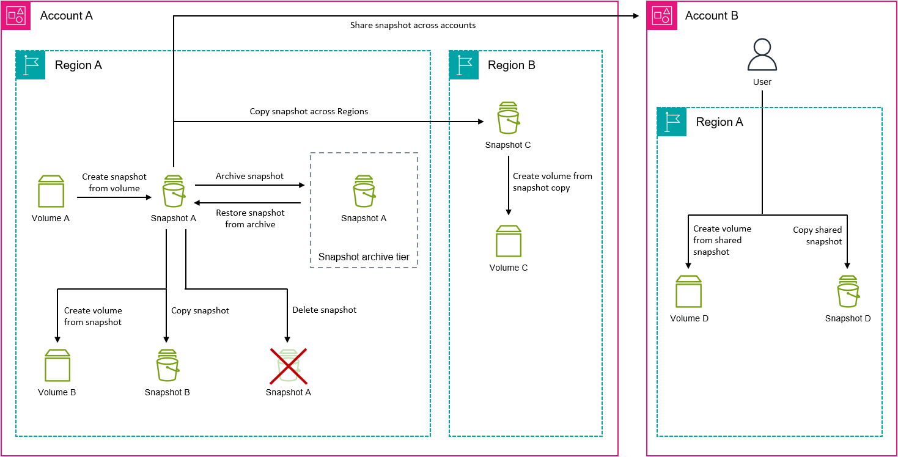

# Amazon EBS snapshot lifecycle

The lifecycle of an Amazon EBS snapshot starts with the creation process. You create snapshots
from Amazon EBS volumes. You can use snapshots to restore new Amazon EBS volumes. You can create copies
of snapshots either in the same Region, or in different Regions. You can share snapshots with
other AWS accounts, either publicly or privately. Those accounts can restore volumes from
the shared snapshots, or they can create copies of the shared snapshots in their own account.
If you don't need immediate access to a snapshot, you can archive it to save on storage
costs.

The following image shows actions that you can perform on your snapshots as part of the
snapshot lifecycle.

###### Tasks

- [Create snapshots](ebs-creating-snapshot.md "ebs-creating-snapshot.md")
- [View snapshot information](ebs-describing-snapshots.md "ebs-describing-snapshots.md")
- [Copy a snapshot](ebs-copy-snapshot.md "ebs-copy-snapshot.md")
- [Share a snapshot](ebs-modifying-snapshot-permissions.md "ebs-modifying-snapshot-permissions.md")
- [Archive snapshots](snapshot-archive.md "snapshot-archive.md")
- [Delete a snapshot](ebs-deleting-snapshot.md "ebs-deleting-snapshot.md")
