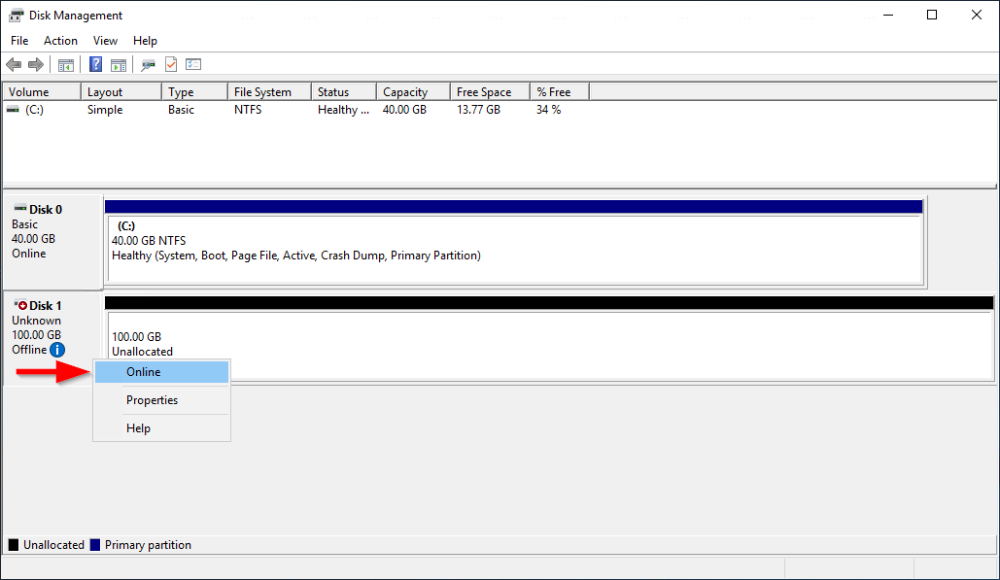
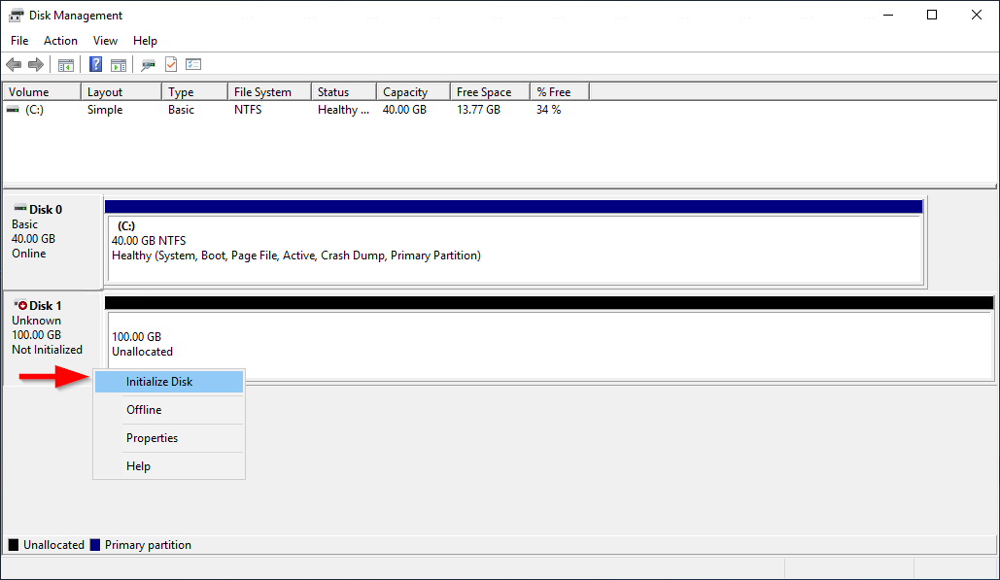
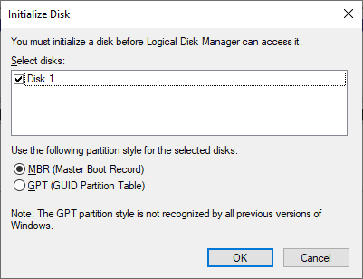
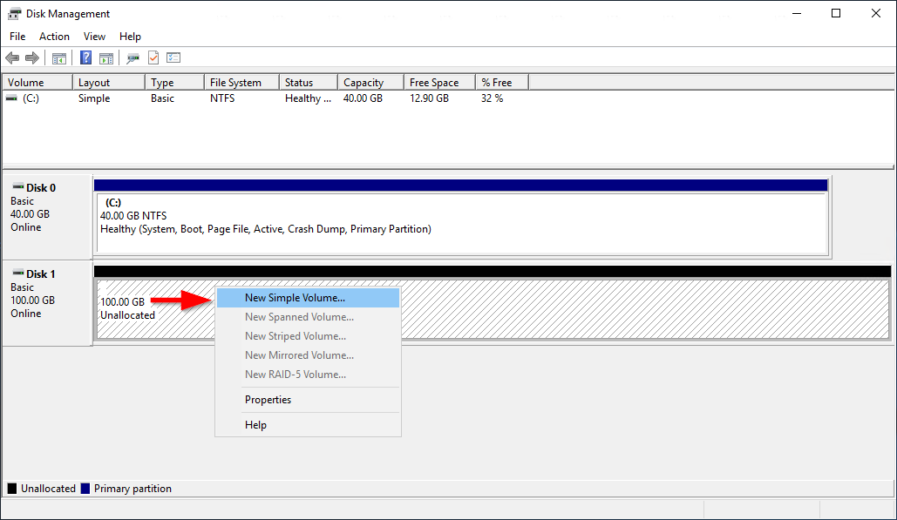
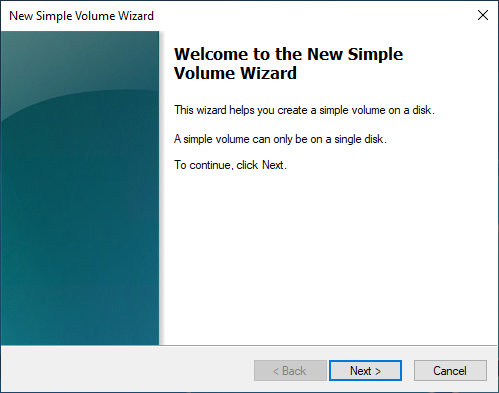
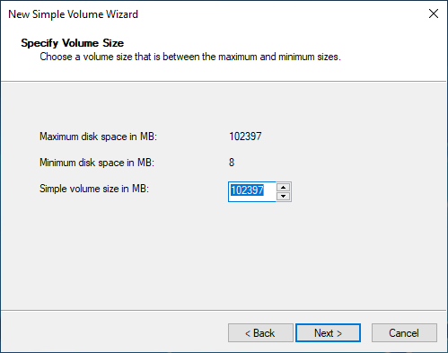
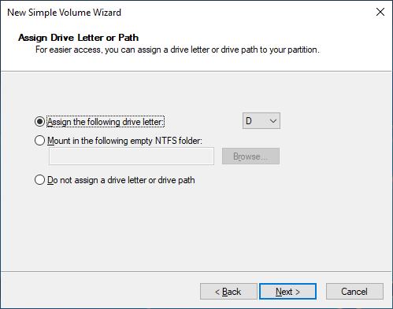
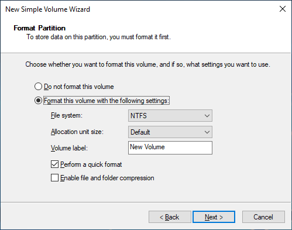
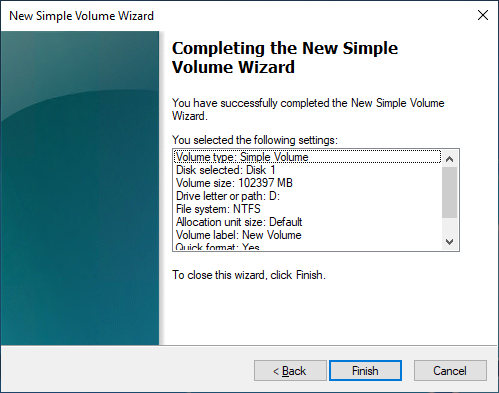

# Make an Amazon EBS volume available for use

After you attach an Amazon EBS volume to your instance it is exposed as a block device. You can
format the volume with any file system and then mount it. After you make the EBS volume available
for use, you can access it in the same ways that you access any other volume. Any data written
to this file system is written to the EBS volume and is transparent to applications using the
device.

You can take snapshots of your EBS volume for backup purposes or to use as a baseline when
you create another volume. For more information, see [Amazon EBS snapshots](ebs-snapshots.md "ebs-snapshots.md").

If the EBS volume you are preparing for use is greater than 2 TiB, you must use
a GPT partitioning scheme to access the entire volume. For more information, see [Amazon EBS volume constraints](volume_constraints.md "volume_constraints.md").

### Format and mount an attached volume

Suppose that you have an EC2 instance with an EBS volume for the root device,
`/dev/xvda`, and that you have just attached an empty EBS volume to the
instance using `/dev/sdf`. Use the following procedure to make the newly
attached volume available for use.

###### To format and mount an EBS volume on Linux

1. Connect to your instance using SSH. For more information, see [Connect to your Linux instance](../../../AWSEC2/latest/UserGuide/connect-to-linux-instance.md "../../../AWSEC2/latest/UserGuide/connect-to-linux-instance.md").
2. The device could be attached to the instance with a different device name than you
   specified in the block device mapping. For more information, see [device names on Linux instances](../../../AWSEC2/latest/UserGuide/device_naming.md "../../../AWSEC2/latest/UserGuide/device_naming.md"). Use the
   **lsblk** command to view your available disk devices and their mount
   points (if applicable) to help you determine the correct device name to use. The output
   of **lsblk** removes the `/dev/` prefix from full
   device paths.

The following is example output for an instance built on the
[Nitro System](../../../ec2/latest/instancetypes/ec2-nitro-instances.md "../../../ec2/latest/instancetypes/ec2-nitro-instances.md"), which exposes EBS volumes as NVMe
block devices. The root device is `/dev/nvme0n1`, which has two
partitions named `nvme0n1p1` and `nvme0n1p128`. The attached
volume is `/dev/nvme1n1`, which has no partitions and is not yet
mounted.

```
`[ec2-user ~]$` `lsblk``NAME MAJ:MIN RM SIZE RO TYPE MOUNTPOINT
nvme1n1 259:0 0 10G 0 disk
nvme0n1 259:1 0 8G 0 disk
-nvme0n1p1 259:2 0 8G 0 part /
-nvme0n1p128 259:3 0 1M 0 part`
```

The following is example output for a T2 instance. The root device is
`/dev/xvda`, which has one partition named `xvda1`. The
attached volume is `/dev/xvdf`, which has no partitions and is not
yet mounted.

```
`[ec2-user ~]$` `lsblk``NAME MAJ:MIN RM SIZE RO TYPE MOUNTPOINT
xvda 202:0 0 8G 0 disk
-xvda1 202:1 0 8G 0 part /
xvdf 202:80 0 10G 0 disk`
```

3. Determine whether there is a file system on the volume. New volumes are raw block
   devices, and you must create a file system on them before you can mount and use them.
   Volumes that were created from snapshots likely have a file system on them already; if
   you create a new file system on top of an existing file system, the operation overwrites
   your data.

Use one or both of the following methods to determine whether there is a file system
on the volume:

    * Use the **file -s** command to get information about a specific
     device, such as its file system type. If the output shows simply `data`,
     as in the following example output, there is no file system on the device


    ```
    `[ec2-user ~]$` `sudo file -s `/dev/xvdf```/dev/xvdf: data`
    ```

    If the device has a file system, the command shows information about the file
     system type. For example, the following output shows a root device with the XFS file
     system.


    ```
    `[ec2-user ~]$` `sudo file -s `/dev/xvda1```/dev/xvda1: SGI XFS filesystem data (blksz 4096, inosz 512, v2 dirs)`
    ```
    * Use the **lsblk -f** command to get information about all of the
     devices attached to the instance.


    ```
    `[ec2-user ~]$` `sudo lsblk -f`
    ```

    For example, the following output shows that there are three devices attached to
     the instances—`nvme1n1`, `nvme0n1`, and
     `nvme2n1`. The first column lists the devices and their partitions. The
     `FSTYPE` column shows the file system type for each device. If the
     column is empty for a specific device, it means that the device does not have a file
     system. In this case, device `nvme1n1` and partition
     `nvme0n1p1` on device `nvme0n1` are both formatted using the
     XFS file system, while device `nvme2n1` and partition
     `nvme0n1p128` on device `nvme0n1` do not have file
     systems.


    ```
    NAME		FSTYPE	LABEL	UUID						MOUNTPOINT
    nvme1n1	        xfs		7f939f28-6dcc-4315-8c42-6806080b94dd
    nvme0n1
    ├─nvme0n1p1	xfs	    /	90e29211-2de8-4967-b0fb-16f51a6e464c	        /
    └─nvme0n1p128
    nvme2n1
    ```

If the output from these commands show that there is no file system on the device,
you must create one. 4. (Conditional) If you discovered that there is a file system on the device in the
previous step, skip this step. If you have an empty volume, use the **mkfs
-t** command to create a file system on the volume.

###### Warning

Do not use this command if you're mounting a volume that already has data on it
(for example, a volume that was created from a snapshot). Otherwise, you'll format the
volume and delete the existing data.

```
`[ec2-user ~]$` `sudo mkfs -t xfs `/dev/xvdf``
```

If you get an error that `mkfs.xfs` is not found, use the
following command to install the XFS tools and then repeat the previous command:

```
`[ec2-user ~]$` `sudo yum install xfsprogs`
```

5. Use the **mkdir** command to create a mount point directory for the
   volume. The mount point is where the volume is located in the file system tree and where
   you read and write files to after you mount the volume. The following example creates a
   directory named `/data`.

```
`[ec2-user ~]$` `sudo mkdir `/data``
```

6. Mount the volume or partition at the mount point directory you created in the previous
   step.

If the volume has no partitions, use the following command and specify the device
name to mount the entire volume.

```
`[ec2-user ~]$` `sudo mount `/dev/xvdf` `/data``
```

If the volume has partitions, use the following command and specify the partition name to mount a partition.

```
`[ec2-user ~]$` `sudo mount `/dev/xvdf1` `/data``
```

7. Review the file permissions of your new volume mount to make sure that your users
   and applications can write to the volume. For more information about file permissions,
   see [File
   security](https://tldp.org/LDP/intro-linux/html/sect_03_04.html "https://tldp.org/LDP/intro-linux/html/sect_03_04.html") at _The Linux Documentation Project_.
8. The mount point is not automatically preserved after rebooting your instance. To
   automatically mount this EBS volume after reboot, follow the next procedure.

### Automatically mount an attached volume after

reboot

To mount an attached EBS volume on every system reboot, add an entry for the device to
the `/etc/fstab` file.

You can use the device name, such as `/dev/xvdf`, in
`/etc/fstab`, but we recommend using the device's 128-bit universally
unique identifier (UUID) instead. Device names can change, but the UUID persists throughout
the life of the partition. By using the UUID, you reduce the chances that the system becomes
unbootable after a hardware reconfiguration. For more information, see [Map Amazon EBS volumes to NVMe device names](identify-nvme-ebs-device.md "identify-nvme-ebs-device.md").

###### To mount an attached volume automatically after reboot

1. (Optional) Create a backup of your `/etc/fstab` file that you can
   use if you accidentally destroy or delete this file while editing it.

```
`[ec2-user ~]$` `sudo cp /etc/fstab /etc/fstab.orig`
```

2. Use the **blkid** command to find the UUID of the device. Make a note
   of the UUID of the device that you want to mount after reboot. You'll need it in the
   following step.

For example, the following command shows that there are two devices mounted to the
instance, and it shows the UUIDs for both devices.

```
`[ec2-user ~]$` `sudo blkid``/dev/xvda1: LABEL="/" UUID="**ca774df7-756d-4261-a3f1-76038323e572**" TYPE="xfs" PARTLABEL="Linux" PARTUUID="02dcd367-e87c-4f2e-9a72-a3cf8f299c10"
/dev/xvdf: UUID="**aebf131c-6957-451e-8d34-ec978d9581ae**" TYPE="xfs"`
```

For Ubuntu 18.04 use the lsblk command.

```
`[ec2-user ~]$` `sudo lsblk -o +UUID`
```

3. Open the `/etc/fstab` file using any text editor, such as
   **nano** or **vim**.

```
`[ec2-user ~]$` `sudo vim /etc/fstab`
```

4. Add the following entry to `/etc/fstab` to mount the device at
   the specified mount point. The fields are the UUID value returned by
   **blkid** (or **lsblk** for Ubuntu 18.04), the mount
   point, the file system, and the recommended file system mount options. For more
   information about the required fields, run `man fstab` to open the
   **fstab** manual.

In the following example, we mount the device with UUID
`aebf131c-6957-451e-8d34-ec978d9581ae` to mount point `/data`
and we use the `xfs` file system. We also use the `defaults` and
`nofail` flags. We specify `0` to prevent the file system from
being dumped, and we specify `2` to indicate that it is a non-root
device.

```
UUID=`aebf131c-6957-451e-8d34-ec978d9581ae`  `/data`  `xfs`  defaults,nofail  0  2
```

###### Note

If you ever boot your instance without this volume attached (for example, after
moving the volume to another instance), the `nofail` mount option enables
the instance to boot even if there are errors mounting the volume. Debian derivatives,
including Ubuntu versions earlier than 16.04, must also add the
`nobootwait` mount option. 5. To verify that your entry works, run the following commands to unmount the device
and then mount all file systems in `/etc/fstab`. If there are no
errors, the `/etc/fstab` file is OK and your file system will mount
automatically after it is rebooted.

```
`[ec2-user ~]$` `sudo umount `/data``
`[ec2-user ~]$` `sudo mount -a`
```

If you receive an error message, address the errors in the file.

###### Warning

Errors in the `/etc/fstab` file can render a system unbootable.
Do not shut down a system that has errors in the `/etc/fstab`
file.

If you are unsure how to correct errors in `/etc/fstab` and you
created a backup file in the first step of this procedure, you can restore from your
backup file using the following command.

```
`[ec2-user ~]$` `sudo mv /etc/fstab.orig /etc/fstab`
```

Use one of the following methods to make a volume available on a Windows instance.

PowerShell

###### To make all EBS volumes with raw partitions available to use with Windows

PowerShell

1. Log in to your Windows instance using Remote Desktop. For more information, see
   [Connect to your Windows instance](../../../AWSEC2/latest/UserGuide/connecting_to_windows_instance.md "../../../AWSEC2/latest/UserGuide/connecting_to_windows_instance.md").
2. On the taskbar, open the Start menu, and choose **Windows
   PowerShell**.
3. Use the provided series of Windows PowerShell commands within the opened
   PowerShell prompt. The script performs the following actions by default:
   1. Stops the ShellHWDetection service.
   2. Enumerates disks where the partition style is raw.
   3. Creates a new partition that spans the maximum size the disk and partition
      type will support.
   4. Assigns an available drive letter.
   5. Formats the file system as NTFS with the specified file system label.
   6. Starts the ShellHWDetection service again.

```
Stop-Service -Name ShellHWDetection
Get-Disk | Where PartitionStyle -eq 'raw' | Initialize-Disk -PartitionStyle `MBR` -PassThru | New-Partition -AssignDriveLetter -UseMaximumSize | Format-Volume -FileSystem NTFS -NewFileSystemLabel "`Volume Label`" -Confirm:$false
Start-Service -Name ShellHWDetection
```

DiskPart command line tool

###### To make an EBS volume available to use with the DiskPart command line

tool

1. Log in to your Windows instance using Remote Desktop. For more information, see
   [Connect to your Windows instance](../../../AWSEC2/latest/UserGuide/connecting_to_windows_instance.md "../../../AWSEC2/latest/UserGuide/connecting_to_windows_instance.md").
2. Determine the disk number that you want to make available:
   1. Open the Start menu, and select Windows PowerShell.
   2. Use the `Get-Disk` Cmdlet to retrieve a list of available
      disks.
   3. In the command output, note the **Number** corresponding to
      the disk that you're making available.

3. Create a script file to execute DiskPart commands:
   1. Open the Start menu, and select **File Explorer**.
   2. Navigate to a directory, such as C:\, to store the script file.
   3. Choose or right-click an empty space within the folder to open the dialog
      box, position the cursor over **New** to access the context
      menu, and then choose **Text Document**.
   4. Name the text file `diskpart.txt`.

4. Add the following commands to the script file. You may need to modify the disk
   number, partition type, volume label, and drive letter. The script performs the
   following actions by default:
   1. Selects disk 1 for modification.
   2. Configures the volume to use the master boot record (MBR) partition
      structure.
   3. Formats the volume as an NTFS volume.
   4. Sets the volume label.
   5. Assigns the volume a drive letter.

###### Warning

If you're mounting a volume that already has data on it, do not reformat the
volume or you will delete the existing data.

```
select disk `1`
attributes disk clear readonly
online disk noerr
convert `mbr`
create partition primary
format quick fs=ntfs label="`volume_label`"
assign letter="`drive_letter`"
```

For more information, see [DiskPart Syntax and Parameters](<https://learn.microsoft.com/en-us/previous-versions/windows/it-pro/windows-vista/cc766465(v=ws.10)#diskpart-syntax-and-parameters> "https://learn.microsoft.com/en-us/previous-versions/windows/it-pro/windows-vista/cc766465(v=ws.10)#diskpart-syntax-and-parameters"). 5. Open a command prompt, navigate to the folder in which the script is located,
and run the following command to make a volume available for use on the specified
disk:

```
`C:\>` diskpart /s diskpart.txt
```

Disk Management utility

###### To make an EBS volume available to use with the Disk Management utility

1. Log in to your Windows instance using Remote Desktop. For more information, see
   [Connect to your Windows instance](../../../AWSEC2/latest/UserGuide/connecting_to_windows_instance.md "../../../AWSEC2/latest/UserGuide/connecting_to_windows_instance.md").
2. Start the Disk Management utility. On the taskbar, open the context
   (right-click) menu for the Windows logo, and choose **Disk
   Management**.

###### Note

In Windows Server 2008, choose **Start**,
**Administrative Tools**, **Computer
Management**, **Disk Management**. 3. Bring the volume online. In the lower pane, open the context (right-click) menu
for the left panel for the disk for the EBS volume. Choose
**Online**.

 4. (Conditional) If the disk is not initialized, you must initialize it before you
can use it. If the disk is already initialized, skip this step.

###### Warning

If you're mounting a volume that already has data on it (for example, a public
data set, or a volume that you created from a snapshot), do not reformat the
volume or you will delete the existing data.

If the disk is not initialized, initialize it as follows:

    1. Open the context (right-click) menu for the left panel for the disk, and
     choose **Initialize Disk**.


    
    2. In the **Initialize Disk** dialog box, select a partition
     style, and choose **OK**.


    

5. Open the context (right-click) menu for the right panel for the disk, and choose
   **New Simple Volume**.

 6. In the **New Simple Volume Wizard**, choose
**Next**.

 7. If you want to change the default maximum value, specify the **Simple
volume size in MB**, and then choose **Next.**

 8. Specify a preferred drive letter, if necessary, within the **Assign the
following drive letter** dropdown, and then choose
**Next.**

 9. Specify a **Volume Label** and adjust the default settings as
necessary, and then choose **Next.**

 10. Review your settings, and then choose **Finish** to apply the
modifications and close the New Simple Volume wizard.


