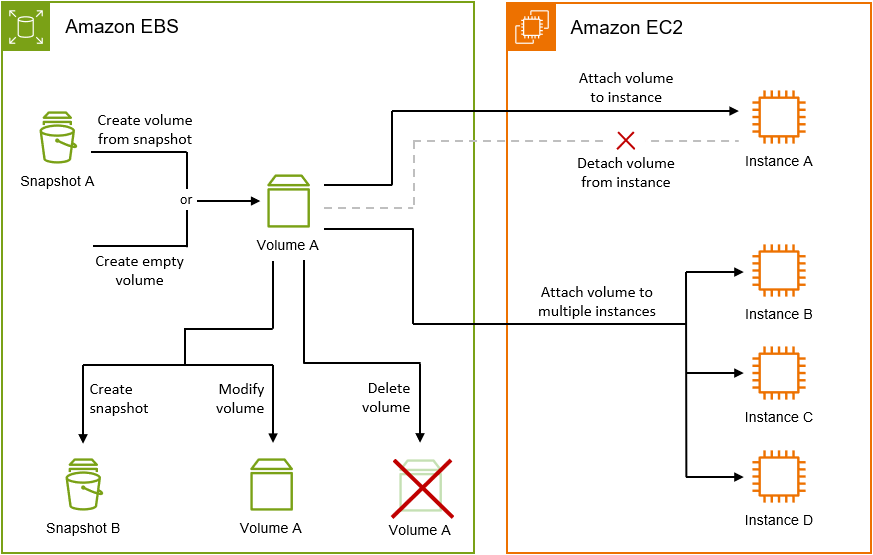

# Amazon EBS volume lifecycle

The lifecycle of an Amazon EBS volume starts with the creation process. You can create a volume
from an Amazon EBS snapshot or you can create an empty volume. Before you can use your volume, you
must attach it to one or more Amazon EC2 instances that are in the same Availability Zone as the
volume. You can attach multiple volumes to an instance. If needed, you can detach a volume
from one instance and then attach it to another instance. If your storage requirements change,
you can modify the size or performance of the volume at any time. You can create point-in-time
backups of your volumes by creating Amazon EBS snapshots. If you no longer need a volume, you can
delete it to stop incurring the related storage costs.

The following image shows actions that you can perform on your volumes as part of the
volume lifecycle. There are also tasks that you perform by connecting to the instance and running an
operating system command. For example, formatting the volume, mounting the volume, managing
partitions, and viewing the free disk space.

###### Tasks

- [Create a volume](ebs-creating-volume.md "ebs-creating-volume.md")
- [Copy a volume](ebs-copying-volume.md "ebs-copying-volume.md")
- [Attach a volume to an instance](ebs-attaching-volume.md "ebs-attaching-volume.md")
- [Attach a volume to multiple instances](ebs-volumes-multi.md "ebs-volumes-multi.md")
- [Make a volume available for use](ebs-using-volumes.md "ebs-using-volumes.md")
- [View volume details](ebs-describing-volumes.md "ebs-describing-volumes.md")
- [Modify a volume](ebs-modify-volume.md "ebs-modify-volume.md")
- [Detach a volume from an instance](ebs-detaching-volume.md "ebs-detaching-volume.md")
- [Delete a volume](ebs-deleting-volume.md "ebs-deleting-volume.md")
