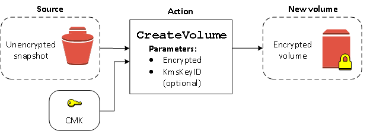
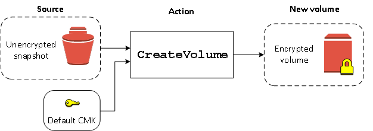
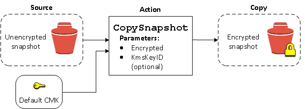
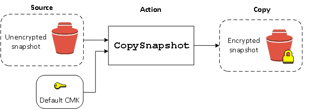
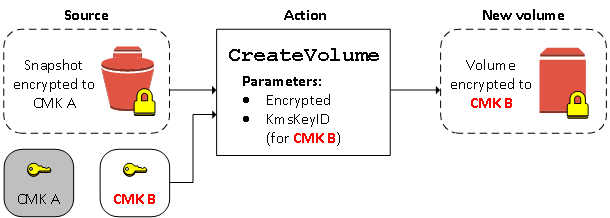
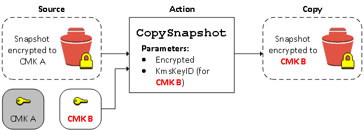

# Amazon EBS encryption examples

When you create an encrypted EBS resource, it is encrypted by your account's
default KMS key for EBS encryption unless you specify a different customer managed key in the
volume creation parameters or the block device mapping for the AMI
or instance.

The following examples illustrate how you can manage the encryption state of your
volumes and snapshots. For a full list of encryption cases, see the [encryption outcomes table](#ebs-volume-encryption-outcomes "#ebs-volume-encryption-outcomes").

###### Examples

- [Restore an unencrypted volume (encryption by
  default not enabled)](#volume-account-off "#volume-account-off")
- [Restore an unencrypted volume (encryption by
  default enabled)](#volume-account-on "#volume-account-on")
- [Copy an unencrypted snapshot (encryption by
  default not enabled)](#snapshot-account-off "#snapshot-account-off")
- [Copy an unencrypted snapshot (encryption
  by default enabled)](#snapshot-account-on "#snapshot-account-on")
- [Re-encrypt an encrypted volume](#reencrypt-volume "#reencrypt-volume")
- [Re-encrypt an encrypted snapshot](#reencrypt-snapshot "#reencrypt-snapshot")
- [Migrate data between encrypted
  and unencrypted volumes](#migrate-data-encrypted-unencrypted "#migrate-data-encrypted-unencrypted")
- [Encryption outcomes](#ebs-volume-encryption-outcomes "#ebs-volume-encryption-outcomes")

## Restore an unencrypted volume (encryption by

default not enabled)

Without encryption by default enabled, a volume restored from an unencrypted
snapshot is unencrypted by default. However, you can encrypt the resulting
volume by setting the `Encrypted` parameter and, optionally, the
`KmsKeyId` parameter. The following diagram illustrates the
process.



If you leave out the `KmsKeyId` parameter, the resulting volume is
encrypted using your default KMS key for EBS encryption. You must specify a KMS key ID to encrypt the volume to
a different KMS key.

For more information, see [Create an Amazon EBS volume](ebs-creating-volume.md "ebs-creating-volume.md").

## Restore an unencrypted volume (encryption by

default enabled)

When you have enabled encryption by default, encryption is mandatory for
volumes restored from unencrypted snapshots, and no encryption parameters are
required for your default KMS key to be used. The following diagram shows this
simple default case:



If you want to encrypt the restored volume to a symmetric customer managed encryption key,
you must supply both the `Encrypted` and `KmsKeyId` parameters
as shown in [Restore an unencrypted volume (encryption by
default not enabled)](#volume-account-off "#volume-account-off").

## Copy an unencrypted snapshot (encryption by

default not enabled)

Without encryption by default enabled, a copy of an unencrypted snapshot is
unencrypted by default. However, you can encrypt the resulting snapshot by setting
the `Encrypted` parameter and, optionally, the `KmsKeyId`
parameter. If you omit `KmsKeyId`, the resulting snapshot is encrypted by
your default KMS key. You must specify a KMS key ID to encrypt the volume to a different
symmetric encryption KMS key.

The following diagram illustrates the process.



You can encrypt an EBS volume by copying an unencrypted snapshot to an
encrypted snapshot and then creating a volume from the encrypted snapshot.
For more information, see [Copy an Amazon EBS snapshot](ebs-copy-snapshot.md "ebs-copy-snapshot.md").

## Copy an unencrypted snapshot (encryption

by default enabled)

When you have enabled encryption by default, encryption is
mandatory for copies of unencrypted snapshots, and no encryption parameters are
required if your default KMS key is used. The following diagram illustrates this
default case:



## Re-encrypt an encrypted volume

When the `CreateVolume` action operates on an encrypted snapshot,
you have the option of re-encrypting it with a different KMS key. The following
diagram illustrates the process. In this example, you own two KMS keys, KMS key A and
KMS key B. The source snapshot is encrypted by KMS key A. During volume creation, with
the KMS key ID of KMS key B specified as a parameter, the source data is automatically
decrypted, then re-encrypted by KMS key B.



For more information, see [Create an Amazon EBS volume](ebs-creating-volume.md "ebs-creating-volume.md").

## Re-encrypt an encrypted snapshot

The ability to encrypt a snapshot during copying allows you to apply a new
symmetric encryption KMS key to an already-encrypted snapshot that you own. Volumes restored from
the resulting copy are only accessible using the new KMS key. The following diagram
illustrates the process. In this example, you own two KMS keys, KMS key A and KMS key B. The
source snapshot is encrypted by KMS key A. During copy, with the KMS key ID of KMS key B
specified as a parameter, the source data is automatically re-encrypted by KMS key
B.



In a related scenario, you can choose to apply new encryption parameters to a
copy of a snapshot that has been shared with you. By default, the copy is
encrypted with a KMS key shared by the snapshot's owner. However, we recommend that
you create a copy of the shared snapshot using a different KMS key that you control.
This protects your access to the volume if the original KMS key is compromised, or
if the owner revokes the KMS key for any reason. For more information, see [Encryption and snapshot copying](ebs-copy-snapshot.md#creating-encrypted-snapshots "ebs-copy-snapshot.md#creating-encrypted-snapshots").

## Migrate data between encrypted

and unencrypted volumes

When you have access to both an encrypted and unencrypted volume, you can freely
transfer data between them. EC2 carries out the encryption and decryption operations
transparently.

For example, use the **rsync** command to copy the data.
In the following command, the source data is located in `/mnt/source`
and the destination volume is mounted at `/mnt/destination`.

```
`[ec2-user ~]$` `sudo rsync -avh --progress `/mnt/source/` `/mnt/destination/``
```

For example, use the **robocopy** command to copy the
data. In the following command, the source data is located in `D:\`
and the destination volume is mounted at `E:\`.

```
`PS C:\>` `robocopy `D:\sourcefolder` `E:\destinationfolder` /e /copyall /eta`
```

We recommend using folders rather than copying an entire volume, as
this avoids potential problems with hidden folders.

## Encryption outcomes

The following table describes the encryption outcome for each possible combination of settings.

| Is encryption enabled? | Is encryption by default enabled? | Source of volume                             | Default (no customer managed key specified) | Custom (customer managed key specified)           |
| ---------------------- | --------------------------------- | -------------------------------------------- | ------------------------------------------- | ------------------------------------------------- |
| No                     | No                                | New (empty) volume                           | Unencrypted                                 | N/A                                               |
| No                     | No                                | Unencrypted snapshot that you own            | Unencrypted                                 |
| No                     | No                                | Encrypted snapshot that you own              | Encrypted by same key                       |
| No                     | No                                | Unencrypted snapshot that is shared with you | Unencrypted                                 |
| No                     | No                                | Encrypted snapshot that is shared with you   | Encrypted by default customer managed key\* |
| Yes                    | No                                | New volume                                   | Encrypted by default customer managed key   | Encrypted by a specified customer managed key\*\* |
| Yes                    | No                                | Unencrypted snapshot that you own            | Encrypted by default customer managed key   |
| Yes                    | No                                | Encrypted snapshot that you own              | Encrypted by same key                       |
| Yes                    | No                                | Unencrypted snapshot that is shared with you | Encrypted by default customer managed key   |
| Yes                    | No                                | Encrypted snapshot that is shared with you   | Encrypted by default customer managed key   |
| No                     | Yes                               | New (empty) volume                           | Encrypted by default customer managed key   | N/A                                               |
| No                     | Yes                               | Unencrypted snapshot that you own            | Encrypted by default customer managed key   |
| No                     | Yes                               | Encrypted snapshot that you own              | Encrypted by same key                       |
| No                     | Yes                               | Unencrypted snapshot that is shared with you | Encrypted by default customer managed key   |
| No                     | Yes                               | Encrypted snapshot that is shared with you   | Encrypted by default customer managed key   |
| Yes                    | Yes                               | New volume                                   | Encrypted by default customer managed key   | Encrypted by a specified customer managed key     |
| Yes                    | Yes                               | Unencrypted snapshot that you own            | Encrypted by default customer managed key   |
| Yes                    | Yes                               | Encrypted snapshot that you own              | Encrypted by same key                       |
| Yes                    | Yes                               | Unencrypted snapshot that is shared with you | Encrypted by default customer managed key   |
| Yes                    | Yes                               | Encrypted snapshot that is shared with you   | Encrypted by default customer managed key   |

\* This is the default customer managed key used for EBS encryption for the AWS account and Region.
By default this is a unique AWS managed key for EBS, or you can specify a customer managed key.

\*\* This is a customer managed key specified for the volume at launch time. This
customer managed key is used instead of the default customer managed key for the AWS account and Region.
