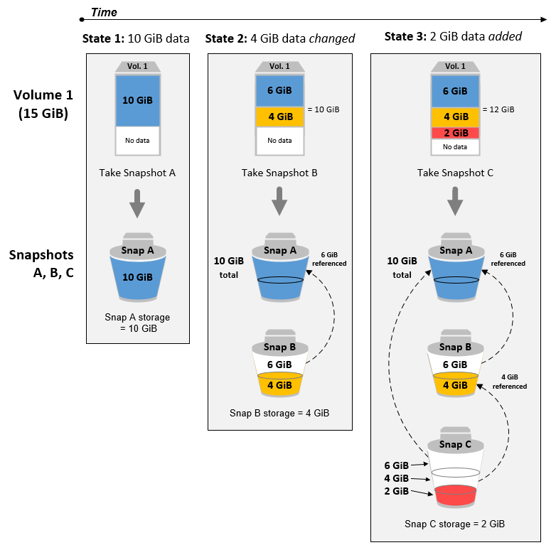
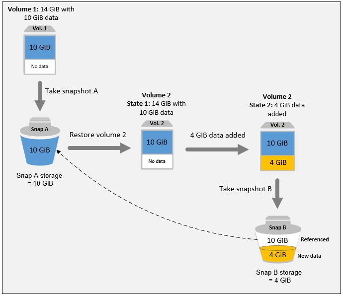

# How Amazon EBS snapshots work

The first snapshot that you create from a volume is always a _full
snapshot_. It includes all of the data blocks written to the volume at the
time of creating the snapshot. Subsequent snapshots of the same volume are
_incremental snapshots_. They include only changed and new
data blocks written to the volume since the last snapshot was created

The size of a full snapshot is determined by the size of the data being backed
up, not the size of the source volume. Similarly, the storage costs associated
with a full snapshot is determined by the size of the snapshot, not the size of
the source volume. For example, you create the first snapshot of a `200 GiB`
Amazon EBS volume that contains only `50 GiB` of data. This results in a
full snapshot that is `50 GiB` in size, and you are billed for
`50 GiB` snapshot storage.

Similarly, the size and storage costs of an incremental snapshot are determined
by the size of any data that was written to the volume since the previous snapshot
was created. Continuing the previous example, if you create a second snapshot of the
same `200 GiB` volume after changing `20 GiB` of data and adding
`10 GiB` of data, the incremental snapshot is `30 GiB` in
size. You are then billed for that additional `30 GiB` snapshot storage.

For more information about snapshot pricing, see [Amazon EBS pricing](https://aws.amazon.com/ebs/pricing/ "https://aws.amazon.com/ebs/pricing/").

###### Important

When you archive an incremental snapshot, it is converted to a full snapshot
that includes all of the blocks written to the volume at the time that the snapshot
was created. It is then moved to the Amazon EBS Snapshots Archive tier. Snapshots in
the archive tier are billed at a different rate from snapshots in the standard tier.
For more information, see [Pricing and billing for archiving Amazon EBS snapshots](snapshot-archive-pricing.md "snapshot-archive-pricing.md").

The following sections show how an EBS snapshot captures the state of a volume at
a point in time, and how subsequent snapshots of a changing volume create a history of
those changes.

Multiple snapshots of the same volume

The diagram in this section shows Volume 1, which is `15 GiB` in size,
at three points in time. A snapshot is taken of each of these three volume states. The
diagram specifically shows the following:

- In **State 1**, the volume has `10 GiB` of data.
  **Snap A** is the first snapshot taken of the volume.
  **Snap A** is a full snapshot and the entire `10 GiB`
  of data is backed up.
- In **State 2**, the volume still contains `10 GiB`
  of data, but only `4 GiB` have changed after **Snap A**
  was taken. **Snap B** is an incremental snapshot. It needs to
  back up only the `4 GiB` that changed. The other `6 GiB` of unchanged
  data, which are already backed up in **Snap A**, are
  _referenced_ by **Snap B** rather than being
  backed up again. This is indicated by the dashed arrow.
- In **State 3**, `2 GiB` of data have been added to
  the volume, for a total of `12 GiB`, after **Snap B**
  was taken. **Snap C** is an incremental snapshot. It needs to back
  up only the `2 GiB` that were added after **Snap B** was
  taken. As shown by the dashed arrows, **Snap C** also references
  the `4 GiB` of data stored in **Snap B**, and the
  `6 GiB` of data stored in **Snap A**.
- The total storage required for the three snapshots is `16 GiB` total. This
  accounts for 10 GiB for Snap A, 4 GiB for Snap B, and 2 GiB for Snap C.

Incremental snapshots of different volumes

The diagram in this section shows how incremental snapshots can be taken from different
volumes.

1. **Vol 1**, which is `14 GiB` in size, has
   `10 GiB` of data. Because **Snap A** is the first
   snapshot taken of the volume, it is a full snapshot and the entire `10 GiB`
   of data is backed up.
2. **Vol 2** is created from **Snap
   A**, so it is an exact replica of **Vol 1** at
   the time the snapshot was taken.
3. Over time, `4 GiB` of data is added to **Vol 2**
   and the total size of its data is `14 GiB`.
4. **Snap B** is taken from **Vol
   2**. For **Snap B**, only the `4 GiB`
   of data that was added after the volume was created from **Snap
   A** is backed up. The other `10 GiB` of unchanged data, which
   is already stored in **Snap A**, is referenced by
   **Snap B** instead of being backed up again.

**Snap B** is an incremental snapshot of **Snap A**, even though it was created from a different volume.

###### Important

The diagram assumes that you own **Vol 1** and
**Snap A**, and that **Vol 2**
is encrypted with the same KMS key as Vol 1. If **Vol 1**
was owned by another AWS account and that account took **Snap
A** and shared it with you, then **Snap B**
would be a full snapshot. Or, if **Vol 2** was encrypted
with a different KMS key than **Vol 1**, then
**Snap B** would be a full snapshot.

For more information about how data is managed when you delete a snapshot, see [Delete an Amazon EBS snapshot](ebs-deleting-snapshot.md "ebs-deleting-snapshot.md").
