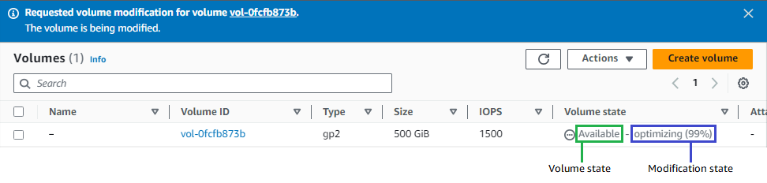

# Monitor the progress of Amazon EBS volume modifications

When you modify an EBS volume, it goes through a sequence of states. The volume enters the
`modifying` state, the `optimizing` state, and finally the
`completed` state. At this point, the volume is ready to be further modified.

While the volume is in the `optimizing` state, your volume performance is in
between the source and target configuration specifications. Transitional volume performance
will be no less than the source volume performance. If you are downgrading IOPS, transitional
volume performance is no less than the target volume performance.

Volume modification changes take effect as follows:

- Size changes usually take a few seconds to complete and take effect after the volume
  has transitioned to the `Optimizing` state.
- Performance (IOPS) changes can take from a few minutes to a few hours to complete and
  are dependent on the configuration change being made.
- In some cases, it can take more than 24 hours for a new configuration to take effect,
  such as when the volume has not been fully initialized. Typically, a fully used 1-TiB
  volume takes about 6 hours to migrate to a new performance configuration.
  The possible volume states are `creating`, `available`,
  `in-use`, `deleting`, `deleted`, and
  `error`.

The possible modification states are `modifying`, `optimizing`,
and `completed`.

Console

###### To monitor progress of a modification

1. Open the Amazon EC2 console at
   [https://console.aws.amazon.com/ec2/](https://console.aws.amazon.com/ec2/ "https://console.aws.amazon.com/ec2/").
2. In the navigation pane, choose **Volumes**.
3. Select the volume.
4. The **Volume state** column and the **Volume state**
   field in the **Details** tab contain information in the following format:
   `Volume state` - `Modification state`
   (`Modification progress`%). The following image shows the volume and volume
   modification states.



After the modification completes, only the volume state is displayed. The modification
state and progress are no longer displayed.

Alternatively, you can use Amazon EventBridge to create a notification rule for volume
modification events. For more information, see [Getting started with Amazon EventBridge](../../../eventbridge/latest/userguide/eb-get-started.md "../../../eventbridge/latest/userguide/eb-get-started.md").

AWS CLI

###### To monitor progress of a modification

Use the [describe-volumes-modifications](../../../cli/latest/reference/ec2/describe-volumes-modifications.md "../../../cli/latest/reference/ec2/describe-volumes-modifications.md") command to view the progress of one or more
volume modifications. The following example describes the volume modifications for two
volumes.

```
aws ec2 describe-volumes-modifications \
    --volume-ids `vol-11111111111111111` `vol-22222222222222222`
```

In the following example output, the volume modifications are still in the
`modifying` state. Progress is reported as a percentage.

```
{
    "VolumesModifications": [
        {
            "TargetSize": 200,
            "TargetVolumeType": "io1",
            "ModificationState": "modifying",
            "VolumeId": "vol-11111111111111111",
            "TargetIops": 10000,
            "StartTime": "2017-01-19T22:21:02.959Z",
            "Progress": 0,
            "OriginalVolumeType": "gp2",
            "OriginalIops": 300,
            "OriginalSize": 100
        },
        {
            "TargetSize": 2000,
            "TargetVolumeType": "sc1",
            "ModificationState": "modifying",
            "VolumeId": "vol-22222222222222222",
            "StartTime": "2017-01-19T22:23:22.158Z",
            "Progress": 0,
            "OriginalVolumeType": "gp2",
            "OriginalIops": 300,
            "OriginalSize": 1000
        }
    ]
}
```

The next example describes all volumes with a modification state of either
`optimizing` or `completed`, and then filters and formats the
results to show only modifications that were initiated on or after February 1,
2017:

```
aws ec2 describe-volumes-modifications \
    --filters Name=modification-state,Values="optimizing","completed" \
    --query "VolumesModifications[?StartTime>='2017-02-01'].{ID:VolumeId,STATE:ModificationState}"
```

The following is example output with information about two volumes:

```
[
    {
        "STATE": "optimizing",
        "ID": "vol-06397e7a0eEXAMPLE"
    },
    {
        "STATE": "completed",
        "ID": "vol-ba74e18c2aEXAMPLE"
    }
]
```

PowerShell

###### To monitor progress of a modification

Use the [Get-EC2VolumeModification](../../../powershell/latest/reference/items/Get-EC2VolumeModification.md "../../../powershell/latest/reference/items/Get-EC2VolumeModification.md") cmdlet. The following example describes the
volume modifications for two volumes.

```
Get-EC2VolumeModification `
    -VolumeId `vol-11111111111111111` `vol-22222222222222222`
```

###### Note

Rarely, a transient AWS fault can result in a `failed` state. This is not
an indication of volume health; it merely indicates that the modification to the volume
failed. If this occurs, retry the volume modification.
