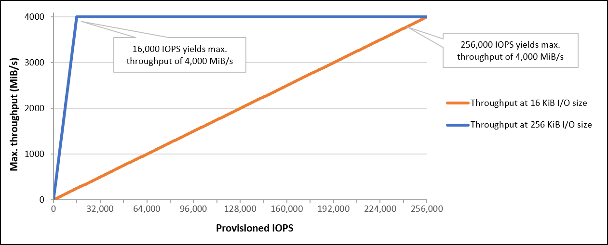
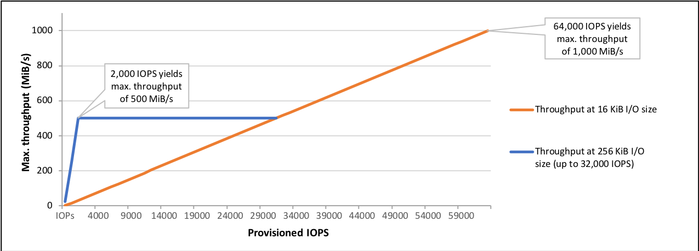

# Amazon EBS Provisioned IOPS SSD volumes

Provisioned IOPS SSD volumes are backed by solid-state drives (SSDs). They are the highest performance
Amazon EBS storage volumes designed for critical, IOPS-intensive, and throughput-intensive workloads
that require low latency. Provisioned IOPS SSD volumes deliver their provisioned IOPS performance 99.9
percent of the time.

###### Amazon EBS offers two types of Provisioned IOPS SSD volumes:

- [Provisioned IOPS SSD (io2) Block Express volumes](#io2-block-express "#io2-block-express")
- [Provisioned IOPS SSD (io1) volumes](#EBSVolumeTypes_piops "#EBSVolumeTypes_piops")

## Provisioned IOPS SSD (`io2`) Block Express volumes

`io2` Block Express volumes are built on the next generation of Amazon EBS storage server architecture.
It has been built for the purpose of meeting the performance requirements of the most demanding
I/O intensive applications that run on [instances built on the Nitro System](../../../ec2/latest/instancetypes/ec2-nitro-instances.md "../../../ec2/latest/instancetypes/ec2-nitro-instances.md"). With the highest durability and lowest latency, Block Express is ideal
for running performance-intensive, mission-critical workloads, such as Oracle, SAP HANA,
Microsoft SQL Server, and SAS Analytics.

Block Express architecture increases performance and scale of `io2` volumes. Block Express
servers communicate with [Nitro-based instances](../../../ec2/latest/instancetypes/ec2-nitro-instances.md "../../../ec2/latest/instancetypes/ec2-nitro-instances.md") using the Scalable Reliable Datagram (SRD) networking protocol.
This interface is implemented in the Nitro Card dedicated for Amazon EBS I/O function on the host
hardware of the instance. It minimizes I/O delay and latency variation (network jitter), which
provides faster and more consistent performance for your applications.

`io2` Block Express volumes are designed to provide 99.999 percent volume durability with an annual
failure rate (AFR) no higher than 0.001 percent, which translates to a single volume failure per
100,000 running volumes over a one-year period. `io2` Block Express volumes are suited for workloads that
benefit from a single volume that provides consistent sub-millisecond latency, and supports higher
IOPS and throughput than gp3 volumes.

When attached to [Nitro-based instances](../../../ec2/latest/instancetypes/ec2-nitro-instances.md "../../../ec2/latest/instancetypes/ec2-nitro-instances.md"), `io2` Block Express volumes are designed to deliver an average
latency of under 500 microseconds for 16KiB I/O operations. `io2` Block Express volumes also deliver
better outlier latency compared to General Purpose volumes, reducing the frequency of I/Os
exceeding 800 microseconds by over 10 times.

###### Topics

- [Considerations](#io2-bx-considerations "#io2-bx-considerations")
- [Performance](#io2-bx-perf "#io2-bx-perf")

### Considerations

- `io2` Block Express volumes are available in all AWS Regions, including the AWS GovCloud (US) Regions and China Regions.
- As of **April 30, 2025**, all new and previously created `io2`
  volumes are `io2` Block Express volumes.
- [Nitro-based instances](../../../ec2/latest/instancetypes/ec2-nitro-instances.md "../../../ec2/latest/instancetypes/ec2-nitro-instances.md") support volumes provisioned with up to 256,000 IOPS. Other instance
  types can be attached to volumes provisioned with up to 64,000 IOPS, but can achieve up to 32,000
  IOPS.

### Performance

`io2` Block Express volumes have the following characteristics:

- Average latency under 500 microseconds for 16KiB I/O size. Better outlier latency compared
  to General Purpose volumes, reducing the frequency of I/Os exceeding 800 microseconds by over 10 times.
- Storage capacity up to 64 TiB (65,536 GiB).
- Provisioned IOPS up to 256,000, with an IOPS:GiB ratio of 1,000:1. Maximum IOPS can be
  provisioned with volumes 256 GiB and larger (1,000 IOPS × 256 GiB = 256,000 IOPS).

###### Note

You can achieve up to 256,000 IOPS with [Nitro-based instances](../../../ec2/latest/instancetypes/ec2-nitro-instances.md "../../../ec2/latest/instancetypes/ec2-nitro-instances.md"). On other instances, you can achieve up to 32,000 IOPS.

- Volume throughput up to 4,000 MiB/s. Throughput scales proportionally at a rate of 0.256
  MiB/s per provisioned IOPS. Maximum throughput can be achieved at 16,000 IOPS or higher.

## Provisioned IOPS SSD (`io1`) volumes

Provisioned IOPS SSD (`io1`) volumes are designed to meet the needs of I/O-intensive workloads,
particularly database workloads, that are sensitive to storage performance and
consistency. Provisioned IOPS SSD volumes use a consistent IOPS rate, which you specify when you create
the volume, and Amazon EBS delivers the provisioned performance 99.9 percent of the
time.

`io1` volumes are designed to provide 99.8 percent to 99.9 percent volume durability
with an annual failure rate (AFR) no higher than 0.2 percent, which translates to a
maximum of two volume failures per 1,000 running volumes over a one-year period.

`io1` volumes are available for all Amazon EC2 instance types.

###### Performance

`io1` volumes can range in size from 4 GiB to 16 TiB and you can provision
from 100 IOPS up to 64,000 IOPS per volume. The maximum ratio of
provisioned IOPS to requested volume size (in GiB) is 50:1. For example, a
100 GiB `io1` volume can be provisioned with up to 5,000 IOPS.

The maximum IOPS can be provisioned for volumes that are 1,280 GiB or larger (50 ×
1,280 GiB = 64,000 IOPS).

- `io1` volumes provisioned with up to 32,000 IOPS support a maximum I/O size of 256
  KiB and yield as much as 500 MiB/s of throughput. With the I/O size at the maximum, peak
  throughput is reached at 2,000 IOPS.
- `io1` volumes provisioned with more than 32,000 IOPS (up to the maximum of 64,000
  IOPS) yield a linear increase in throughput at a rate of 16 KiB per provisioned IOPS.
  For example, a volume provisioned with 48,000 IOPS can support up to 750 MiB/s of
  throughput (16 KiB per provisioned IOPS × 48,000 provisioned IOPS = 750 MiB/s).
- To achieve the maximum throughput of 1,000 MiB/s, a volume must be provisioned
  with 64,000 IOPS (16 KiB per provisioned IOPS × 64,000 provisioned IOPS = 1,000 MiB/s).
- You can achieve up to 64,000 IOPS only on [Nitro-based instances](../../../ec2/latest/instancetypes/ec2-nitro-instances.md "../../../ec2/latest/instancetypes/ec2-nitro-instances.md"). On other instances, you can achieve up to 32,000 IOPS.

.
The following graph illustrates these performance characteristics:

Your per-I/O latency experience depends on the provisioned IOPS and on your workload
profile. For the best I/O latency experience, ensure that you provision IOPS to meet the
I/O profile of your workload.
