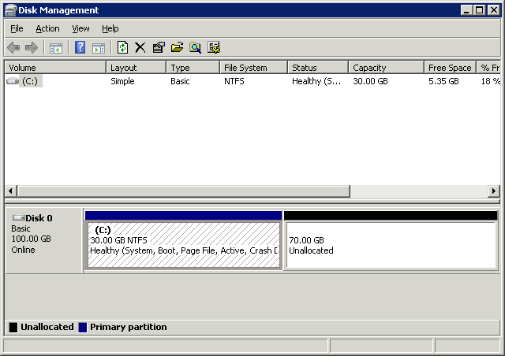
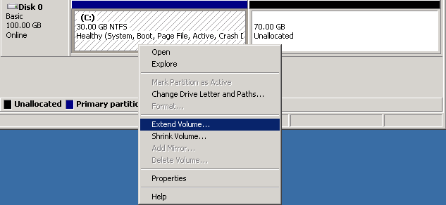
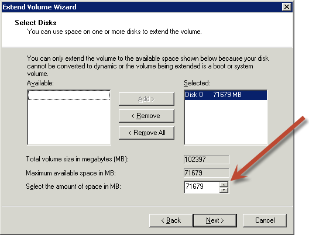
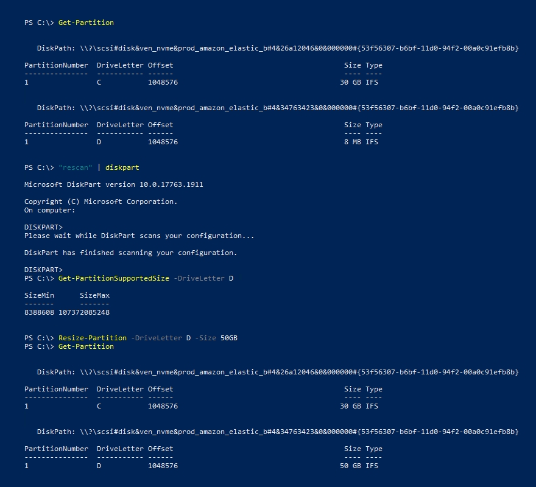
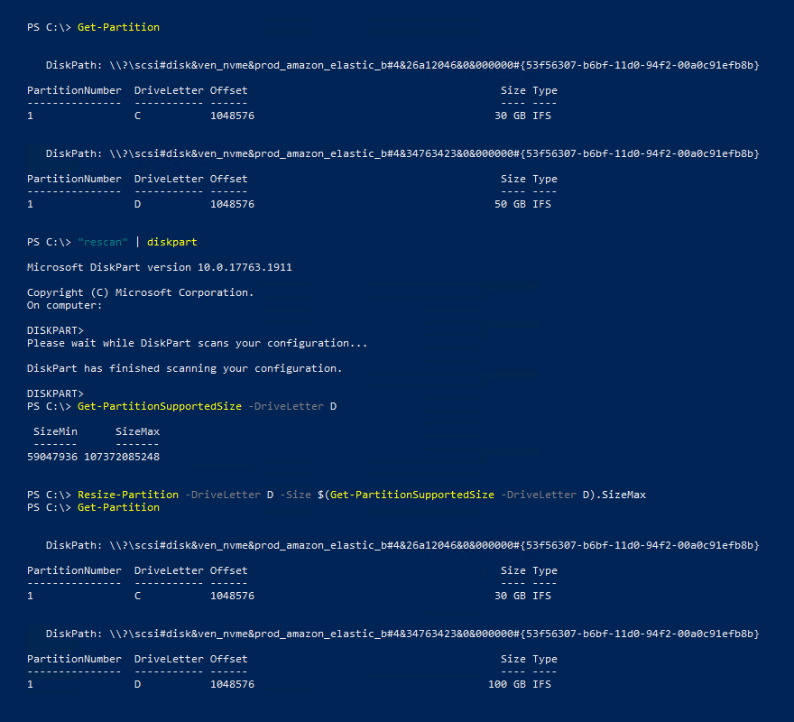

# Extend the file system after resizing an Amazon EBS volume

After you [increase the size of an EBS
volume](requesting-ebs-volume-modifications.md "requesting-ebs-volume-modifications.md"), you must extend the partition and file system to the new, larger size. You can
do this as soon as the volume enters the `optimizing` state.

## Before you begin

- Create a snapshot of the volume, in case you need to roll back your changes. For more
  information, see [Create Amazon EBS snapshots](ebs-creating-snapshot.md "ebs-creating-snapshot.md").
- Confirm that the volume modification succeeded and that it is in the`optimizing`
  or `completed` state. For more information, see [Monitor the progress of Amazon EBS volume modifications](monitoring-volume-modifications.md "monitoring-volume-modifications.md").
- Ensure that the volume is attached to the instance and that it is formatted and mounted.
  For more information, see [Format and mount an attached volume](ebs-using-volumes.md#ebs-format-mount-volume "ebs-using-volumes.md#ebs-format-mount-volume").
- (_Linux instances only_) If you are using logical volumes
  on the Amazon EBS volume, you must use Logical Volume Manager (LVM) to extend the logical volume.
  For instructions about how to do this, see the **Extend the LV**
  section in the article [How do I use LVM to create a logical volume on an EBS volume's partition?](https://repost.aws/knowledge-center/create-lv-on-ebs-partition "https://repost.aws/knowledge-center/create-lv-on-ebs-partition").

###### Note

The following instructions walk you through the process of extending **XFS** and **Ext4** file systems for Linux. For
information about extending a different file system, see its documentation.

Before you can extend a file system on Linux, you must extend the partition,
if your volume has one.

### Extend the file system of EBS volumes

Use the following procedure to extend the file system for a resized volume.

Note that device and partition naming differs for Xen instances and instances built
on the Nitro System. To determine whether your instance is Xen-based or Nitro-based,
see [Amazon EC2 hypervisor type](../../../AWSEC2/latest/UserGuide/instance-types.md#instance-hypervisor-type "../../../AWSEC2/latest/UserGuide/instance-types.md#instance-hypervisor-type").

###### To extend the file system of EBS volumes

1.  [Connect to your instance](../../../AWSEC2/latest/UserGuide/connect-to-linux-instance.md "../../../AWSEC2/latest/UserGuide/connect-to-linux-instance.md").
2.  Resize the partition, if needed. To do so:
    1. Check whether the volume has a partition. Use the **lsblk**
       command.

    Nitro instance example
    In the following example output, the root volume (`nvme0n1`)
    has two partitions (`nvme0n1p1` and `nvme0n1p128`),
    while the additional volume (`nvme1n1`) has no partitions.

    ```
    `[ec2-user ~]$` `sudo lsblk``NAME MAJ:MIN RM SIZE RO TYPE MOUNTPOINT
    nvme1n1 259:0 0 30G 0 disk /data
    nvme0n1 259:1 0 16G 0 disk
    └─nvme0n1p1 259:2 0 8G 0 part /
    └─nvme0n1p128 259:3 0 1M 0 part`
    ```

    Xen instance example
    In the following example output, the root volume (`xvda`) has a
    partition (`xvda1`), while the additional volume
    (`xvdf`) has no partition.

    ```
    `[ec2-user ~]$` `sudo lsblk` `NAME MAJ:MIN RM SIZE RO TYPE MOUNTPOINT
    xvda 202:0 0 16G 0 disk
    └─xvda1 202:1 0 8G 0 part /
    xvdf 202:80 0 24G 0 disk`
    ```

        * If the volume has a partition, continue to the next step (2b).
        * If the volume has no partitions, skip steps 2b, 2c, and 2d, and continue to step 3.

    ###### Troubleshooting tip

    If you do not see the volume in the command output, ensure that the volume is
    [attached to the instance](ebs-attaching-volume.md "ebs-attaching-volume.md"), and that it is
    [formatted and mounted](ebs-using-volumes.md#ebs-format-mount-volume "ebs-using-volumes.md#ebs-format-mount-volume"). 2. Check whether the partition needs to be extended. In the **lsblk** command
    output from the previous step, compare the partition size and the volume size.

        * If the partition size is smaller than the volume size, continue to the next step (2c).
        * If the partition size is equal to the volume size, the partition does not need
         to be extended - skip steps 2c and 2d, and continue to step 3.

    ###### Troubleshooting tip

    If the volume still reflects the original size, [confirm that the volume modification succeeded](monitoring-volume-modifications.md "monitoring-volume-modifications.md"). 3. Extend the partition. Use the **growpart** command and specify the device name
    and the partition number.

    Nitro instance example
    The partition number is the number after the `p`. For example, for `nvme0n1p1`,
    the partition number is `1`. For `nvme0n1p128`, the partition number is `128`.

    To extend a partition named `nvme0n1p1`, use the following command.

    ###### Important

    Note the space between the device name (`nvme0n1`) and the partition number
    (`1`).

    ```
    `[ec2-user ~]$` `sudo growpart /dev/nvme0n1 1`
    ```

    Xen instance example
    The partition number is the number after the device name. For example, for `xvda1`,
    the partition number is `1`. For `xvda128`, the partition number is `128`.

    To extend a partition named `xvda1`, use the following command.

    ###### Important

    Note the space between the device name (`xvda`) and the partition number
    (`1`).

    ```
    `[ec2-user ~]$` `sudo growpart /dev/xvda 1`
    ```

    ###### Troubleshooting tips

        * `mkdir: cannot create directory ‘/tmp/growpart.31171’: No space left on device FAILED:
         failed to make temp dir`: Indicates that there is not enough free disk space on the volume
         for growpart to create the temporary directory it needs to perform the resize. Free up some disk
         space and then try again.
        * `must supply partition-number`: Indicates that you specified an incorrect partition.
         Use the **lsblk** command to confirm the partition name, and ensure that you enter
         a space between the device name and the partition number.
        * `NOCHANGE: partition 1 is size 16773087. it cannot be grown`: Indicates that the
         partition already extends the entire volume and can't be extended.
         [Confirm that the volume modification succeeded](monitoring-volume-modifications.md "monitoring-volume-modifications.md").

    4. Verify that the partition has been extended. Use the **lsblk** command. The
       partition size should now be equal to the volume size.

    Nitro instance example
    The following example output shows that both the volume
    (`nvme0n1`) and the partition (`nvme0n1p1`) are the
    same size (`16 GB`).

    ```
    `[ec2-user ~]$` `sudo lsblk``NAME MAJ:MIN RM SIZE RO TYPE MOUNTPOINT
    nvme1n1 259:0 0 30G 0 disk /data
    nvme0n1 259:1 0 16G 0 disk
    └─nvme0n1p1 259:2 0 16G 0 part /
    └─nvme0n1p128 259:3 0 1M 0 part`
    ```

    Xen instance example
    The following example output shows that both the volume
    (`xvda`) and the partition (`xvda1`) are the same size
    (`16 GB`).

    ```
    `[ec2-user ~]$` `sudo lsblk` `NAME MAJ:MIN RM SIZE RO TYPE MOUNTPOINT
    xvda 202:0 0 16G 0 disk
    └─xvda1 202:1 0 16G 0 part /
    xvdf 202:80 0 24G 0 disk`
    ```

3.  Extend the file system.
    1. Get the name, size, type, and mount point for the file system that you need to
       extend. Use the **df -hT** or **lsblk -f** command.

    Nitro instance example
    The following example output for the **df -hT** command shows
    that the `/dev/nvme0n1p1` file system is 8 GB in size, its type is
    `xfs`, and its mount point is `/`.

    ```
    `[ec2-user ~]$` `df -hT``Filesystem Type Size Used Avail Use% Mounted on
    /dev/nvme0n1p1 xfs 8.0G 1.6G 6.5G 20% /
    /dev/nvme1n1 xfs 8.0G 33M 8.0G 1% /data
    ...`
    ```

    Xen instance example
    The following example output for the **df -hT** command shows
    that the `/dev/xvda1` file system is 8 GB in size, its type is `ext4`,
    and its mount point is `/`.

    ```
    `[ec2-user ~]$` `df -hT``Filesystem Type Size Used Avail Use% Mounted on
    /dev/xvda1 ext4 8.0G 1.9G 6.2G 24% /
    /dev/xvdf1 xfs 24.0G 45M 8.0G 1% /data
    ...`
    ```

        * If the file system size is smaller than the volume size, continue to the next
         step (3b).
        * If the file system size is equal to the volume size, then it does not need
         to be extended. In this case, skip the remaining steps - the partition and
         file system have been extended to the new volume size.

    2.  The commands to extend the file system differ depending on the file system
        type. Choose the following correct command based on the file system type that you
        noted in the previous step.
        - **[XFS file system]** Use the **xfs_growfs**
          command and specify the mount point of the file system that you noted in the previous
          step.

        Nitro and Xen instance example
        For example, to extend a file system mounted on `/`, use the following
        command.

        ```
        `[ec2-user ~]$` `sudo xfs_growfs -d /`
        ```

        ###### Troubleshooting tips

            + `xfs_growfs: /data is not a mounted XFS filesystem`: Indicates that you
             specified the incorrect mount point, or the file system is not XFS. To verify the mount
             point and file system type, use the **df -hT** command.
            + `data size unchanged, skipping`: Indicates that the file system already
             extends the entire volume. If the volume has no partitions, [confirm that the volume modification succeeded](monitoring-volume-modifications.md "monitoring-volume-modifications.md"). If the volume has partitions,
             ensure that the partition was extended as described in step 2.

        - **[Ext4 file system]** Use the **resize2fs**
          command and specify the name of the file system that you noted in the previous step.

        Nitro instance example
        For example, to extend a file system mounted named `/dev/nvme0n1p1`, use the
        following command.

        ```
        `[ec2-user ~]$` `sudo resize2fs /dev/nvme0n1p1`
        ```

        Xen instance example
        For example, to extend a file system mounted named `/dev/xvda1`, use the
        following command.

        ```
        `[ec2-user ~]$` `sudo resize2fs /dev/xvda1`
        ```

        ###### Troubleshooting tips

            + `resize2fs: Bad magic number in super-block while trying to open /dev/xvda1`:
             Indicates that the file system is not Ext4. To verify file the system type, use the
             **df -hT** command.
            + `open: No such file or directory while opening /dev/xvdb1`: Indicates
             that you specified an incorrect partition. To verify the partition, use the
             **df -hT** command.
            + `The filesystem is already 3932160 blocks long. Nothing to
             do!`: Indicates that the file system already extends the entire
             volume. If the volume has no partitions, [confirm that the volume
             modification succeeded](monitoring-volume-modifications.md "monitoring-volume-modifications.md"). If the volume has partitions, ensure that
             the partition was extended, as described in step 2.

        - **[Other file system]** See the documentation
          for your file system for instructions.

    3.  Verify that the file system has been extended. Use the **df -hT**
        command and confirm that the file system size is equal to the volume size.

Use one of the following methods to extend the file system on a Windows instance.

Disk Management utility

###### To extend a file system using Disk Management

1. Before extending a file system that contains valuable data, it is a best practice to
   create a snapshot of the volume that contains it in case you need to roll back your
   changes. For more information, see [Create Amazon EBS snapshots](ebs-creating-snapshot.md "ebs-creating-snapshot.md").
2. Log in to your Windows instance using Remote Desktop.
3. In the **Run** dialog, enter **diskmgmt.msc** and
   press Enter. The Disk Management utility opens.

 4. On the **Disk Management** menu, choose
**Action**, **Rescan Disks**. 5. Open the context (right-click) menu for the expanded drive and choose
**Extend Volume**.

###### Note

**Extend Volume** might be disabled (grayed out) if:

    * The unallocated space is not adjacent to the drive. The unallocated space must
     be adjacent to the right side of the drive you want to extend.
    * The volume uses the Master Boot Record (MBR) partition style and it is already
     2TB in size. Volumes that use MBR cannot exceed 2TB in size.

 6. In the **Extend Volume** wizard, choose **Next**.
For **Select the amount of space in MB**, enter the number of megabytes
by which to extend the volume. Generally, you specify the maximum available space. The
highlighted text under **Selected** is the amount of space that is
added, not the final size the volume will have. Complete the wizard.

 7. If you increase the size of an NVMe volume on an instance that does not have the
AWS NVMe driver, you must reboot the instance to enable Windows to see the new volume
size. For more information about installing the AWS NVMe driver, see [AWS NVMe drivers](../../../AWSEC2/latest/UserGuide/aws-nvme-drivers.md "../../../AWSEC2/latest/UserGuide/aws-nvme-drivers.md").

PowerShell
Use the following procedure to extend a Windows file system using PowerShell.

###### To extend a file system using PowerShell

1. Before extending a file system that contains valuable data, it is a best practice to
   create a snapshot of the volume that contains it in case you need to roll back your
   changes. For more information, see [Create Amazon EBS snapshots](ebs-creating-snapshot.md "ebs-creating-snapshot.md").
2. Log in to your Windows instance using Remote Desktop.
3. Run PowerShell as an administrator.
4. Run the `Get-Partition` command. PowerShell returns the corresponding
   partition number for each partition, the drive letter, offset, size, and type. Note the
   drive letter of the partition to extend.
5. Run the following command to rescan the disk.

```
"rescan" | diskpart
```

6. Run the following command, using the drive letter you noted in step 4 in place of
   `<drive-letter>`. PowerShell returns the minimum and maximum
   size of the partition allowed, in bytes.

```
Get-PartitionSupportedSize -DriveLetter `<drive-letter>`
```

7. To extend the partition to a specified amount, run the following command, entering
   the new size of the volume in place of `<size>`. You can enter
   the size in `KB`, `MB`, and `GB`; for example,
   `50GB`.

```
Resize-Partition -DriveLetter `<drive-letter>` -Size `<size>`
```

To extend the partition to the maximum available size, run the following
command.

```
Resize-Partition -DriveLetter `<drive-letter>` -Size $(Get-PartitionSupportedSize -DriveLetter `<drive-letter>`).SizeMax
```

The following PowerShell commands show the complete command and response flow for
extending a file system to a specific size.



The following PowerShell commands show the complete command and response flow for
extending a file system to the maximum available size.


