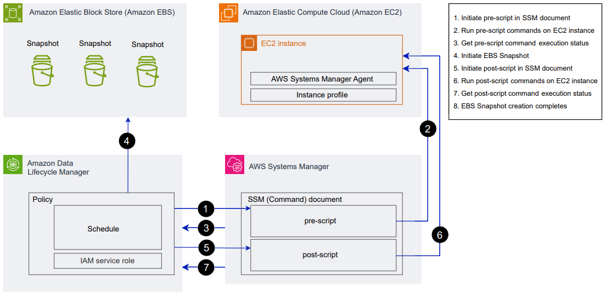

# How Amazon Data Lifecycle Manager pre and post scripts work

The following image shows the process flow for pre and post scripts when
using custom SSM documents. This does not apply to VSS Backups.

At the scheduled snapshot creation time, the following actions and cross-service
interactions occur.

1. Amazon Data Lifecycle Manager initiates the pre script action by calling the SSM document and
   passing the `pre-script` parameter.

###### Note

Steps 1 to 3 occur only if you run pre scripts. If you run post scripts
only, steps 1 to 3 are skipped. 2. Systems Manager sends pre script commands to the SSM Agent running on the target
instances. The SSM Agent runs the commands on the instance, and sends status
information back to Systems Manager.

For example, if the SSM document is used to create application-consistent
snapshots, the pre script might freeze and flush I/O to ensure that all
buffered data is written to the volume before the snapshot is taken. 3. Systems Manager sends pre script command status updates to Amazon Data Lifecycle Manager. If the pre script
fails, Amazon Data Lifecycle Manager takes one of the following actions, depending on how you configure
the pre and post script options:

| Retries                                 | Default to crash-consistent snapshots | Action                                                                         |
| --------------------------------------- | ------------------------------------- | ------------------------------------------------------------------------------ |
| Enabled with retries remaining          | Enabled                               | Retry script until it succeeds or retries are exhausted                        |
| Exhausted without successful completion | Enabled                               | Create crash-consistent snapshots, and do not run post script.                 |
| Enabled with retries remaining          | Disabled                              | Retry script until it succeeds or retries are exhausted                        |
| Exhausted without successful completion | Disabled                              | Skip snapshot creation for the target instance, and do not run post script. |
| Disabled                                | Enabled                               | Create crash-consistent snapshots, and do not run post script.                 |
| Disabled                                | Disabled                              | Skip snapshot creation for the target instance, and do not run post script. |

4. Amazon Data Lifecycle Manager initiates snapshot creation.
5. Amazon Data Lifecycle Manager initiates the post script action by calling the SSM document and
   passing the `post-script` parameter.

###### Note

Steps 5 to 7 occur only if you run pre scripts. If you run post scripts
only, steps 1 to 3 are skipped. 6. Systems Manager sends post script commands to the SSM Agent running on the target
instances. The SSM Agent runs the commands on the instance, and sends status
information back to Systems Manager.

For example, if the SSM document enables application-consistent snapshots,
this post script might thaw I/O to ensure that your databases resume normal
I/O operations after the snapshot has been taken. 7. If you run a post script and Systems Manager indicates that it completed successfully,
the process completes.

If the post script fails, Amazon Data Lifecycle Manager takes one of the following actions, depending
on how you configure the pre and post script options:

| Retries                        | Action                                                       |
| ------------------------------ | ------------------------------------------------------------ |
| Enabled with retries remaining | Retry post script until it succeeds or retries are exhausted |
| Exhausted without success      | Skip post script                                             |
| Disabled                       | Skip post script                                             |

Keep in mind that if the post script fails, the pre script (if enabled) will
have completed successfully, and the snapshots might have been created. You
might need to take further action on the instance to ensure that it is operating
as expected. For example if the pre script paused and flushed I/O, but the post
script failed to thaw I/O, you might need to configure your database to
auto-thaw I/O or you need to manually thaw I/O. 8. The snapshot creation process might complete after the post script completes.
The time taken to complete the snapshot depends on the snapshot size.
