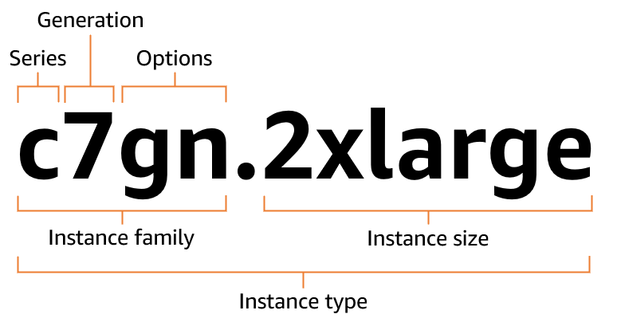

# Amazon EC2 instance type naming conventions

Amazon EC2 provides a variety of instance types so you can choose the type that best meets your
requirements. Instance types are named based on their _instance family_
and _instance size_. The first position of the instance family indicates
the _series_, for example `c`. The second position indicates
the _generation_, for example `7`. The third position indicates
the _options_, for example `gn`. After the period (`.`)
is the instance size, such as `small` or `4xlarge`, or `metal`
for bare metal instances.

| Series                                                                                                                                                                                                                                                                                                                                                                                                                                                                                                                                                                                                                                        | Options                                  |
| --------------------------------------------------------------------------------------------------------------------------------------------------------------------------------------------------------------------------------------------------------------------------------------------------------------------------------------------------------------------------------------------------------------------------------------------------------------------------------------------------------------------------------------------------------------------------------------------------------------------------------------------- | ---------------------------------------- | ----------------------------------------------------------------------------------------------------------------------------------- | -------------------------------------------------------------------------------------------------------------------------------------------------------------------------------------------------------------------------------------------------------------------------------------------------------------------------------------------------------------------------------------------------------------------------------------------------------------------------------------------------------------------------------------------- |
| • **C** – Compute optimized • **D** – Dense storage • **F** – FPGA • **G** – Graphics intensive • **Hpc** – High performance computing • **I** – Storage optimized • **Im** – Storage optimized (1 to 4 ratio of vCPU to memory) • **Is** – Storage optimized (1 to 6 ratio of vCPU to memory) • **Inf** – AWS Inferentia • **M** – General purpose • **Mac** – macOS • **P** – GPU accelerated • **R** – Memory optimized • **T** – Burstable performance • **Trn** – AWS Trainium • **U** – High memory • **VT** – Video transcoding • **X** – Memory intensive • **Z** – High memory | • **a** – AMD processors • **b`*`00** | **gb`*`00** – Accelerated by NVIDIA Blackwell GPUs • **g** – AWS Graviton processors • **i** – Intel processors • **m`*`** | **m`*`pro**– Apple chip • **b** – Block storage optimization • **d** – Instance store volumes • **e** – Extra instance storage (for storage optimized instance types), extra memory (for memory optimized instance types), or extra GPU memory (for accelerated computing instance types). • **flex** – Flex instance • **n** – Network and EBS optimized • **q** – Qualcomm inference accelerators • **`*`tb** – Amount of memory for high-memory instances (3 TiB to 32 TiB) • **z** – High CPU frequency |
