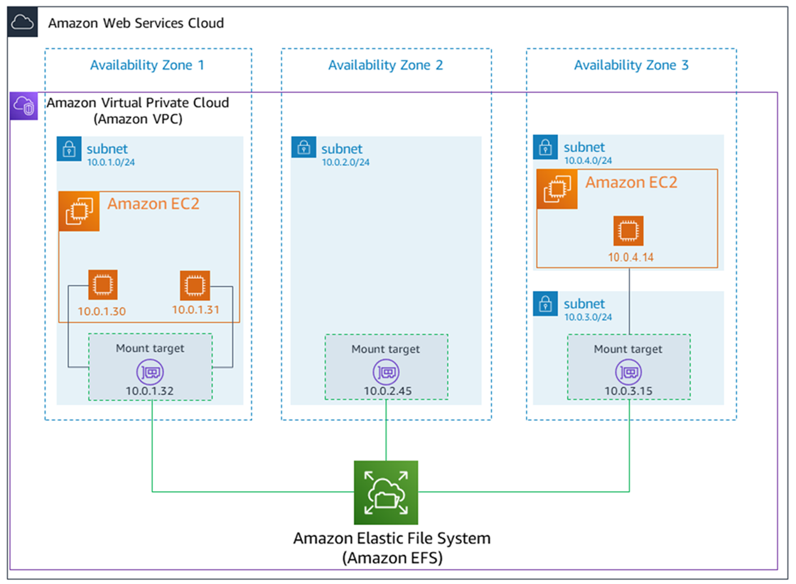
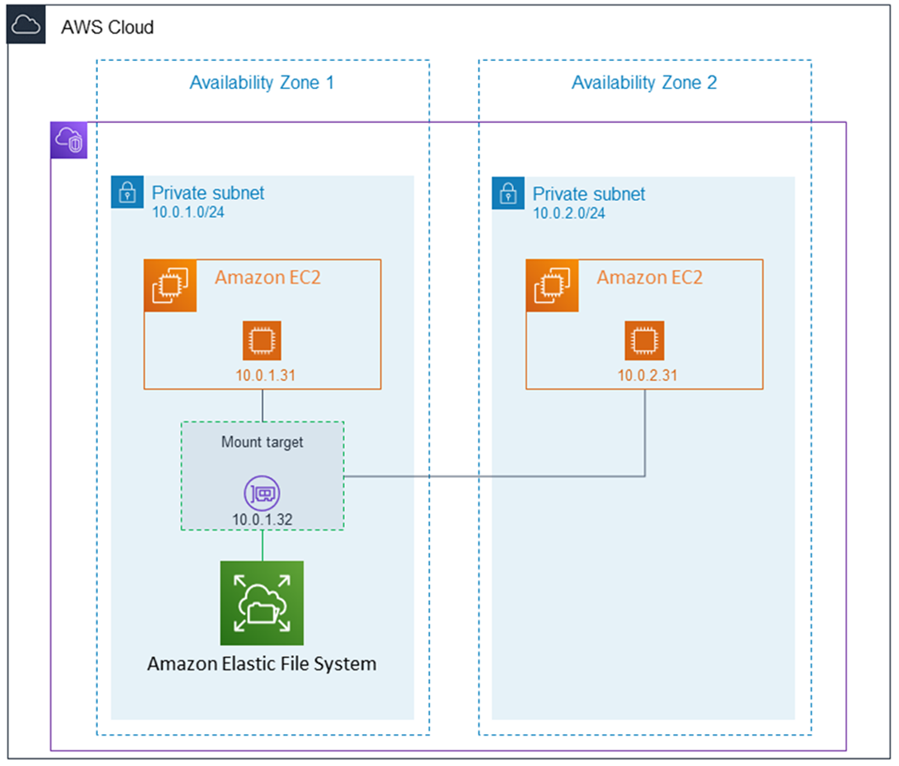
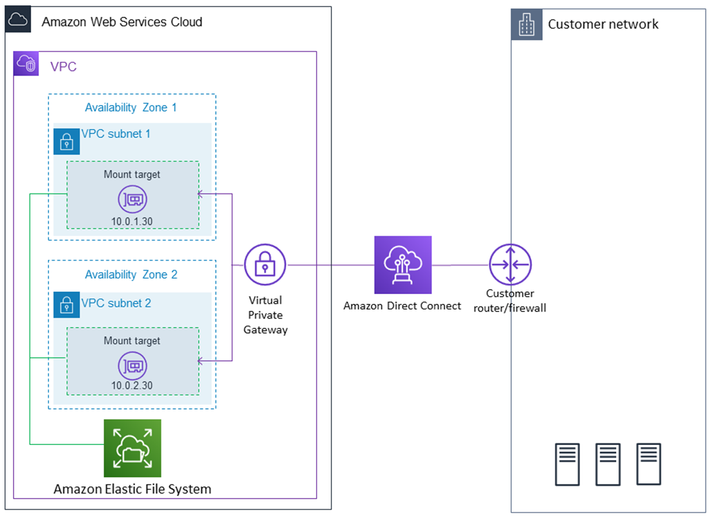

# How Amazon EFS works

Amazon Elastic File System (EFS) provides a simple, serverless, set-and-forget elastic file
system. With Amazon EFS, you can create a file system, mount the file system on an Amazon EC2 instance,
and then read and write data to and from your file system. You
can mount an EFS file system in your virtual private cloud (VPC), through the Network
File System versions 4.0 and 4.1 (NFSv4) protocol. We recommend using a current generation Linux
NFSv4.1 client, such as those found in the latest Amazon Linux, Amazon Linux 2, Red Hat, Ubuntu, and macOS Big Sur
AMIs, in conjunction with the EFS mount helper. For instructions, see [Installing the Amazon EFS client](using-amazon-efs-utils.md "using-amazon-efs-utils.md").

For a list of Amazon EC2 Linux and macOS Amazon Machine Images (AMIs) that support this
protocol, see [NFS support](mounting-fs-old.md#mounting-fs-nfs-info "mounting-fs-old.md#mounting-fs-nfs-info"). For
some AMIs, you must install an NFS client to mount your file system on your Amazon EC2 instance.
For instructions, see [Installing the NFS client](mounting-fs-install-nfsclient.md "mounting-fs-install-nfsclient.md").

You can access your EFS file system concurrently from multiple NFS clients, so
applications that scale beyond a single connection can access a file system. Amazon EC2 and other
AWS compute instances running in multiple Availability Zones within the same AWS Region can access
the file system, so that many users can access and share a common data source.

For a list of AWS Regions where you can create an EFS file system, see the
[Amazon Web Services General Reference](../../../general/latest/gr/rande.md#elasticfilesystem_region "../../../general/latest/gr/rande.md#elasticfilesystem_region").

To access your EFS file system in a VPC, you create one or more mount targets
in the VPC. A _mount target_ provides an IP address for an
NFSv4 endpoint at which you can mount an EFS file system. You mount your file system
using its Domain Name Service (DNS) name, which resolves to the IP address of the EFS
mount target in the same Availability Zone as your EC2 instance. You can create one mount
target in each Availability Zone in an AWS Region. If there are multiple subnets in an Availability Zone
in your VPC, you create a mount target in one of the subnets. Then all EC2 instances in
that Availability Zone share that mount target.

###### Note

An EFS file system can have mount targets in only one VPC at a time.

Mount targets themselves are designed to be highly available. As you design for high
availability and failover to other Availability Zones, keep in mind that while the IP addresses and
DNS for your mount targets in each Availability Zone are static, they are redundant components backed
by multiple resources. For more information about mount targets, see [Managing mount targets](accessing-fs.md "accessing-fs.md").

After mounting the file system by using its DNS name, you use it like any other
POSIX-compliant file system. For information about NFS-level permissions and related
considerations, see [Network File System (NFS) level users, groups, and permissions](accessing-fs-nfs-permissions.md "accessing-fs-nfs-permissions.md").

You can mount your EFS file systems on your on-premises
data center servers when connected to your Amazon VPC with AWS Direct Connect or Site-to-Site VPN. You can mount your
EFS file systems on on-premises servers to migrate datasets to EFS, enable
cloud bursting scenarios, or back up your on-premises data to Amazon EFS.

Following, you can find a description about how Amazon EFS works with other services.

###### Topics

- [How Amazon EFS works with Amazon EC2](#how-it-works-ec2 "#how-it-works-ec2")
- [How Amazon EFS works with AWS Direct Connect and AWS
  Managed VPN](#how-it-works-direct-connect "#how-it-works-direct-connect")
- [How Amazon EFS works with AWS Backup](#how-it-works-backups "#how-it-works-backups")

## How Amazon EFS works with Amazon EC2

This section explains how Amazon EFS Regional and One Zone file
systems are mounted to EC2 instances in an Amazon VPC.

### Regional EFS file systems

The following illustration shows multiple EC2 instances accessing an Amazon EFS file system
that is configured for multiple Availability Zones in an AWS Region.

In this illustration, the virtual private cloud (VPC) has three
Availability Zones. Because the file system is Regional, a mount target was
created in each Availability Zone. We recommend that you access the file system from a
mount target within the same Availability Zone for performance and cost reasons. One of the
Availability Zones has two subnets. However, a mount target is created in only one of the
subnets. For more information, see [Mounting EFS file systems using the
EFS mount helper](efs-mount-helper.md "efs-mount-helper.md").

### One Zone EFS file systems

The following illustration shows multiple EC2 instances accessing a One Zone
file system from different Availability Zones in a single AWS Region.

In this illustration, the VPC has two Availability Zones, each with one subnet. Because
the file system type is One Zone, it can only have a single mount target. For
better performance and cost, we recommend that you access the file system from a mount
target in the same Availability Zone as the EC2 instance that you're mounting it on.

In this example, the EC2 instance in the us-west-2c Availability Zone will pay EC2 data
access charges for accessing a mount target in a different Availability Zone. For more information, see
[Mounting One Zone file systems](mounting-one-zone.md "mounting-one-zone.md").

## How Amazon EFS works with AWS Direct Connect and AWS

Managed VPN

By using an Amazon EFS file system mounted on an on-premises server, you can migrate
on-premises data into the AWS Cloud hosted in an Amazon EFS file system. You can also take
advantage of bursting. In other words, you can move data from your on-premises servers into
Amazon EFS and analyze it on a fleet of Amazon EC2 instances in your Amazon VPC. You can then store the
results permanently in your file system or move the results back to your on-premises
server.

Keep the following considerations in mind when using Amazon EFS with an on-premises
server:

- Your on-premises server must have a Linux-based operating system. We recommend Linux
  kernel version 4.0 or later.
- For the sake of simplicity, we recommend mounting an Amazon EFS file system on an
  on-premises server using a mount target IP address instead of a DNS name.

There is no additional cost for on-premises access to your Amazon EFS file systems. You are
charged for the Direct Connect connection to your Amazon VPC. For more information, see [Direct Connect pricing](https://aws.amazon.com/directconnect/pricing/ "https://aws.amazon.com/directconnect/pricing/").

The following illustration shows an example of how to access an Amazon EFS file system from
on-premises (the on-premises servers have the file systems mounted).

You can use any mount target in your VPC if you can reach that mount target's subnet by
using an Direct Connect connection between your on-premises server and VPC. To access Amazon EFS from an
on-premises server, add a rule to your mount target security group to allow inbound traffic to
the NFS port (2049) from your on-premises server. For more information, including detailed procedures,
see [Prerequisites](mounting-fs-mount-helper-direct.md#efs-onpremises "mounting-fs-mount-helper-direct.md#efs-onpremises").

## How Amazon EFS works with AWS Backup

For a comprehensive backup implementation for your file systems, you can use Amazon EFS with
AWS Backup. AWS Backup is a fully managed backup service that makes it easy to centralize and automate
data backup across AWS services in the cloud and on-premises. Using AWS Backup, you can centrally
configure backup policies and monitor backup activity for your AWS resources. Amazon EFS always
prioritizes file system operations over backup operations. To learn more about backing up
EFS file systems using AWS Backup, see [Backing up EFS file systems](awsbackup.md "awsbackup.md").
