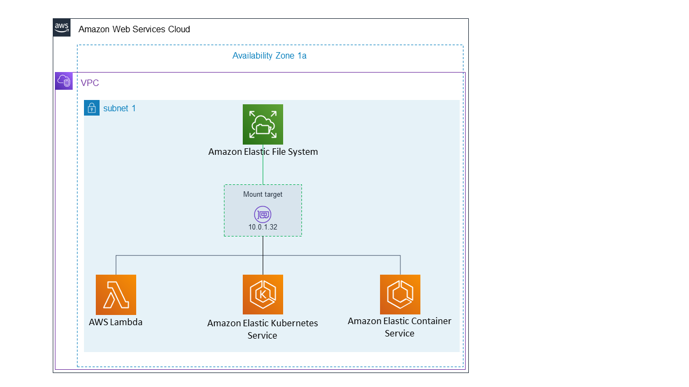

# Mounting One Zone file systems

EFS One Zone file systems support only a single mount target
which is located in the same Availability Zone as the file system. You cannot add additional mount
targets. This section describes things to consider when mounting One Zone file
systems.

You can avoid data transfer charges between Availability Zones and achieve better performance
by accessing an EFS file system using an Amazon EC2 compute instance that is located
in the same Availability Zone as that of the file system's mount target.

The procedures in this section require the following:

- You have installed the `amazon-efs-utils package` on the EC2
  instance. For more information, see [Installing the Amazon EFS client](using-amazon-efs-utils.md "using-amazon-efs-utils.md").
- You have created a mount target for the file system. For more information, see [Managing mount targets](accessing-fs.md "accessing-fs.md").

## Mounting One Zone file systems on

EC2 in a different Availability Zone

If you are mounting a One Zone file system on an Amazon EC2 instance that is
located in a different Availability Zone, you have to specify the file system's Availability Zone
name or the DNS name of the file system's mount target in the mount helper mount
command.

Create a directory called `efs` to use as the file system mount point using the following command:

```
sudo mkdir efs
```

Use the following command to mount the file system using the EFS mount
helper. The command specifies the file system's Availability Zone name.

```
sudo mount -t efs -o az=`availability-zone-name`,tls `file-system-id` `mount-point`/
```

This is the command with sample values:

```
sudo mount -t efs -o az=us-east-1a,tls fs-abcd1234567890ef efs/
```

The following command mounts the file system, specifying the DNS name of the file system's mount target.

```
sudo mount -t efs -o tls `mount-target-dns-name` `mount-point`/
```

This is the command with an example mount target DNS name.

```
sudo mount -t efs -o tls us-east-1a.fs-abcd1234567890ef9.efs.us-east-1.amazonaws.com efs/
```

### Mounting One Zone file systems in a different

Availability Zone automatically with EFS mount helper

If you are using `/etc/fstab` to mount an EFS
One Zone file system on an EC2 instance that is located in a
different Availability Zone, you have to specify the file system's Availability Zone name or
the DNS name of the file system's mount target in the
`/etc/fstab` entry.

```
`availability-zone-name`.`file-system-id`.efs.`aws-region`.amazonaws.com:/ `efs-mount-point` efs defaults,_netdev,noresvport,tls 0 0
```

```
us-east-1a.fs-abc123def456a7890.efs.us-east-1.amazonaws.com:/ efs-one-zone efs defaults,_netdev,noresvport,tls 0 0
```

### Mounting One Zone file systems automatically with

NFS

If you are using `/etc/fstab` to mount an EFS file
system using One Zone storage on an EC2 instance that is located in a
different Availability Zone, you have to specify the file system's Availability Zone name with
the file system's DNS name in the `/etc/fstab` entry.

```
`availability-zone-name`.`file-system-id`.efs.`aws-region`.amazonaws.com:/ `efs-mount-point` nfs4 nfsvers=4.1,rsize=1048576,wsize=1048576,hard,timeo=600,retrans=2,noresvport,_netdev 0 0
```

```
us-east-1a.fs-abc123def456a7890.efs.us-east-1.amazonaws.com:/ efs-one-zone nfs4 nfsvers=4.1,rsize=1048576,wsize=1048576,hard,timeo=600,retrans=2,noresvport,_netdev 0 0
```

For more information about how to edit the `/etc/fstab` file, and the values used in this command, see
[Automatically mounting EFS file systems](nfs-automount-efs.md "nfs-automount-efs.md").

## Mounting file systems with One Zone file

system on other AWS compute instances

When you use a One Zone file system with Amazon Elastic Container Service, Amazon Elastic Kubernetes Service, or AWS Lambda, you need
to configure the service to use the same Availability Zone that the EFS file
system is located in, illustrated as follows, and described in the following
sections.



### Connecting from Amazon Elastic Container Service

You can use EFS file systems with Amazon ECS to share file system data across
your fleet of container instances so your tasks have access to the same persistent
storage, no matter the instance on which they land. To use EFS
One Zone file systems with Amazon ECS you should choose only subnets that are in
the same Availability Zone as your file system when launching your task. For more information,
see [Amazon EFS volumes](../../../AmazonECS/latest/developerguide/efs-volumes.md "../../../AmazonECS/latest/developerguide/efs-volumes.md") in the
_Amazon Elastic Container Service Developer Guide_.

### Connecting from Amazon Elastic Kubernetes Service

When mounting an One Zone file system from Amazon EKS, you can use the Amazon EFS
[Container Storage
Interface](../../../eks/latest/userguide/efs-csi.md "../../../eks/latest/userguide/efs-csi.md") (CSI) driver, which supports EFS access points, to share
a file system between multiple pods in an Amazon EKS or self-managed Kubernetes cluster. The
Amazon EFS CSI driver is installed in the Fargate stack. When using the Amazon EFS CSI driver with
EFS One Zone file systems, you can use the
`nodeSelector` option when launching your pod to ensure it gets scheduled
within the same Availability Zone as your file system.

### Connecting from AWS Lambda

You can use Amazon EFS with AWS Lambda to share data across function invocations, read
large reference data files, and write function output to a persistent and shared store.
Lambda securely connects the function instances to the EFS mount targets that
are in the same Availability Zone and subnet. When you use Lambda with One Zone
file systems, configure your function to only launch invocations into subnets that are
in the same Availability Zone as your file system.
