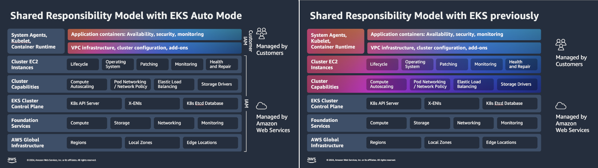

**Help improve this page**

To contribute to this user guide, choose the **Edit this page on GitHub** link that is located in the right pane of every page.

# Automate cluster infrastructure with EKS Auto Mode

EKS Auto Mode extends AWS management of Kubernetes clusters beyond the cluster itself, to allow AWS to also set up and manage the infrastructure that enables the smooth operation of your workloads.
You can delegate key infrastructure decisions and leverage the expertise of AWS for day-to-day operations.
Cluster infrastructure managed by AWS includes many Kubernetes capabilities as core components, as opposed to add-ons, such as compute autoscaling, pod and service networking, application load balancing, cluster DNS, block storage, and GPU support.

To get started, you can deploy a new EKS Auto Mode cluster or enable EKS Auto Mode on an existing cluster.
You can deploy, upgrade, or modify your EKS Auto Mode clusters using eksctl, the AWS CLI, the AWS Management Console, EKS APIs, or your preferred infrastructure-as-code tools.

With EKS Auto Mode, you can continue using your preferred Kubernetes-compatible tools. EKS Auto Mode integrates with AWS services like Amazon EC2, Amazon EBS, and ELB, leveraging AWS cloud resources that follow best practices. These resources are automatically scaled, cost-optimized, and regularly updated to help minimize operational costs and overhead.

## Features

EKS Auto Mode provides the following high-level features:

**Streamline Kubernetes Cluster Management**: EKS Auto Mode streamlines EKS management by providing production-ready clusters with minimal operational overhead. With EKS Auto Mode, you can run demanding, dynamic workloads confidently, without requiring deep EKS expertise.

**Application Availability**: EKS Auto Mode dynamically adds or removes nodes in your EKS cluster based on the demands of your Kubernetes applications. This minimizes the need for manual capacity planning and ensures application availability.

**Efficiency**: EKS Auto Mode is designed to optimize compute costs while adhering to the flexibility defined by your NodePool and workload requirements. It also terminates unused instances and consolidates workloads onto other nodes to improve cost efficiency.

**Security**: EKS Auto Mode uses AMIs that are treated as immutable, for your nodes. These AMIs enforce locked-down software, enable SELinux mandatory access controls, and provide read-only root file systems. Additionally, nodes launched by EKS Auto Mode have a maximum lifetime of 21 days (which you can reduce), after which they are automatically replaced with new nodes. This approach enhances your security posture by regularly cycling nodes, aligning with best practices already adopted by many customers.

**Automated Upgrades**: EKS Auto Mode keeps your Kubernetes cluster, nodes, and related components up to date with the latest patches, while respecting your configured Pod Disruption Budgets (PDBs) and NodePool Disruption Budgets (NDBs). Up to the 21-day maximum lifetime, intervention might be required if blocking PDBs or other configurations prevent updates.

**Managed Components**: EKS Auto Mode includes Kubernetes and AWS cloud features as core components that would otherwise have to be managed as add-ons. This includes built-in support for Pod IP address assignments, Pod network policies, local DNS services, GPU plug-ins, health checkers, and EBS CSI storage.

**Customizable NodePools and NodeClasses**: If your workload requires changes to storage, compute, or networking configurations, you can create custom NodePools and NodeClasses using EKS Auto Mode. While you should not edit default NodePools and NodeClasses, you can add new custom NodePools or NodeClasses alongside the default configurations to meet your specific requirements.

## Automated Components

EKS Auto Mode streamlines the operation of your Amazon EKS clusters by automating key infrastructure components. Enabling EKS Auto Mode further reduces the tasks to manage your EKS clusters.

The following is a list of data plane components that are automated:

- **Compute**: For many workloads, with EKS Auto Mode you can forget about many aspects of compute for your EKS clusters. These include:
  - **Nodes**: EKS Auto Mode nodes are designed to be treated like appliances. EKS Auto Mode does the following:
    - Chooses an appropriate AMI that’s configured with many services needed to run your workloads without intervention.
    - Locks down access to files on the AMI using SELinux enforcing mode and a read-only root file system.
    - Prevents direct access to the nodes by disallowing SSH or SSM access.
    - Includes GPU support, with separate kernel drivers and plugins for NVIDIA and Neuron GPUs, enabling high-performance workloads.
    - Automatically handles [EC2 Spot Instance interruption notices](../../../AWSEC2/latest/UserGuide/spot-instance-termination-notices.md "../../../AWSEC2/latest/UserGuide/spot-instance-termination-notices.md") and EC2 Instance health events

  - **Auto scaling**: Relying on [Karpenter](https://karpenter.sh/docs/ "https://karpenter.sh/docs/") auto scaling, EKS Auto Mode monitors for unschedulable Pods and makes it possible for new nodes to be deployed to run those pods. As workloads are terminated, EKS Auto Mode dynamically disrupts and terminates nodes when they are no longer needed, optimizing resource usage.
  - **Upgrades**: Taking control of your nodes streamlines EKS Auto Mode’s ability to provide security patches and operating system and component upgrades as needed. Those upgrades are designed to provide minimal disruption of your workloads. EKS Auto Mode enforces a 21-day maximum node lifetime to ensure up-to-date software and APIs.

- **Load balancing**: EKS Auto Mode streamlines load balancing by integrating with Amazon’s Elastic Load Balancing service, automating the provisioning and configuration of load balancers for Kubernetes Services and Ingress resources. It supports advanced features for both Application and Network Load Balancers, manages their lifecycle, and scales them to match cluster demands. This integration provides a production-ready load balancing solution adhering to AWS best practices, allowing you to focus on applications rather than infrastructure management.
- **Storage**: EKS Auto Mode configures ephemeral storage for you by setting up volume types, volume sizes, encryption policies, and deletion policies upon node termination.
- **Networking**: EKS Auto Mode automates critical networking tasks for Pod and service connectivity. This includes IPv4/IPv6 support and the use of secondary CIDR blocks for extending IP address spaces.
- **Identity and Access Management**: You do not have to install the EKS Pod Identity Agent on EKS Auto Mode clusters.

For more information about these components, see [Learn how EKS Auto Mode works](auto-reference.md "auto-reference.md").

## Configuration

While EKS Auto Mode will effectively manage most of your data plane services without your intervention, there might be times when you want to change the behavior of some of those services. You can modify the configuration of your EKS Auto Mode clusters in the following ways:

- **Kubernetes DaemonSets**: Rather than modify services installed on your nodes, you can instead use Kubernetes daemonsets. Daemonsets are designed to be managed by Kubernetes, but run on every node in the cluster. In this way, you can add special services for monitoring or otherwise watching over your nodes.
- **Custom NodePools and NodeClasses**: Default NodePools and NodeClasses are configured by EKS Auto Mode and you should not edit them. To customize node behavior, you can create additional NodePools or NodeClasses for use cases such as:
  - Selecting specific instance types (for example, accelerated processors or EC2 Spot instances).
  - Isolating workloads for security or cost-tracking purposes.
  - Configuring ephemeral storage settings like IOPS, size, and throughput.

- **Load Balancing**: Some services, such as load balancing, that EKS Auto Mode runs as Kubernetes objects, can be configured directly on your EKS Auto Mode clusters.

For more information about options for configuring EKS Auto Mode, see [Configure EKS Auto Mode settings](settings-auto.md "settings-auto.md").

## Shared responsibility model

The AWS Shared Responsibility Model defines security and compliance responsibilities between AWS and customers.
The images and text below compare and contrast how customer and AWS responsibilities differ between EKS Auto Mode and EKS standard mode.

EKS Auto Mode shifts much of the shared responsibility for Kubernetes infrastructure from customers to AWS. With EKS Auto Mode, AWS takes on more responsibility for cloud security, which was once the customer’s responsibility and is now shared. Customers can now focus more on their applications while AWS manages the underlying infrastructure.

**Customer responsibility**

Under EKS Auto Mode, customers continue to maintain responsibility for the application containers, including availability, security, and monitoring. They also maintain control over VPC infrastructure and EKS cluster configuration. This model lets customers concentrate on application-specific concerns while delegating cluster infrastructure management to AWS. Optional per-node features can be included in clusters through AWS add-ons.

**AWS responsibility**

With EKS Auto Mode, AWS expands its responsibility to include the management of several additional critical components compared to those already managed in EKS clusters not using Auto Mode. In particular, EKS Auto Mode takes over the configuration, management, security, and scaling of the EC2 instances launched as well as cluster capabilities for load balancing, IP address management, networking policy, and block storage. The following components are managed by AWS in EKS Auto Mode:

- **Auto Mode-launched EC2 Instances**: AWS handles the complete lifecycle of nodes by leveraging Amazon EC2 managed instances. EC2 managed instances take responsibility for operating system configuration, patching, monitoring, and health maintenance. In this model, both the instance itself and the guest operating system running on it are the responsibility of AWS. The nodes use variants of [Bottlerocket](https://aws.amazon.com/bottlerocket "https://aws.amazon.com/bottlerocket") AMIs that are optimized to run containers. The Bottlerocket AMIs have locked-down software, immutable root file systems, and secure network access (to prevent direct communications through SSH or SSM).
- **Cluster Capabilities**: AWS manages compute autoscaling, Pod networking with network policy enforcement, Elastic Load Balancing integration, and storage drivers configuration.
- **Cluster Control Plane**: AWS continues to manage the Kubernetes API server, cross-account ENIs, and the etcd database, as with standard EKS.
- **Foundation Services and Global Infrastructure**: AWS maintains responsibility for the underlying compute, storage, networking, and monitoring services, as well as the global infrastructure of regions, local zones, and edge locations.
