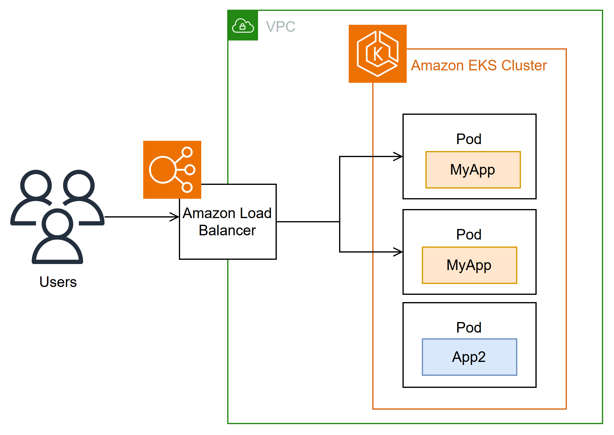

**Help improve this page**

To contribute to this user guide, choose the **Edit this page on GitHub** link that is located in the right pane of every page.

# Route internet traffic with AWS Load Balancer Controller

###### Tip

[Register](https://aws-experience.com/emea/smb/events/series/get-hands-on-with-amazon-eks?trk=4a9b4147-2490-4c63-bc9f-f8a84b122c8c&sc_channel=el "https://aws-experience.com/emea/smb/events/series/get-hands-on-with-amazon-eks?trk=4a9b4147-2490-4c63-bc9f-f8a84b122c8c&sc_channel=el") for upcoming Amazon EKS workshops.

The AWS Load Balancer Controller manages AWS Elastic Load Balancers for a Kubernetes cluster. You can use the controller to expose your cluster apps to the internet. The controller provisions AWS load balancers that point to cluster Service or Ingress resources. In other words, the controller creates a single IP address or DNS name that points to multiple pods in your cluster.

The controller watches for Kubernetes Ingress or Service resources. In response, it creates the appropriate AWS Elastic Load Balancing resources. You can configure the specific behavior of the load balancers by applying annotations to the Kubernetes resources. For example, you can attach AWS security groups to load balancers using annotations.

The controller provisions the following resources:

**Kubernetes `Ingress`**

The LBC creates an [AWS Application Load Balancer (ALB)](../../../elasticloadbalancing/latest/application/introduction.md "../../../elasticloadbalancing/latest/application/introduction.md") when you create a Kubernetes `Ingress`. [Review the annotations you can apply to an Ingress resource.](https://kubernetes-sigs.github.io/aws-load-balancer-controller/latest/guide/ingress/annotations/ "https://kubernetes-sigs.github.io/aws-load-balancer-controller/latest/guide/ingress/annotations/")

**Kubernetes service of the `LoadBalancer` type**

The LBC creates an [AWS Network Load Balancer (NLB)](../../../elasticloadbalancing/latest/network/introduction.md "../../../elasticloadbalancing/latest/network/introduction.md")when you create a Kubernetes service of type `LoadBalancer`. [Review the annotations you can apply to a Service resource.](https://kubernetes-sigs.github.io/aws-load-balancer-controller/latest/guide/service/annotations/ "https://kubernetes-sigs.github.io/aws-load-balancer-controller/latest/guide/service/annotations/")

In the past, the Kubernetes network load balancer was used for _instance_ targets, but the LBC was used for _IP_ targets. With the AWS Load Balancer Controller version `2.3.0` or later, you can create NLBs using either target type. For more information about NLB target types, see [Target type](../../../elasticloadbalancing/latest/network/load-balancer-target-groups.md#target-type "../../../elasticloadbalancing/latest/network/load-balancer-target-groups.md#target-type") in the User Guide for Network Load Balancers.

The controller is an [open-source project](https://github.com/kubernetes-sigs/aws-load-balancer-controller "https://github.com/kubernetes-sigs/aws-load-balancer-controller") managed on GitHub.

Before deploying the controller, we recommend that you review the prerequisites and considerations in [Route application and HTTP traffic with Application Load Balancers](alb-ingress.md "alb-ingress.md") and [Route TCP and UDP traffic with Network Load Balancers](network-load-balancing.md "network-load-balancing.md"). In those topics, you will deploy a sample app that includes an AWS load balancer.

**Kubernetes `Gateway` API**

With the AWS Load Balancer Controller version `2.14.0` or later, the LBC creates an [AWS Application Load Balancer (ALB)](../../../elasticloadbalancing/latest/application/introduction.md "../../../elasticloadbalancing/latest/application/introduction.md") when you create a Kubernetes `Gateway`. Kubernetes Gateway standardizes more configuration than Ingress, which needed custom annotations for many common options. [Review the configuration that you can apply to an Gateway resource.](https://kubernetes-sigs.github.io/aws-load-balancer-controller/latest/guide/gateway/gateway/ "https://kubernetes-sigs.github.io/aws-load-balancer-controller/latest/guide/gateway/gateway/") For more information about the `Gateway` API, see [Gateway API](https://kubernetes.io/docs/concepts/services-networking/gateway/ "https://kubernetes.io/docs/concepts/services-networking/gateway/") in the Kubernetes documentation.

## Install the controller

You can use one of the following procedures to install the AWS Load Balancer Controller:

- If you are new to Amazon EKS, we recommend that you use Helm for the installation because it simplifies the AWS Load Balancer Controller installation. For more information, see [Install AWS Load Balancer Controller with Helm](lbc-helm.md "lbc-helm.md").
- For advanced configurations, such as clusters with restricted network access to public container registries, use Kubernetes Manifests. For more information, see [Install AWS Load Balancer Controller with manifests](lbc-manifest.md "lbc-manifest.md").

## Migrate from deprecated controller versions

- If you have deprecated versions of the AWS Load Balancer Controller installed, see [Migrate apps from deprecated ALB Ingress Controller](lbc-remove.md "lbc-remove.md").
- Deprecated versions cannot be upgraded. They must be removed and a current version of the AWS Load Balancer Controller installed.
- Deprecated versions include:
  - AWS ALB Ingress Controller for Kubernetes ("Ingress Controller"), a predecessor to the AWS Load Balancer Controller.
  - Any `0.1.`x`` version of the AWS Load Balancer Controller

## Legacy cloud provider

Kubernetes includes a legacy cloud provider for AWS. The legacy cloud provider is capable of provisioning AWS load balancers, similar to the AWS Load Balancer Controller. The legacy cloud provider creates Classic Load Balancers. If you do not install the AWS Load Balancer Controller, Kubernetes will default to using the legacy cloud provider. You should install the AWS Load Balancer Controller and avoid using the legacy cloud provider.

###### Important

In versions 2.5 and newer, the AWS Load Balancer Controller becomes the default controller for Kubernetes _service_ resources with the `type: LoadBalancer` and makes an AWS Network Load Balancer (NLB) for each service. It does this by making a mutating webhook for services, which sets the `spec.loadBalancerClass` field to `service.k8s.aws/nlb` for new services of `type: LoadBalancer`. You can turn off this feature and revert to using the [legacy Cloud Provider](https://kubernetes-sigs.github.io/aws-load-balancer-controller/latest/guide/service/annotations/#legacy-cloud-provider "https://kubernetes-sigs.github.io/aws-load-balancer-controller/latest/guide/service/annotations/#legacy-cloud-provider") as the default controller, by setting the helm chart value `enableServiceMutatorWebhook` to `false`. The cluster won’t provision new Classic Load Balancers for your services unless you turn off this feature. Existing Classic Load Balancers will continue to work.
