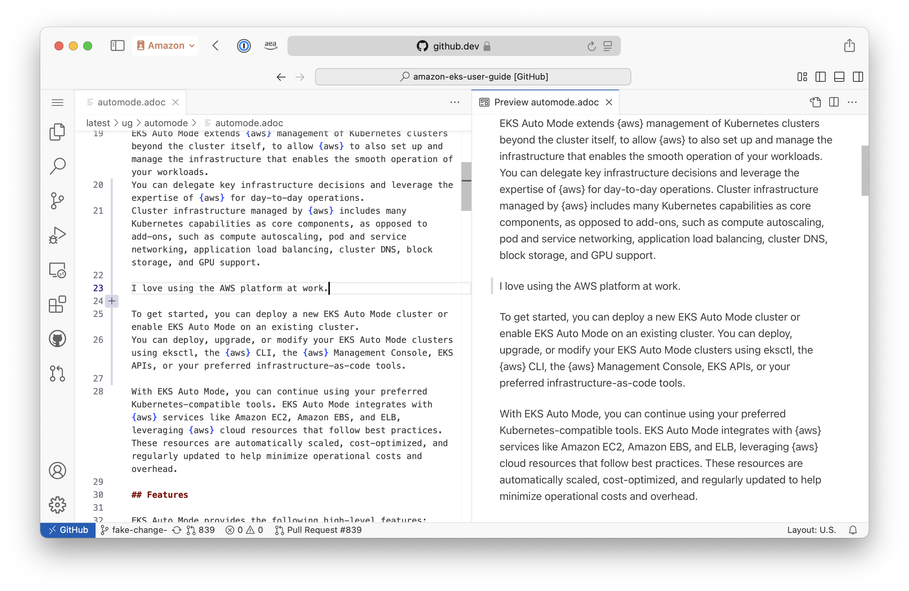

**Help improve this page**

To contribute to this user guide, choose the **Edit this page on GitHub** link that is located in the right pane of every page.

# Edit multiple files from a web browser with the GitHub Web Editor

If you want to propose change to multiple pages, or create a new docs page, use the GitHub.dev web editor. This web editor is based on the popular Visual Studio Code text editor.

## Prerequisites

- Logged in to GitHub
- Familiarity with Visual Studio Code editor
- Familiarity with Git

## Procedure

###### Note

The EKS Docs team has created a workspace file that includes suggested configurations for the editor, such as text wrapping and AsciiDoc syntax highlighting. We suggest you load this workspace file.

1. Open the [workspace](https://github.dev/awsdocs/amazon-eks-user-guide/blob/mainline/eks-docs.code-workspace?workspace=true "https://github.dev/awsdocs/amazon-eks-user-guide/blob/mainline/eks-docs.code-workspace?workspace=true") on GitHub.dev.
   - You can bookmark the URL `https://github.dev/awsdocs/amazon-eks-user-guide/blob/mainline/eks-docs.code-workspace?workspace=true`

2. (First time setup only) You may be prompted to create a fork of the repo in your own GitHub account. Accept this prompt. For more information, see [About forks](https://docs.github.com/en/pull-requests/collaborating-with-pull-requests/working-with-forks/about-forks "https://docs.github.com/en/pull-requests/collaborating-with-pull-requests/working-with-forks/about-forks") in the GitHub docs.
3. (First time setup only) Accept the prompt in the bottom right to install the AsciiDoc extension.
4. Navigate to the docs content at `latest/ug`.
   - Docs files are organized by their top level section. For example, pages in the "Security" chapter have source files under the "security/" directory.

5. To view a preview of a docs page, use the **Open preview to the Side** button in the top right. The icon includes a small magnifying glass.
6. Use the **Source Control** tab in the left to commit your changes. For more information, see the Visual Studio Code docs:
   - [Commit changes](https://code.visualstudio.com/docs/sourcecontrol/overview#_commit "https://code.visualstudio.com/docs/sourcecontrol/overview#_commit")
   - [Create a pull request](https://code.visualstudio.com/docs/sourcecontrol/github#_creating-pull-requests "https://code.visualstudio.com/docs/sourcecontrol/github#_creating-pull-requests")

After you create a pull request, it will be reviewed by the docs team.
