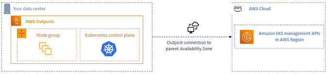

**Help improve this page**

To contribute to this user guide, choose the **Edit this page on GitHub** link that is located in the right pane of every page.

# Create local Amazon EKS clusters on AWS Outposts for high availability

You can use local clusters to run your entire Amazon EKS cluster locally on AWS Outposts. This helps mitigate the risk of application downtime that might result from temporary network disconnects to the cloud. These disconnects can be caused by fiber cuts or weather events. Because the entire Kubernetes cluster runs locally on Outposts, applications remain available. You can perform cluster operations during network disconnects to the cloud. For more information, see [Prepare local Amazon EKS clusters on AWS Outposts for network disconnects](eks-outposts-network-disconnects.md "eks-outposts-network-disconnects.md"). The following diagram shows a local cluster deployment.

Local clusters are generally available for use with Outposts racks.

## Supported AWS Regions

You can create local clusters in the following AWS Regions: US East (Ohio), US East (N. Virginia), US West (N. California), US West (Oregon), Asia Pacific (Seoul), Asia Pacific (Singapore), Asia Pacific (Sydney), Asia Pacific (Tokyo), Canada (Central), Europe (Frankfurt), Europe (Ireland), Europe (London), Middle East (Bahrain), and South America (São Paulo). For detailed information about supported features, see [Comparing the deployment options](eks-outposts.md#outposts-overview-comparing-deployment-options "eks-outposts.md#outposts-overview-comparing-deployment-options").

###### Topics
