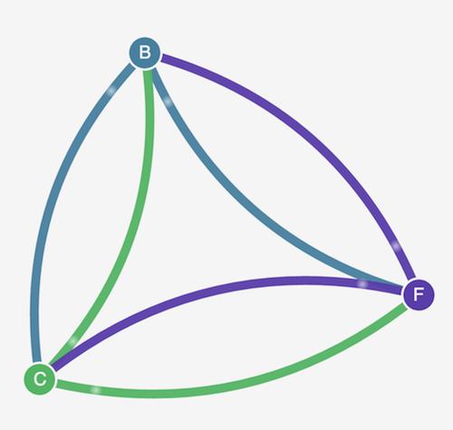
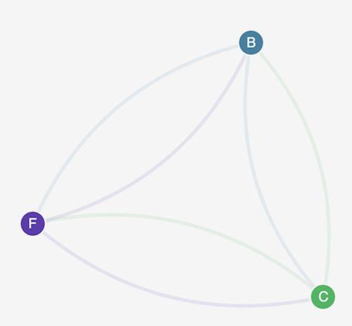
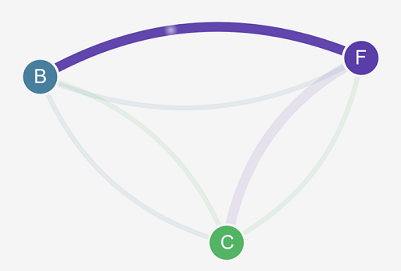
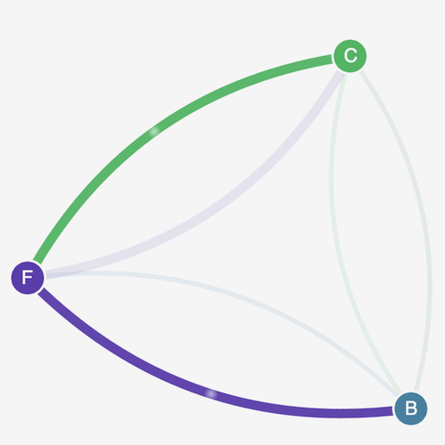

**Help improve this page**

To contribute to this user guide, choose the **Edit this page on GitHub** link that is located in the right pane of every page.

# Stars demo of network policy for Amazon EKS

This demo creates a front-end, back-end, and client service on your Amazon EKS cluster. The demo also creates a management graphical user interface that shows the available ingress and egress paths between each service. We recommend that you complete the demo on a cluster that you don’t run production workloads on.

Before you create any network policies, all services can communicate bidirectionally. After you apply the network policies, you can see that the client can only communicate with the front-end service, and the back-end only accepts traffic from the front-end.

1. Apply the front-end, back-end, client, and management user interface services:

```
kubectl apply -f https://raw.githubusercontent.com/aws-samples/eks-workshop/2f9d29ed3f82ed6b083649e975a0e574fb8a4058/content/beginner/120_network-policies/calico/stars_policy_demo/create_resources.files/namespace.yaml
kubectl apply -f https://raw.githubusercontent.com/aws-samples/eks-workshop/2f9d29ed3f82ed6b083649e975a0e574fb8a4058/content/beginner/120_network-policies/calico/stars_policy_demo/create_resources.files/management-ui.yaml
kubectl apply -f https://raw.githubusercontent.com/aws-samples/eks-workshop/2f9d29ed3f82ed6b083649e975a0e574fb8a4058/content/beginner/120_network-policies/calico/stars_policy_demo/create_resources.files/backend.yaml
kubectl apply -f https://raw.githubusercontent.com/aws-samples/eks-workshop/2f9d29ed3f82ed6b083649e975a0e574fb8a4058/content/beginner/120_network-policies/calico/stars_policy_demo/create_resources.files/frontend.yaml
kubectl apply -f https://raw.githubusercontent.com/aws-samples/eks-workshop/2f9d29ed3f82ed6b083649e975a0e574fb8a4058/content/beginner/120_network-policies/calico/stars_policy_demo/create_resources.files/client.yaml
```

2. View all Pods on the cluster.

```
kubectl get pods -A
```

An example output is as follows.

In your output, you should see pods in the namespaces shown in the following output. The `NAMES` of your pods and the number of pods in the `READY` column are different than those in the following output. Don’t continue until you see pods with similar names and they all have `Running` in the `STATUS` column.

```
NAMESPACE         NAME                                       READY   STATUS    RESTARTS   AGE
[...]
client            client-xlffc                               1/1     Running   0          5m19s
[...]
management-ui     management-ui-qrb2g                        1/1     Running   0          5m24s
stars             backend-sz87q                              1/1     Running   0          5m23s
stars             frontend-cscnf                             1/1     Running   0          5m21s
[...]
```

3. To connect to the management user interface, connect to the `EXTERNAL-IP` of the service running on your cluster:

```
kubectl get service/management-ui -n management-ui
```

4. Open the a browser to the location from the previous step. You should see the management user interface. The **C** node is the client service, the **F** node is the front-end service, and the **B** node is the back-end service. Each node has full communication access to all other nodes, as indicated by the bold, colored lines.

 5. Apply the following network policy in both the `stars` and `client` namespaces to isolate the services from each other:

```
kind: NetworkPolicy
apiVersion: networking.k8s.io/v1
metadata:
  name: default-deny
spec:
  podSelector:
    matchLabels: {}
```

You can use the following commands to apply the policy to both namespaces:

```
kubectl apply -n stars -f https://raw.githubusercontent.com/aws-samples/eks-workshop/2f9d29ed3f82ed6b083649e975a0e574fb8a4058/content/beginner/120_network-policies/calico/stars_policy_demo/apply_network_policies.files/default-deny.yaml
kubectl apply -n client -f https://raw.githubusercontent.com/aws-samples/eks-workshop/2f9d29ed3f82ed6b083649e975a0e574fb8a4058/content/beginner/120_network-policies/calico/stars_policy_demo/apply_network_policies.files/default-deny.yaml
```

6. Refresh your browser. You see that the management user interface can no longer reach any of the nodes, so they don’t show up in the user interface.
7. Apply the following different network policies to allow the management user interface to access the services. Apply this policy to allow the UI:

```
kind: NetworkPolicy
apiVersion: networking.k8s.io/v1
metadata:
  namespace: stars
  name: allow-ui
spec:
  podSelector:
    matchLabels: {}
  ingress:
    - from:
        - namespaceSelector:
            matchLabels:
              role: management-ui
```

Apply this policy to allow the client:

```
kind: NetworkPolicy
apiVersion: networking.k8s.io/v1
metadata:
  namespace: client
  name: allow-ui
spec:
  podSelector:
    matchLabels: {}
  ingress:
    - from:
        - namespaceSelector:
            matchLabels:
              role: management-ui
```

You can use the following commands to apply both policies:

```
kubectl apply -f https://raw.githubusercontent.com/aws-samples/eks-workshop/2f9d29ed3f82ed6b083649e975a0e574fb8a4058/content/beginner/120_network-policies/calico/stars_policy_demo/apply_network_policies.files/allow-ui.yaml
kubectl apply -f https://raw.githubusercontent.com/aws-samples/eks-workshop/2f9d29ed3f82ed6b083649e975a0e574fb8a4058/content/beginner/120_network-policies/calico/stars_policy_demo/apply_network_policies.files/allow-ui-client.yaml
```

8. Refresh your browser. You see that the management user interface can reach the nodes again, but the nodes cannot communicate with each other.

 9. Apply the following network policy to allow traffic from the front-end service to the back-end service:

```
kind: NetworkPolicy
apiVersion: networking.k8s.io/v1
metadata:
  namespace: stars
  name: backend-policy
spec:
  podSelector:
    matchLabels:
      role: backend
  ingress:
    - from:
        - podSelector:
            matchLabels:
              role: frontend
      ports:
        - protocol: TCP
          port: 6379
```

10. Refresh your browser. You see that the front-end can communicate with the back-end.

 11. Apply the following network policy to allow traffic from the client to the front-end service:

```
kind: NetworkPolicy
apiVersion: networking.k8s.io/v1
metadata:
  namespace: stars
  name: frontend-policy
spec:
  podSelector:
    matchLabels:
      role: frontend
  ingress:
    - from:
        - namespaceSelector:
            matchLabels:
              role: client
      ports:
        - protocol: TCP
          port: 80
```

12. Refresh your browser. You see that the client can communicate to the front-end service. The front-end service can still communicate to the back-end service.

 13. (Optional) When you are done with the demo, you can delete its resources.

```
kubectl delete -f https://raw.githubusercontent.com/aws-samples/eks-workshop/2f9d29ed3f82ed6b083649e975a0e574fb8a4058/content/beginner/120_network-policies/calico/stars_policy_demo/create_resources.files/client.yaml
kubectl delete -f https://raw.githubusercontent.com/aws-samples/eks-workshop/2f9d29ed3f82ed6b083649e975a0e574fb8a4058/content/beginner/120_network-policies/calico/stars_policy_demo/create_resources.files/frontend.yaml
kubectl delete -f https://raw.githubusercontent.com/aws-samples/eks-workshop/2f9d29ed3f82ed6b083649e975a0e574fb8a4058/content/beginner/120_network-policies/calico/stars_policy_demo/create_resources.files/backend.yaml
kubectl delete -f https://raw.githubusercontent.com/aws-samples/eks-workshop/2f9d29ed3f82ed6b083649e975a0e574fb8a4058/content/beginner/120_network-policies/calico/stars_policy_demo/create_resources.files/management-ui.yaml
kubectl delete -f https://raw.githubusercontent.com/aws-samples/eks-workshop/2f9d29ed3f82ed6b083649e975a0e574fb8a4058/content/beginner/120_network-policies/calico/stars_policy_demo/create_resources.files/namespace.yaml
```

Even after deleting the resources, there can still be network policy endpoints on the nodes that might interfere in unexpected ways with networking in your cluster. The only sure way to remove these rules is to reboot the nodes or terminate all of the nodes and recycle them. To terminate all nodes, either set the Auto Scaling Group desired count to 0, then back up to the desired number, or just terminate the nodes.
