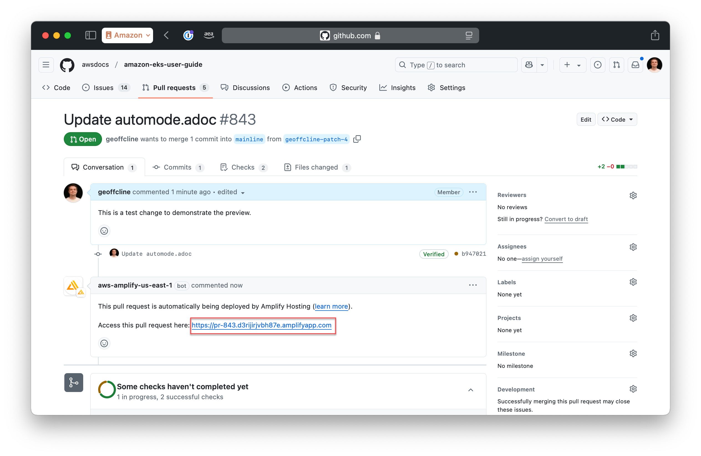

**Help improve this page**

To contribute to this user guide, choose the **Edit this page on GitHub** link that is located in the right pane of every page.

# View a preview of pull request content

The Amazon EKS User Guide GitHub is configured to build and generate a preview of the docs site. This preview doesn’t have the full AWS theme, but it does check the content builds properly and links work.

This preview is hosted at a temporary URL by AWS Amplify.

## View preview

When you submit a pull request, AWS Amplify attempts to build and deploy a preview of the content.

If the build succeeds, **aws-amplify-us-east-1** adds a comment to the pull request that has a link to the preview. Choose the link to the right of "Access this pull request here" (as called out in the screenshot with a red outline).

If the build fails, the repo admins can see the logs and provide feedback.

###### Note

If you haven’t contributed before, a project maintainer may need to approve running the build.

## Preview limitations

The preview is built as a single large HTML file. It will be displayed as multiple pages when published.

**What works:**

- Cross references (`xref`)
- Links to the internet
- Images
- Content hosted from `samples/`

**What doesn’t work:**

- Links to other AWS content, using `type="documentation"`. This is because this content doesn’t exist in the preview environment.
- The attribute `{aws}` will not display properly. The value of this changes based on the environment.
