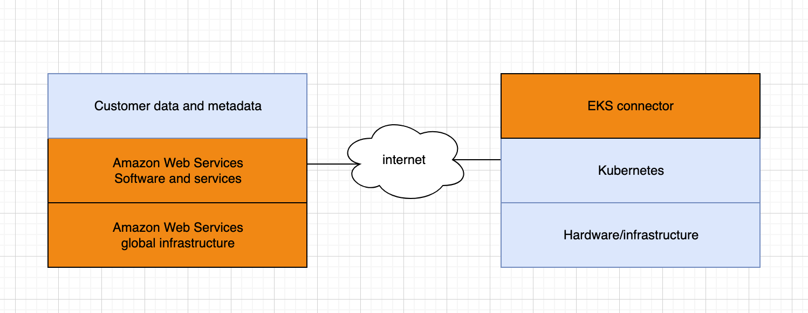

**Help improve this page**

To contribute to this user guide, choose the **Edit this page on GitHub** link that is located in the right pane of every page.

# Understand security in Amazon EKS Connector

The Amazon EKS Connector is an open source component that runs on your Kubernetes cluster. This cluster can be located outside of the AWS environment. This creates additional considerations for security responsibilities. This configuration can be illustrated by the following diagram. Orange represents AWS responsibilities, and blue represents customer responsibilities:

This topic describes the differences in the responsibility model if the connected cluster is outside of AWS.

## AWS responsibilities

- Maintaining, building, and delivering Amazon EKS Connector, which is an [open source component](https://github.com/aws/amazon-eks-connector "https://github.com/aws/amazon-eks-connector") that runs on a customer’s Kubernetes cluster and communicates with AWS.
- Maintaining transport and application layer communication security between the connected Kubernetes cluster and AWS services.

## Customer responsibilities

- Kubernetes cluster specific security, specifically along the following lines:
  - Kubernetes secrets must be properly encrypted and protected.
  - Lock down access to the `eks-connector` namespace.

- Configuring role-based access control (RBAC) permissions to manage [IAM principal](../../../IAM/latest/UserGuide/id_roles.md#iam-term-principal "../../../IAM/latest/UserGuide/id_roles.md#iam-term-principal") access from AWS. For instructions, see [Grant access to view Kubernetes cluster resources on an Amazon EKS console](connector-grant-access.md "connector-grant-access.md").
- Installing and upgrading Amazon EKS Connector.
- Maintaining the hardware, software, and infrastructure that supports the connected Kubernetes cluster.
- Securing their AWS accounts (for example, through safeguarding your [root user credentials](../../../IAM/latest/UserGuide/best-practices.md#lock-away-credentials "../../../IAM/latest/UserGuide/best-practices.md#lock-away-credentials")).
