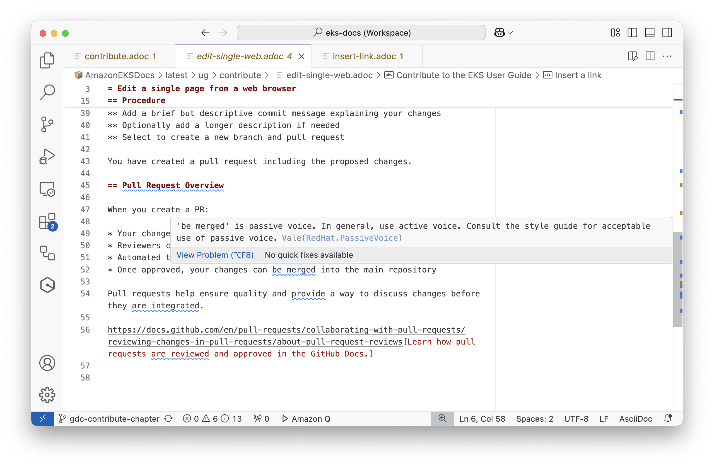

**Help improve this page**

To contribute to this user guide, choose the **Edit this page on GitHub** link that is located in the right pane of every page.

# View style feedback as you type by installing Vale locally

You can see style feedback as you type. This helps identify awkward writing and typos.



**Overview:**

- The Vale CLI loads style guides and runs them against source files.
- The EKS Docs repo includes a vale configuration file that loads style guides and local rules.
- The Vale extension for Visual Studio (VS) Code displays vale feedback inside the editor.

## Install Vale

Follow the instructions in the Vale CLI docs to [Install Vale with a Package Manager](https://vale.sh/docs/install#package-managers "https://vale.sh/docs/install#package-managers").

## Install VS Code Vale extension

1. Open VS Code.
2. Click the Extensions icon in the Activity Bar (or press Ctrl+Shift+X).
3. Search for "Vale".
4. Click Install on the "Vale VSCode" extension by Chris Chinchilla.
5. Reload VS Code when prompted.

## Sync Vale

Vale uses the `.vale.ini` configuration file in your project root to determine which style rules to apply.

1. Open VS Code.
2. Click **View** > **Terminal** (or press Ctrl+`).
3. Navigate to your project root directory if needed.
4. Run the command:

```
vale sync
```

5. Wait for Vale to finish downloading and syncing style rules

## View style feedback in VS Code

1. Open a Markdown or AsciiDoc file in VS Code.
2. The Vale extension will automatically check your text against the style rules.
3. Style issues will be underlined in the editor.
4. Hover over underlined text to see the specific style suggestion.
5. Fix issues by following the suggestions or consulting the style guide.
