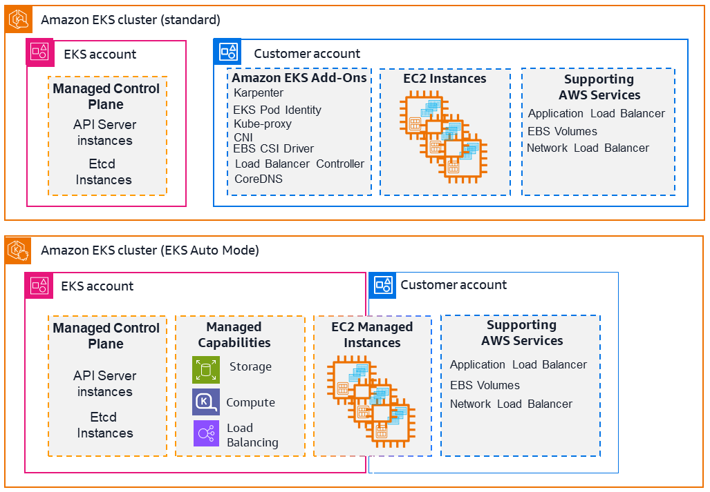

**Help improve this page**

To contribute to this user guide, choose the **Edit this page on GitHub** link that is located in the right pane of every page.

# What is Amazon EKS?

## Amazon EKS: Simplified Kubernetes Management

Amazon Elastic Kubernetes Service (EKS) provides a fully managed Kubernetes service that eliminates the complexity of operating Kubernetes clusters. With EKS, you can:

- Deploy applications faster with less operational overhead
- Scale seamlessly to meet changing workload demands
- Improve security through AWS integration and automated updates
- Choose between standard EKS or fully automated EKS Auto Mode

Amazon Elastic Kubernetes Service (Amazon EKS) is the premiere platform for running [Kubernetes](https://kubernetes.io/docs/concepts/overview/ "https://kubernetes.io/docs/concepts/overview/") clusters, both in the Amazon Web Services (AWS) cloud and in your own data centers ([EKS Anywhere](https://anywhere.eks.amazonaws.com/ "https://anywhere.eks.amazonaws.com/") and [Amazon EKS Hybrid Nodes](hybrid-nodes-overview.md "hybrid-nodes-overview.md")).

Amazon EKS simplifies building, securing, and maintaining Kubernetes clusters. It can be more cost effective at providing enough resources to meet peak demand than maintaining your own data centers. Two of the main approaches to using Amazon EKS are as follows:

- **EKS standard**: AWS manages the [Kubernetes control plane](https://kubernetes.io/docs/concepts/overview/components/#control-plane-components "https://kubernetes.io/docs/concepts/overview/components/#control-plane-components") when you create a cluster with EKS. Components that manage nodes, schedule workloads, integrate with the AWS cloud, and store and scale control plane information to keep your clusters up and running, are handled for you automatically.
- **EKS Auto Mode**: Using the [EKS Auto Mode](automode.md "automode.md") feature, EKS extends its control to manage [Nodes](https://kubernetes.io/docs/concepts/overview/components/#node-components "https://kubernetes.io/docs/concepts/overview/components/#node-components") (Kubernetes data plane) as well.
  It simplifies Kubernetes management by automatically provisioning infrastructure, selecting optimal compute instances, dynamically scaling resources, continuously optimizing costs, patching operating systems, and integrating with AWS security services.

The following diagram illustrates how Amazon EKS integrates your Kubernetes clusters with the AWS cloud, depending on which method of cluster creation you choose:

Amazon EKS helps you accelerate time to production, improve performance, availability and resiliency, and enhance system security.
For more information, see [Amazon Elastic Kubernetes Service](https://aws.amazon.com/eks/ "https://aws.amazon.com/eks/").

## Features of Amazon EKS

Amazon EKS provides the following high-level features:

**Management interfaces**

EKS offers multiple interfaces to provision, manage, and maintain clusters, including AWS Management Console, Amazon EKS API/SDKs, CDK, AWS CLI, eksctl CLI, AWS CloudFormation, and Terraform.
For more information, see [Get started with Amazon EKS](getting-started.md "getting-started.md") and [Amazon EKS cluster lifecycle and configuration](clusters.md "clusters.md").

**Access control tools**

EKS relies on both Kubernetes and AWS Identity and Access Management (AWS IAM) features to [manage access](cluster-auth.md "cluster-auth.md")
from users and workloads.
For more information, see [Grant IAM users and roles access to Kubernetes APIs](grant-k8s-access.md "grant-k8s-access.md") and [Grant Kubernetes workloads access to AWS using Kubernetes Service Accounts](service-accounts.md "service-accounts.md").

**Compute resources**

For [compute resources](eks-compute.md "eks-compute.md"), EKS allows the full range of Amazon EC2 instance types and AWS innovations such as Nitro and Graviton with Amazon EKS for you to optimize the compute for your workloads. For more information, see [Manage compute resources by using nodes](eks-compute.md "eks-compute.md").

**Storage**

EKS Auto Mode automatically creates storage classes using [EBS volumes](create-storage-class.md "create-storage-class.md").
Using Container Storage Interface (CSI) drivers, you can also use Amazon S3, Amazon EFS, Amazon FSX, and Amazon File Cache for your application storage needs. For more information, see [Use application data storage for your cluster](storage.md "storage.md").

**Security**

The shared responsibility model is employed as it relates to [Security in Amazon EKS](security.md "security.md").
For more information, see [Security best practices](security-best-practices.md "security-best-practices.md"), [Infrastructure security](infrastructure-security.md "infrastructure-security.md"),
and [Kubernetes security](security-k8s.md "security-k8s.md").

**Monitoring tools**

Use the [observability dashboard](observability-dashboard.md "observability-dashboard.md") to monitor Amazon EKS clusters.
Monitoring tools include [Prometheus](prometheus.md "prometheus.md"), [CloudWatch](cloudwatch.md "cloudwatch.md"), [Cloudtrail](logging-using-cloudtrail.md "logging-using-cloudtrail.md"),
and [ADOT Operator](opentelemetry.md "opentelemetry.md").
For more information on dashboards, metrics servers, and other tools, see [EKS cluster costs](cost-monitoring.md "cost-monitoring.md") and [Kubernetes Metrics Server](metrics-server.md "metrics-server.md").

**Kubernetes compatibility and support**

Amazon EKS is certified Kubernetes-conformant, so you can deploy Kubernetes-compatible applications without refactoring and use Kubernetes community tooling and plugins.
EKS offers both [standard support](kubernetes-versions-standard.md "kubernetes-versions-standard.md") and [extended support](kubernetes-versions-extended.md "kubernetes-versions-extended.md") for Kubernetes.
For more information, see [Understand the Kubernetes version lifecycle on EKS](kubernetes-versions.md "kubernetes-versions.md").

## Related services

**Services to use with Amazon EKS**

You can use other AWS services with the clusters that you deploy using Amazon EKS:

**Amazon EC2**

Obtain on-demand, scalable compute capacity with [Amazon EC2](../../../AWSEC2/latest/UserGuide/concepts.md "../../../AWSEC2/latest/UserGuide/concepts.md").

**Amazon EBS**

Attach scalable, high-performance block storage resources with [Amazon EBS](../../../ebs/latest/userguide/what-is-ebs.md "../../../ebs/latest/userguide/what-is-ebs.md").

**Amazon ECR**

Store container images securely with [Amazon ECR](../../../AmazonECR/latest/userguide/what-is-ecr.md "../../../AmazonECR/latest/userguide/what-is-ecr.md").

**Amazon CloudWatch**

Monitor AWS resources and applications in real time with [Amazon CloudWatch](../../../AmazonCloudWatch/latest/monitoring/WhatIsCloudWatch.md "../../../AmazonCloudWatch/latest/monitoring/WhatIsCloudWatch.md").

**Amazon Prometheus**

Track metrics for containerized applications with [Amazon Managed Service for Prometheus](../../../prometheus/latest/userguide/what-is-Amazon-Managed-Service-Prometheus.md "../../../prometheus/latest/userguide/what-is-Amazon-Managed-Service-Prometheus.md").

**Elastic Load Balancing**

Distribute incoming traffic across multiple targets with [Elastic Load Balancing](../../../elasticloadbalancing/latest/userguide/what-is-load-balancing.md "../../../elasticloadbalancing/latest/userguide/what-is-load-balancing.md").

**Amazon GuardDuty**

Detect threats to EKS clusters with [Amazon GuardDuty](integration-guardduty.md "integration-guardduty.md").

**AWS Resilience Hub**

Assess EKS cluster resiliency with [AWS Resilience Hub](integration-resilience-hub.md "integration-resilience-hub.md").

## Amazon EKS Pricing

Amazon EKS has per cluster pricing based on Kubernetes cluster version support, pricing for Amazon EKS Auto Mode, and per vCPU pricing for Amazon EKS Hybrid Nodes.

When using Amazon EKS, you pay separately for the AWS resources you use to run your applications on Kubernetes worker nodes. For example, if you are running Kubernetes worker nodes as Amazon EC2 instances with Amazon EBS volumes and public IPv4 addresses, you are charged for the instance capacity through Amazon EC2, the volume capacity through Amazon EBS, and the IPv4 address through Amazon VPC.

Visit the respective pricing pages of the AWS services you are using with your Kubernetes applications for detailed pricing information.

- For Amazon EKS cluster, Amazon EKS Auto Mode, and Amazon EKS Hybrid Nodes pricing, see [Amazon EKS Pricing](https://aws.amazon.com/eks/pricing/ "https://aws.amazon.com/eks/pricing/").
- For Amazon EC2 pricing, see [Amazon EC2 On-Demand Pricing](https://aws.amazon.com/ec2/pricing/on-demand/ "https://aws.amazon.com/ec2/pricing/on-demand/") and [Amazon EC2 Spot Pricing](https://aws.amazon.com/ec2/spot/pricing/ "https://aws.amazon.com/ec2/spot/pricing/").
- For AWS Fargate pricing, see [AWS Fargate Pricing](https://aws.amazon.com/fargate/pricing "https://aws.amazon.com/fargate/pricing").
- You can use your savings plans for compute used in Amazon EKS clusters. For more information, see [Pricing with Savings Plans](https://aws.amazon.com/savingsplans/pricing/ "https://aws.amazon.com/savingsplans/pricing/").
