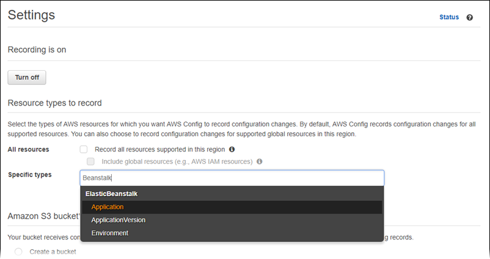
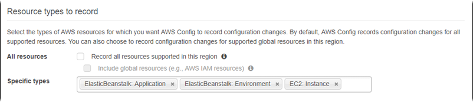
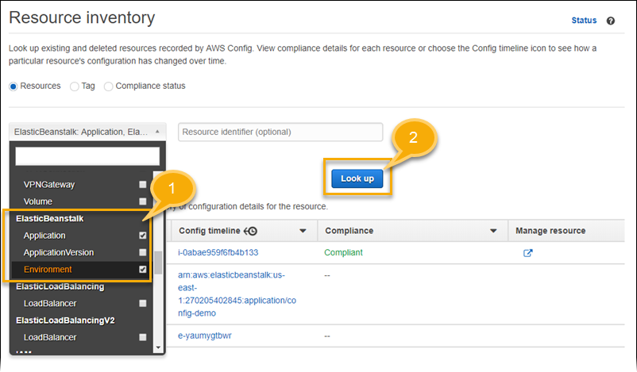
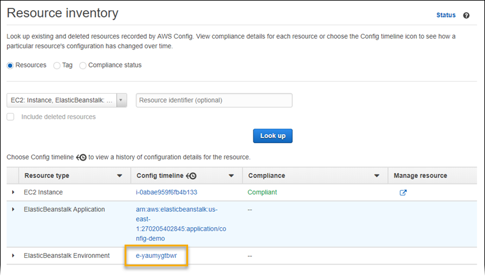
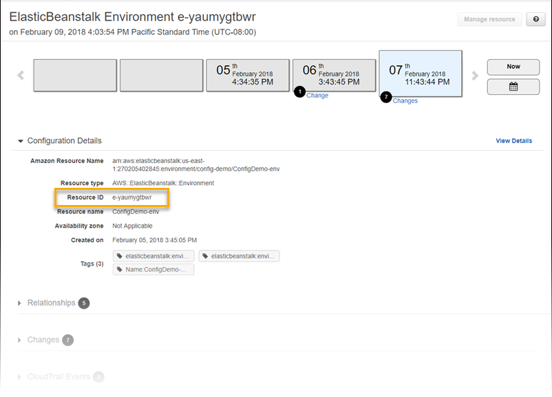
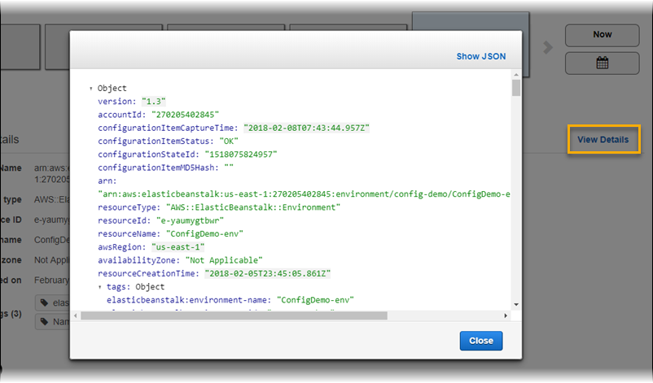

# Finding and tracking Elastic Beanstalk resources with AWS Config

[AWS Config](https://aws.amazon.com/config/ "https://aws.amazon.com/config/") provides a detailed view of the configuration of AWS resources in your AWS account. You can see
how resources are related, get a history of configuration changes, and see how relationships and configurations change over time. You can use AWS Config to define
rules that evaluate resource configurations for data compliance.

Several Elastic Beanstalk resource types are integrated with AWS Config:

- Applications
- Application Versions
- Environments
  The following section shows how to configure AWS Config to record resources of these types.

For more information about AWS Config, see the [AWS Config Developer Guide](../../../config/latest/developerguide.md "../../../config/latest/developerguide.md"). For pricing information, see the [AWS Config pricing
information page](https://aws.amazon.com/config/pricing/ "https://aws.amazon.com/config/pricing/").

## Setting up AWS Config

To initially set up AWS Config, see the following topics in the [AWS Config Developer Guide](../../../config/latest/developerguide.md "../../../config/latest/developerguide.md").

- [Setting up AWS Config with the Console](../../../config/latest/developerguide/gs-console.md "../../../config/latest/developerguide/gs-console.md")
- [Setting up AWS Config with the AWS CLI](../../../config/latest/developerguide/gs-cli.md "../../../config/latest/developerguide/gs-cli.md")

## Configuring AWS Config to record Elastic Beanstalk resources

By default, AWS Config records configuration changes for all supported types of _regional resources_ that it discovers in the region in
which your environment is running. You can customize AWS Config to record changes only for specific resource types, or changes to _global
resources_.

For example, you can configure AWS Config to record changes for Elastic Beanstalk resources and a subset of other AWS resources that Elastic Beanstalk starts
for you. Using the [AWS Config Console](../../../config/latest/developerguide/gs-console.md "../../../config/latest/developerguide/gs-console.md"),
you can select Elastic Beanstalk as a resource in the AWS Config **Settings** page from the **Specific Types** field.
From there you can choose to record any of the Elastic Beanstalk resource types:
**Application**, **ApplicationVersion**, and **Environment**.

The following figure shows the AWS Config **Settings** page, with Elastic Beanstalk resource types that you can choose to record:
**Application**, **ApplicationVersion**, and **Environment**.

After you select a few resource types, this is how the **Specific types** list appears.

To learn about _regional_ vs. _global_ resources, and for the full customization procedure, see [Selecting which Resources AWS Config Records](../../../config/latest/developerguide/select-resources.md "../../../config/latest/developerguide/select-resources.md").

## Viewing Elastic Beanstalk configuration details in the AWS Config console

You can use the AWS Config console to look for Elastic Beanstalk resources, and get current and historical details about their configurations. The following example
shows how to find information about an Elastic Beanstalk environment.

###### To find an Elastic Beanstalk environment in the AWS Config console

1. Open the [AWS Config console](https://console.aws.amazon.com/config "https://console.aws.amazon.com/config").
2. Choose **Resources**.
3. On the **Resource inventory** page, choose **Resources**.
4. Open the **Resource type** menu, scroll to **ElasticBeanstalk**, and then choose one or more of the Elastic Beanstalk
   resource types.

###### Note

To view configuration details for other resources that Elastic Beanstalk created for your application, choose additional resource types. For example, you
can choose **Instance** under **EC2**. 5. Choose **Look up**.

See **2** in the following figure.

 6. Choose a resource ID in the list of resources that AWS Config displays.

AWS Config displays configuration details and other information about the resource you selected.

To see the full details of the recorded configuration, choose **View Details**.

To learn more ways to find a resource and view information on this page, see [Viewing AWS Resource
Configurations and History](../../../config/latest/developerguide/view-manage-resource.md "../../../config/latest/developerguide/view-manage-resource.md") in the _AWS Config Developer Guide_.

## Evaluating Elastic Beanstalk resources using AWS Config rules

You can create AWS Config rules, which represent the ideal configuration settings for your Elastic Beanstalk resources. You can use predefined _AWS Managed
Config Rules_, or define custom rules. AWS Config continuously tracks changes to the configuration of your resources to determine whether those
changes violate any of the conditions in your rules. The AWS Config console shows the compliance status of your rules and resources.

If a resource violates a rule and is flagged as _noncompliant_, AWS Config can alert you using an [Amazon Simple Notification Service (Amazon SNS)](https://aws.amazon.com/sns/ "https://aws.amazon.com/sns/") topic. To programmatically consume the data in these AWS Config alerts, use an [Amazon Simple Queue Service
(Amazon SQS)](https://aws.amazon.com/sqs/ "https://aws.amazon.com/sqs/") queue as the notification endpoint for the Amazon SNS topic. For example, you might want to write code that starts a workflow when someone
modifies your environment's Amazon EC2 Auto Scaling group configuration.

To learn more about setting up and using rules, see [Evaluating Resources with AWS Config Rules](../../../config/latest/developerguide/evaluate-config.md "../../../config/latest/developerguide/evaluate-config.md") in the
_AWS Config Developer Guide_.
