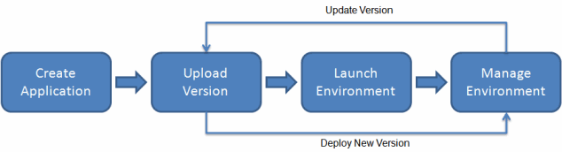

# What is AWS Elastic Beanstalk?

With Elastic Beanstalk you can deploy web applications into the AWS Cloud on a variety of supported platforms. You build and deploy your applications. Elastic Beanstalk provisions Amazon EC2 instances, configures load balancing, sets up health monitoring, and dynamically scales your environment.

In addition to _web server_ environments, Elastic Beanstalk also provides _worker_ environments which you can use to process messages from an Amazon SQS queue, useful for asynchronous or long-running tasks. For more information, see [Elastic Beanstalk worker environments](using-features-managing-env-tiers.md "using-features-managing-env-tiers.md").

## Supported platforms

Elastic Beanstalk supports applications developed in Go, Java, .NET, Node.js, PHP, Python, and Ruby. Elastic Beanstalk also supports Docker containers, where you can choose your own programming language and application dependencies. When you deploy your application, Elastic Beanstalk builds the selected supported platform version and provisions one or more AWS resources, such as Amazon EC2 instances, in your AWS account to run your application.

You can interact with Elastic Beanstalk through the Elastic Beanstalk console, the AWS Command Line Interface (AWS CLI), or the EB CLI, a high-level command line tool designed specifically for Elastic Beanstalk.

You can perform most deployment tasks, such as changing the size of your fleet of Amazon EC2 instances or monitoring your application, directly from the Elastic Beanstalk web interface (console).

To learn more about how to deploy a sample web application using Elastic Beanstalk, see [Learn how to get started with Elastic Beanstalk](GettingStarted.md "GettingStarted.md").

## Application deploy workflow

To use Elastic Beanstalk, you create an application, then upload your application source bundle to
Elastic Beanstalk. Next, you provide information about the application, and Elastic Beanstalk automatically launches an environment and creates and configures the AWS resources needed to run your code.

After you create and deploy your application and your environment is launched, you can manage your environment and deploy new application versions. Information about the application—including metrics, events, and environment status—is made available through the Elastic Beanstalk console, APIs, and Command Line Interfaces.

The following diagram illustrates Elastic Beanstalk workflow:

## Pricing

There is no additional charge for Elastic Beanstalk. You pay only for the underlying AWS resources that your application consumes. For details about pricing,
see the [Elastic Beanstalk service detail page](https://aws.amazon.com/elasticbeanstalk "https://aws.amazon.com/elasticbeanstalk").

## Next steps

We recommend the tutorial, [Getting started tutorial](GettingStarted.md "GettingStarted.md"), to start using Elastic Beanstalk. The tutorial steps you through creating, viewing, and updating a sample Elastic Beanstalk application.
