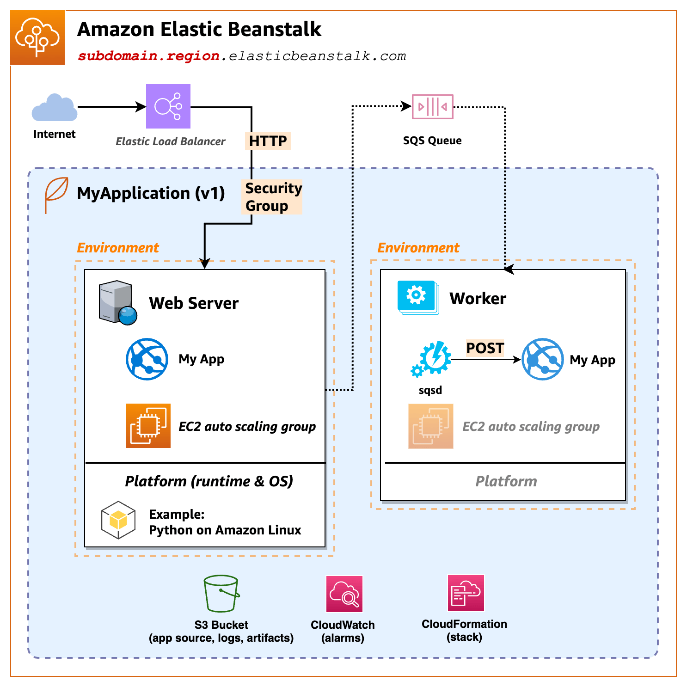

# Understanding concepts in Elastic Beanstalk

Becoming familiar with the concepts and terms will help you gain an understanding needed for deploying your applications with Elastic Beanstalk.

## Application

An Elastic Beanstalk _application_ is a container for Elastic Beanstalk components, including _environments_, _versions_, and _environment configurations_. Within an Elastic Beanstalk application, you manage all the resources relevant to running your code.

## Application version

In Elastic Beanstalk, an _application version_ refers to a specific, labeled iteration of deployable code for a web application. An application
version points to an Amazon Simple Storage Service (Amazon S3) object that contains the deployable code, such as a Java WAR file.

An application version
is part of an application. Applications can have many versions and each application version is unique. In a running environment, you can deploy any
application version you already uploaded to the application, or you can upload and immediately deploy a new application version. For example, you could upload multiple
application versions to test differences between them.

## Environment

An _environment_ is a collection of AWS resources running an application version. Each environment runs only one application version at a time, however, you can run the same application version or different application versions in many environments simultaneously. When you
create an environment, Elastic Beanstalk provisions the resources needed in your AWS account to run the application version you specified.

## Environment tier

When you launch an Elastic Beanstalk environment, you first choose an environment tier. The environment tier designates the type of application that the
environment runs and determines what resources Elastic Beanstalk provisions to support it. An application that serves HTTP requests runs in a [web server environment tier](concepts-webserver.md "concepts-webserver.md"). A backend environment that pulls tasks from an Amazon Simple Queue Service (Amazon SQS) queue runs in a [worker environment tier](concepts-worker.md "concepts-worker.md").

## Environment configuration

An _environment configuration_ identifies a collection of parameters and settings that define how an environment and its
associated resources behave. When you update an environment’s configuration settings, Elastic Beanstalk automatically applies the changes to existing resources or
deletes and deploys new resources (depending on the type of change).

## Saved configuration

A _saved configuration_ is a template that you can use as a starting point for creating unique environment configurations. You can
create and modify saved configurations, and apply them to environments, using the Elastic Beanstalk console, EB CLI, AWS CLI, or API. The API and the AWS CLI refer to
saved configurations as _configuration templates_.

## Platform

A _platform_ is a combination of an operating system, programming language runtime, web server, application server, and Elastic Beanstalk
components. You design and target your web application to a platform. Elastic Beanstalk provides a variety of platforms on which you can build your
applications.

For details, see [Elastic Beanstalk platforms](concepts-all-platforms.md "concepts-all-platforms.md").
