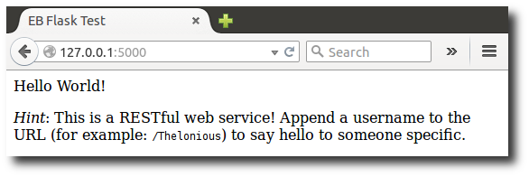
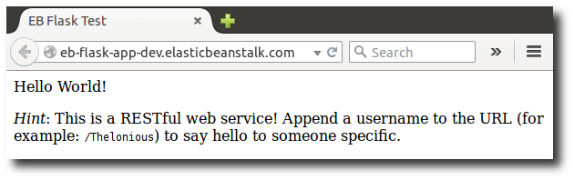

# Deploying a Flask application to Elastic Beanstalk

This tutorial walks you through the process of generating a Flask application and
deploying it to an AWS Elastic Beanstalk environment. Flask is an open source web application framework for Python.

In this tutorial, you’ll do the following:

- [Set up a Python virtual environment with Flask](#python-flask-setup-venv "#python-flask-setup-venv")
- [Create a Flask application](#python-flask-create-app "#python-flask-create-app")
- [Deploy your site with the EB CLI](#python-flask-deploy "#python-flask-deploy")
- [Cleanup](#python-flask-tutorial-cleanup "#python-flask-tutorial-cleanup")

## Prerequisites

This tutorial assumes you have knowledge of the basic Elastic Beanstalk operations and the Elastic Beanstalk console. If you haven't already, follow the instructions in [Learn how to get started with Elastic Beanstalk](GettingStarted.md "GettingStarted.md") to launch your first Elastic Beanstalk environment.

To follow the procedures in this guide, you will need a command line terminal or shell to run commands. Commands are shown in
listings preceded by a
prompt symbol ($) and the name of the current directory, when appropriate.

```
~/eb-project$ `this is a command`
this is output
```

On Linux and macOS, you can use your preferred shell and package manager. On Windows you can [install the Windows Subsystem for Linux](https://docs.microsoft.com/en-us/windows/wsl/install-win10 "https://docs.microsoft.com/en-us/windows/wsl/install-win10") to get a Windows-integrated version of
Ubuntu and Bash.

In this tutorial we use Python 3.11 and the corresponding Elastic Beanstalk platform version. Install Python by following the
instructions at [Setting up your Python development environment for Elastic Beanstalk](python-development-environment.md "python-development-environment.md").

The [Flask](http://flask.pocoo.org/ "http://flask.pocoo.org/") framework will be installed as part of the tutorial.

This tutorial also uses the Elastic Beanstalk Command Line Interface (EB CLI). For details on installing and configuring the EB CLI, see [Install EB CLI with setup script (recommended)](eb-cli3.md#eb-cli3-install "eb-cli3.md#eb-cli3-install") and [Configure the EB CLI](eb-cli3-configuration.md "eb-cli3-configuration.md").

## Set up a Python virtual environment with Flask

Create a project directory and virtual environment for your application, and install Flask.

###### To set up your project environment

1. Create a project directory.

```
~$ `mkdir eb-flask`
~$ `cd eb-flask`
```

2. Create and activate a virtual environment named `virt`:

```
~/eb-flask$ `virtualenv virt`
~$ `source virt/bin/activate`
(virt) ~/eb-flask$
```

You will see `(virt)` prepended to your command prompt, indicating that you're in a virtual environment. Use the virtual environment
for the rest of this tutorial. 3. Install Flask with `pip install`:

```
(virt)~/eb-flask$ `pip install flask==3.0.3`
```

4. View the installed libraries with `pip freeze`:

```
(virt)~/eb-flask$ `pip freeze`
blinker==1.8.2
click==8.1.7
Flask==3.0.3
importlib_metadata==8.5.0
itsdangerous==2.2.0
Jinja2==3.1.4
MarkupSafe==2.1.5
Werkzeug==3.0.4
zipp==3.20.2
```

This command lists all of the packages installed in your virtual environment. Because you are in a virtual environment, globally installed
packages like the EB CLI are not shown. 5. Save the output from `pip freeze` to a file named `requirements.txt`.

```
(virt)~/eb-flask$ `pip freeze > requirements.txt`
```

This file tells Elastic Beanstalk to install the libraries during deployment. For more information, see [Specifying dependencies using a requirements file on Elastic Beanstalk](python-configuration-requirements.md "python-configuration-requirements.md").

## Create a Flask application

Next, create an application that you'll deploy using Elastic Beanstalk. We'll create a "Hello World" RESTful web service.

Create a new text file in this directory named `application.py` with the following contents:

###### Example `~/eb-flask/application.py`

```
from flask import Flask

# print a nice greeting.
def say_hello(username = "World"):
    return '<p>Hello %s!</p>\n' % username

# some bits of text for the page.
header_text = '''
    <html>\n<head> <title>EB Flask Test</title> </head>\n<body>'''
instructions = '''
    <p><em>Hint</em>: This is a RESTful web service! Append a username
    to the URL (for example: <code>/Thelonious</code>) to say hello to
    someone specific.</p>\n'''
home_link = '<p><a href="/">Back</a></p>\n'
footer_text = '</body>\n</html>'

# EB looks for an 'application' callable by default.
application = Flask(__name__)

# add a rule for the index page.
application.add_url_rule('/', 'index', (lambda: header_text +
    say_hello() + instructions + footer_text))

# add a rule when the page is accessed with a name appended to the site
# URL.
application.add_url_rule('/<username>', 'hello', (lambda username:
    header_text + say_hello(username) + home_link + footer_text))

# run the app.
if __name__ == "__main__":
    # Setting debug to True enables debug output. This line should be
    # removed before deploying a production app.
    application.debug = True
    application.run()
```

This example prints a customized greeting that varies based on the path used to access the service.

###### Note

By adding `application.debug = True` before running the application, debug output is enabled in case something goes wrong. It's a good
practice for development, but you should remove debug statements in production code, since debug output can reveal internal aspects of your
application.

Using `application.py` as the filename and providing a callable `application` object (the Flask object, in this case) allows
Elastic Beanstalk to easily find your application's code.

Run `application.py` with Python:

```
(virt) ~/eb-flask$ `python application.py`
 * Serving Flask app "application" (lazy loading)
 * Environment: production
   WARNING: Do not use the development server in a production environment.
   Use a production WSGI server instead.
 * Debug mode: on
 * Running on http://127.0.0.1:5000/ (Press CTRL+C to quit)
 * Restarting with stat
 * Debugger is active!
 * Debugger PIN: 313-155-123
```

Open `http://127.0.0.1:5000/` in your web browser. You should see the application running, showing the index page:



Check the server log to see the output from your request. You can stop the web server and return to your virtual environment by typing
**Ctrl+C**.

If you got debug output instead, fix the errors and make sure the application is running locally before configuring it for Elastic Beanstalk.

## Deploy your site with the EB CLI

You've added everything you need to deploy your application on Elastic Beanstalk. Your project directory should now look like this:

```
~/eb-flask/
|-- virt
|-- application.py
`-- requirements.txt
```

The `virt` folder, however, is not required for the application to run on Elastic Beanstalk. When you deploy, Elastic Beanstalk creates a new virtual
environment on the server instances and installs the libraries listed in `requirements.txt`. To minimize the size of the source bundle
that you upload during deployment, add an [.ebignore](eb-cli3-configuration.md#eb-cli3-ebignore "eb-cli3-configuration.md#eb-cli3-ebignore") file that tells the EB CLI to leave out the
`virt` folder.

###### Example ~/eb-flask/.ebignore

```
virt
```

Next, you'll create your application environment and deploy your configured application with Elastic Beanstalk.

###### To create an environment and deploy your Flask application

1. Initialize your EB CLI repository with the **eb init** command:

```
~/eb-flask$ `eb init -p python-3.11 flask-tutorial --region us-east-2`
Application flask-tutorial has been created.
```

This command creates a new application named `flask-tutorial` and configures your local repository to create environments with
the latest Python 3.11 platform version. 2. (optional) Run **eb init** again to configure a default keypair so that you can connect to the EC2 instance running your
application with SSH:

```
~/eb-flask$ `eb init`
Do you want to set up SSH for your instances?
(y/n): `y`
Select a keypair.
1) my-keypair
2) [ Create new KeyPair ]
```

Select a key pair if you have one already, or follow the prompts to create a new one. If you don't see the prompt or need to change your settings
later, run **eb init -i**. 3. Create an environment and deploy your application to it with **eb create**:

```
~/eb-flask$ `eb create flask-env`
```

Environment creation takes about 5 minutes and creates the following resources:

- **EC2 instance** – An Amazon Elastic Compute Cloud (Amazon EC2) virtual
  machine configured to run web apps on the platform that you choose.

Each platform runs a specific set of software, configuration files, and scripts to support a specific language version, framework, web container, or
combination of these. Most platforms use either Apache or NGINX as a reverse proxy that sits in front of your web app, forwards requests to it, serves
static assets, and generates access and error logs.

- **Instance security group** – An Amazon EC2 security group configured to allow inbound traffic on port 80. This
  resource lets HTTP traffic from the load balancer reach the EC2 instance running your web app. By default, traffic isn't allowed on other ports.
- **Load balancer** – An Elastic Load Balancing load balancer configured to distribute requests to the instances running your
  application. A load balancer also eliminates the need to expose your instances directly to the internet.
- **Load balancer security group** – An Amazon EC2 security group configured to allow inbound traffic on port 80. This
  resource lets HTTP traffic from the internet reach the load balancer. By default, traffic isn't allowed on other ports.
- **Auto Scaling group** – An Auto Scaling group configured to replace
  an instance if it is terminated or becomes unavailable.
- **Amazon S3 bucket** – A storage location for your source
  code, logs, and other artifacts that are created when you use Elastic Beanstalk.
- **Amazon CloudWatch alarms** – Two CloudWatch alarms that monitor the load on the instances in your environment and that are
  triggered if the load is too high or too low. When an alarm is triggered, your Auto Scaling group scales up or down in response.
- **AWS CloudFormation stack** – Elastic Beanstalk uses AWS CloudFormation to launch the
  resources in your environment and propagate configuration changes. The resources are defined
  in a template that you can view in the [AWS CloudFormation
  console](https://console.aws.amazon.com/cloudformation "https://console.aws.amazon.com/cloudformation").
- **Domain name** – A domain name that routes to your
  web app in the form
  _`subdomain`.`region`.elasticbeanstalk.com_.

###### Domain security

To augment the security of your Elastic Beanstalk applications, the _elasticbeanstalk.com_ domain is registered in the
[Public Suffix List (PSL)](https://publicsuffix.org/ "https://publicsuffix.org/").

If you ever need to set sensitive cookies in the default domain name for your Elastic Beanstalk applications, we recommend that you use cookies with a
`__Host-` prefix for increased security. This practice defends your domain against cross-site request forgery attempts (CSRF). For more
information see the [Set-Cookie](https://developer.mozilla.org/en-US/docs/Web/HTTP/Headers/Set-Cookie#cookie_prefixes "https://developer.mozilla.org/en-US/docs/Web/HTTP/Headers/Set-Cookie#cookie_prefixes") page in the Mozilla
Developer Network.

All of these resources are managed by Elastic Beanstalk. When you terminate your environment, Elastic Beanstalk terminates all the resources that it contains.

###### Note

The Amazon S3 bucket that Elastic Beanstalk creates is shared between environments and is not deleted during environment termination. For more information, see [Using Elastic Beanstalk with Amazon S3](AWSHowTo.md "AWSHowTo.md").

When the environment creation process completes, open your web site with **eb open**:

```
~/eb-flask$ `eb open`
```

This will open a browser window using the domain name created for your application. You should see the same Flask website that you created and tested
locally.



If you don't see your application running, or get an error message, see [Troubleshooting Deployments](troubleshooting.md#troubleshooting-deployments "troubleshooting.md#troubleshooting-deployments")
for help with how to determine the cause of the error.

If you _do_ see your application running, then congratulations, you've deployed your first Flask application with Elastic Beanstalk!

## Cleanup

After you finish working with the demo code, you can terminate your environment.
Elastic Beanstalk deletes all related AWS resources, such as
[Amazon EC2 instances](using-features.managing.md "using-features.managing.md"),
[database instances](using-features.managing.md "using-features.managing.md"),
[load balancers](using-features.managing.md "using-features.managing.md"),
security groups,
and [alarms](using-features.md#using-features.alarms.title "using-features.md#using-features.alarms.title").

Removing resources does not delete the Elastic Beanstalk application, so you can create new environments for your application at any time.

###### To terminate your Elastic Beanstalk environment from the console

1. Open the [Elastic Beanstalk console](https://console.aws.amazon.com/elasticbeanstalk "https://console.aws.amazon.com/elasticbeanstalk"),
   and in the **Regions** list, select your AWS Region.
2. In the navigation pane, choose **Environments**, and then choose the name of your environment from the list.
3. Choose **Actions**, and then choose **Terminate
   environment**.
4. Use the on-screen dialog box to confirm environment termination.

Or, with the EB CLI:

```
~/eb-flask$ `eb terminate flask-env`
```

## Next steps

For more information about Flask, visit [flask.pocoo.org](http://flask.pocoo.org/ "http://flask.pocoo.org/").

If you'd like to try out another Python web framework, check out [Deploying a Django application to Elastic Beanstalk](create-deploy-python-django.md "create-deploy-python-django.md").
