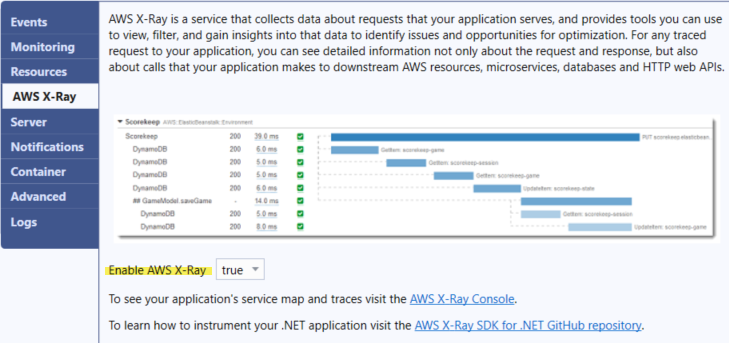

# Configuring AWS X-Ray using the AWS toolkit for Visual Studio

AWS X-Ray provides request tracing, exception collection, and profiling capabilities. With the AWS X-Ray panel, you can enable or disable
X-Ray for your application. For more information about X-Ray, see the [AWS X-Ray Developer Guide](../../../xray/latest/devguide.md "../../../xray/latest/devguide.md").

