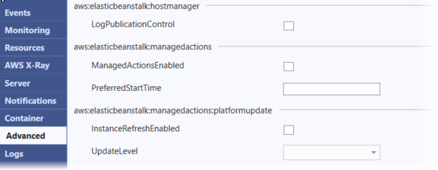

# Configuring additional environment options using AWS toolkit for Visual Studio

Elastic Beanstalk defines a large number of configuration options that you can use to configure your environment's behavior and the resources that it contains.
Configuration options are organized into namespaces like `aws:autoscaling:asg`. Each namespace defines options for an environment's Amazon EC2 Auto Scaling group.
The **Advanced** panel lists the configuration option namespaces in alphabetical order that you can update after environment
creation.

For a complete list of namespaces and options, including default and supported values for each, see [General options for all environments](command-options-general.md "command-options-general.md") and [.NET Core on Linux platform options](command-options-specific.md#command-options-dotnet-core-linux "command-options-specific.md#command-options-dotnet-core-linux").

