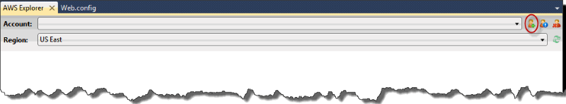
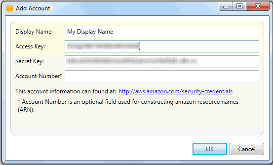

# Managing accounts

##

If you want to set up different AWS accounts to perform different tasks, such as testing,
staging, and production, you can add, edit, and delete accounts using the AWS Toolkit for
Visual Studio.

###### To manage multiple accounts

1. In Visual Studio, on the **View** menu, click **AWS
   Explorer**.
2. Beside the **Account** list, click the **Add
   Account** button.

The **Add Account** dialog box appears.

 3. Fill in the requested information. 4. Your account information now appears on the **AWS Explorer** tab.
When you publish to Elastic Beanstalk, you can select which account you would like to use.
