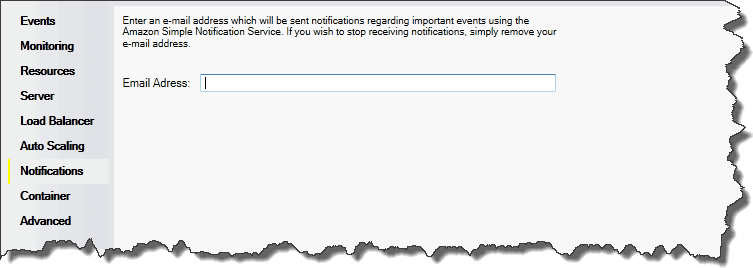

# Configuring notifications using AWS toolkit for Visual Studio

Elastic Beanstalk uses the Amazon Simple Notification Service (Amazon SNS) to notify you of important events affecting your application. To enable Amazon SNS notifications, simply enter
your email address in the **Email Address** box. To disable these notifications, remove your email address from the box.

