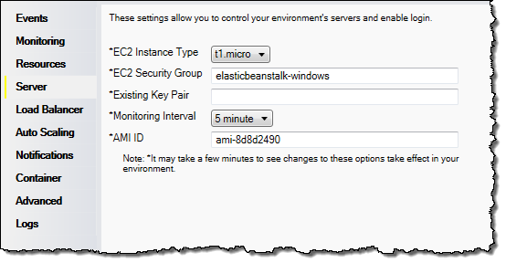

# Configuring EC2 server instances using the AWS toolkit for Visual Studio

Amazon Elastic Compute Cloud (Amazon EC2) is a web service that you use to launch and manage server instances in Amazon's data centers. You can use
Amazon EC2 server instances at any time, for as long as you need, and for any legal purpose. Instances are available in different sizes and
configurations. For more information, go to [Amazon EC2](https://aws.amazon.com/ec2/ "https://aws.amazon.com/ec2/").

You can edit the Elastic Beanstalk environment's Amazon EC2 instance configuration with the **Server** tab inside your application environment
tab in the AWS Toolkit for Visual Studio.

## Amazon EC2 instance types

**Instance type** displays the
instance types available to your Elastic Beanstalk application. Change the instance type
to select a server with the characteristics (including memory size
and CPU power) that are most appropriate to your application. For example,
applications with intensive and long-running operations can require more CPU or
memory.

For more information about the Amazon EC2 instance types available for your Elastic Beanstalk
application, see [Instance Types](../../../AWSEC2/latest/UserGuide/instance-types.md "../../../AWSEC2/latest/UserGuide/instance-types.md") in the _Amazon Elastic Compute Cloud
User Guide_.

## Amazon EC2 security groups

You can control access to your Elastic Beanstalk application using an _Amazon EC2 Security Group_. A security group defines firewall rules
for your instances. These rules specify which ingress (i.e., incoming) network traffic should be delivered to your instance. All other ingress traffic
will be discarded. You can modify rules for a group at any time. The new rules are automatically enforced for all running instances and instances
launched in the future.

You can set up your Amazon EC2 security groups using the AWS Management Console or by using the AWS Toolkit for Visual Studio. You can specify which
Amazon EC2 Security Groups control access to your Elastic Beanstalk application by entering the names of one or more Amazon EC2 security group names (delimited by
commas) into the **EC2 Security Groups** text box.

###### Note

Make sure port 80 (HTTP) is accessible from 0.0.0.0/0 as the source CIDR range if you want to enable health checks for your application. For more
information about health checks, see [Health checks](create_deploy_NET.managing.md#create_deploy_NET.managing.elb.healthchecks "create_deploy_NET.managing.md#create_deploy_NET.managing.elb.healthchecks").

###### To create a security group using the AWS toolkit for Visual Studio

1. In Visual Studio, in **AWS Explorer**, expand the **Amazon EC2** node, and then double-click
   **Security Groups**.
2. Click **Create Security Group**, and enter a name and description for your security group.
3. Click **OK**.

For more information on Amazon EC2 Security Groups, see [Using
Security Groups](../../../AWSEC2/latest/UserGuide/using-network-security.md "../../../AWSEC2/latest/UserGuide/using-network-security.md") in the _Amazon Elastic Compute Cloud User Guide_.

## Amazon EC2 key pairs

You can securely log in to the Amazon EC2 instances provisioned for your Elastic Beanstalk application with an Amazon EC2 key pair.

###### Important

You must create an Amazon EC2 key pair and configure your Elastic Beanstalk–provisioned Amazon EC2 instances to use the Amazon EC2 key pair before you
can access your Elastic Beanstalk–provisioned Amazon EC2 instances. You can create your key pair using the **Publish to AWS** wizard inside
the AWS Toolkit for Visual Studio when you deploy your application to Elastic Beanstalk. If you want to create additional key pairs using the Toolkit, follow the
steps below. Alternatively, you can set up your Amazon EC2 key pairs using the [AWS Management
Console](https://console.aws.amazon.com/ "https://console.aws.amazon.com/"). For instructions on creating a key pair for Amazon EC2, see the [Amazon Elastic Compute Cloud Getting Started Guide](../../../AWSEC2/latest/GettingStartedGuide.md "../../../AWSEC2/latest/GettingStartedGuide.md").

The **Existing Key Pair** text box lets you specify the name of an Amazon EC2 key pair you can use to securely log in to the
Amazon EC2 instances running your Elastic Beanstalk application.

###### To specify the name of an Amazon EC2 key pair

1. Expand the **Amazon EC2** node and double-click **Key Pairs**.
2. Click **Create Key Pair** and enter the key pair name.
3. Click **OK**.

For more information about Amazon EC2 key pairs, go to [Using Amazon EC2
Credentials](../../../AWSEC2/latest/UserGuide/using-credentials.md "../../../AWSEC2/latest/UserGuide/using-credentials.md") in the _Amazon Elastic Compute Cloud User Guide_. For more information about connecting to Amazon EC2
instances, see [Listing and connecting to server instances](create_deploy_NET.md "create_deploy_NET.md").

## Monitoring interval

By default, only basic Amazon CloudWatch metrics are enabled. They return
data in five-minute periods. You can enable more granular one-minute CloudWatch
metrics by selecting **1 minute** for the **Monitoring
Interval** in the **Server** section of the **Configuration** tab for your environment in the AWS Toolkit for Eclipse.

###### Note

Amazon CloudWatch service charges can apply for one-minute interval
metrics. See [Amazon
CloudWatch](https://aws.amazon.com/cloudwatch/ "https://aws.amazon.com/cloudwatch/") for more information.

## Custom AMI ID

You can override the default AMI used for your Amazon EC2 instances with your own
custom AMI by entering the identifier of your custom AMI into the
**Custom AMI ID** box in the **Server** section of the **Configuration** tab for your environment in the AWS Toolkit for Eclipse.

###### Important

Using your own AMI is an advanced task that you should do with
care. If you need a custom AMI, we recommend you start with the default
Elastic Beanstalk AMI and then modify it. To be considered healthy, Elastic Beanstalk
expects Amazon EC2 instances to meet a set of requirements, including having a
running host manager. If these requirements are not met, your environment
might not work properly.
