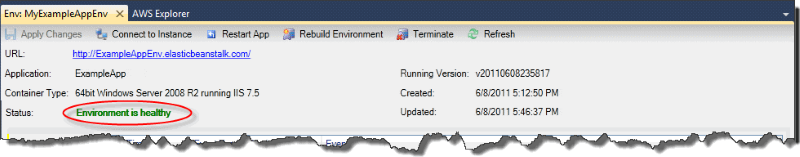
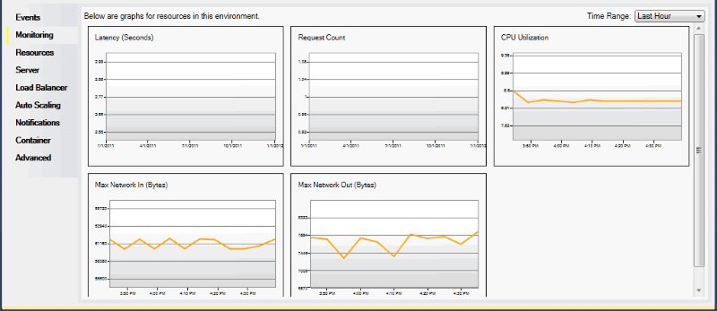
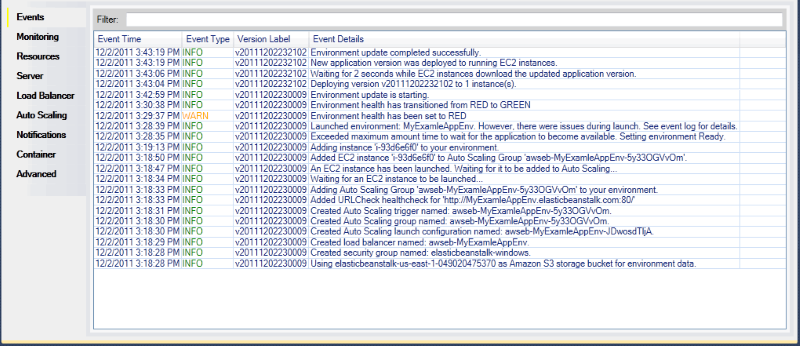

# Monitoring application health

When you are running a production website, it is important to know that your application is
available and responding to requests. To assist with monitoring your application’s
responsiveness, Elastic Beanstalk provides features where you can monitor statistics about your application
and create alerts that trigger when thresholds are exceeded.

For information about the health monitoring provided by Elastic Beanstalk, see [Basic health reporting](using-features.md "using-features.md").

You can access operational information about your application by using either the AWS
Toolkit for Visual Studio or the AWS Management Console.

The toolkit displays your environment's status and application health in the
**Status** field.

###### To monitor application health

1. In the AWS Toolkit for Visual Studio, in **AWS Explorer**, expand
   the Elastic Beanstalk node, and then expand your application node.
2. Right-click your Elastic Beanstalk environment, and then click **View
   Status**.
3. On your application environment tab, click **Monitoring**.

The **Monitoring** panel includes a set of graphs showing resource
usage for your particular application environment.

###### Note

By default, the time range is set to the last hour. To modify this setting, in the
**Time Range** list, click a different time range.
You can use the AWS Toolkit for Visual Studio or the AWS Management Console to view events
associated with your application.

###### To view application events

1. In the AWS Toolkit for Visual Studio, in **AWS Explorer**, expand
   the Elastic Beanstalk node and your application node.
2. Right-click your Elastic Beanstalk environment in **AWS Explorer** and then
   click **View Status**.
3. In your application environment tab, click **Events**.

