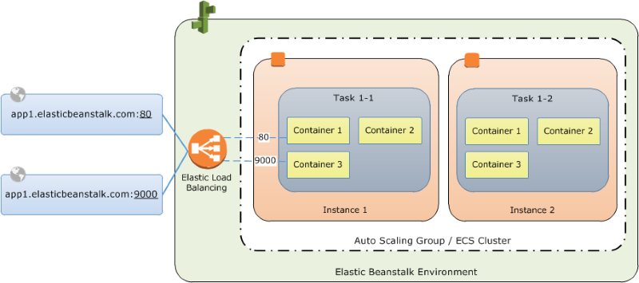

# Using the ECS managed Docker platform branch in Elastic Beanstalk

This topic provides an overview of the Elastic Beanstalk ECS managed Docker platform branches for Amazon Linux 2 and Amazon Linux 2023. It also provides configuration
information that's specific to the Docker ECS managed platform.

###### Migration from Multi-container Docker on AL1

On [July 18, 2022](../relnotes/release-2022-07-18-linux-al1-retire.md "../relnotes/release-2022-07-18-linux-al1-retire.md"),
Elastic Beanstalk set the status of all platform branches based on Amazon Linux AMI (AL1) to **retired**. Although this chapter provides configuration information for this retired platform, we strongly
recommend that you migrate to the latest supported platform branch. If you're presently using the retired _Multi-container Docker running on
AL1_ platform branch, you can migrate to the latest _ECS Running on AL2023_ platform branch. The latest platform branch
supports all of the features from the discontinued platform branch. No changes to the source code are required. For more information, see [Migrating your Elastic Beanstalk application from ECS managed Multi-container Docker on AL1 to ECS on Amazon Linux 2023](migrate-to-ec2-AL2-platform.md "migrate-to-ec2-AL2-platform.md").

## ECS managed Docker platform overview

Elastic Beanstalk uses Amazon Elastic Container Service (Amazon ECS) to coordinate container deployments to ECS managed Docker environments. Amazon ECS provides tools to manage a cluster of instances
running Docker containers. Elastic Beanstalk takes care of Amazon ECS tasks including cluster creation, task definition and execution. Each of the instances in the
environment run the same set of containers, which are defined in a `Dockerrun.aws.json` v2 file. In order to get the most out of Docker, Elastic Beanstalk
lets you create an environment where your Amazon EC2 instances run multiple Docker containers side by side.

The following diagram shows an example Elastic Beanstalk environment configured with three Docker containers running on each Amazon EC2 instance in an Auto Scaling
group:

## Amazon ECS resources created by Elastic Beanstalk

When you create an environment using the ECS managed Docker platform, Elastic Beanstalk automatically creates and configures several Amazon Elastic Container Service resources while
building the environment. In doing so, it creates the necessary containers on each Amazon EC2 instance.

- **Amazon ECS Cluster** – Container instances in Amazon ECS are organized into clusters. When used with Elastic Beanstalk, one cluster
  is always created for each ECS managed Docker environment. An ECS cluster also contains Auto Scaling group capacity providers and other
  resources.
- **Amazon ECS Task Definition** – Elastic Beanstalk uses the `Dockerrun.aws.json` v2 in your project to generate the
  Amazon ECS task definition that is used to configure container instances in the environment.
- **Amazon ECS Task** – Elastic Beanstalk communicates with Amazon ECS to run a task on every instance in the environment to coordinate
  container deployment. In a scalable environment, Elastic Beanstalk initiates a new task whenever an instance is added to the cluster.
- **Amazon ECS Container Agent** – The agent runs in a Docker container on the instances in your environment. The
  agent polls the Amazon ECS service and waits for a task to run.
- **Amazon ECS Data Volumes** – In addition to the volumes that you define in the `Dockerrun.aws.json` v2,
  Elastic Beanstalk inserts volume definitions into the task definition to facilitate log collection.

Elastic Beanstalk creates log volumes on the container instance, one for each container, at
`/var/log/containers/`containername``. These volumes are named
 `awseb-logs-`containername`` and are provided for containers to mount. See [Container definition format](create_deploy_docker_v2config.md#create_deploy_docker_v2config_dockerrun_format "create_deploy_docker_v2config.md#create_deploy_docker_v2config_dockerrun_format") for details on how to
mount them.

For more information about Amazon ECS resources, see the [Amazon Elastic Container Service Developer Guide](../../../AmazonECS/latest/developerguide/Welcome.md "../../../AmazonECS/latest/developerguide/Welcome.md").

## `Dockerrun.aws.json` v2 file

The container instances require a configuration file named `Dockerrun.aws.json`. _Container instances_
refers to Amazon EC2 instances running ECS managed Docker in an Elastic Beanstalk environment. This file is specific to Elastic Beanstalk and can be used alone or combined with source
code and content in a [source bundle](applications-sourcebundle.md "applications-sourcebundle.md") to create an environment on a Docker platform.

###### Note

The Version 2 format of the `Dockerrun.aws.json` adds support for multiple containers per Amazon EC2 instance and can only be used with an ECS
managed Docker platform. The format differs significantly from the other configuration file versions that support the Docker platform branches that
aren't managed by ECS.

See the [Dockerrun.aws.json v2](create_deploy_docker_v2config.md#create_deploy_docker_v2config_dockerrun "create_deploy_docker_v2config.md#create_deploy_docker_v2config_dockerrun") for details on the updated
format and an example file.

## Docker images

The ECS managed Docker platform for Elastic Beanstalk requires images to be prebuilt and stored in a public or private online image repository before creating an
Elastic Beanstalk environment.

###### Note

Building custom images during deployment with a `Dockerfile` is not supported by the ECS managed Docker platform on Elastic Beanstalk. Build
your images and deploy them to an online repository before creating an Elastic Beanstalk environment.

Specify images by name in `Dockerrun.aws.json` v2.

To configure Elastic Beanstalk to authenticate to a private repository, include the `authentication` parameter in your `Dockerrun.aws.json` v2
file.

## Failed container deployments

If an Amazon ECS task fails, one or more containers in your Elastic Beanstalk environment will not start. Elastic Beanstalk does not roll back multi-container environments due to
a failed Amazon ECS task. If a container fails to start in your environment, redeploy the current version or a previous working version from the Elastic Beanstalk console.

###### To deploy an existing version

1. Open the Elastic Beanstalk console in your environment's region.
2. Click **Actions** to the right of your application name and then click **View application versions**.
3. Select a version of your application and click **Deploy**.

## Extending ECS based Docker platforms for Elastic Beanstalk

Elastic Beanstalk offers extensibility features that enable you to apply your own commands, scripts, software, and configurations to your application deployments.
The deployment workflow for the _ECS AL2 and AL2023_ platform branches varies slightly from the other Linux based platforms.
For more information, see [Instance deployment workflow for ECS running on Amazon Linux 2 and later](platforms-linux-extend.workflow.md "platforms-linux-extend.workflow.md").
