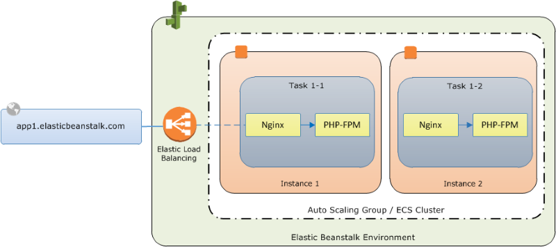

# Creating an ECS managed Docker environment with the Elastic Beanstalk console

This tutorial details container configuration and source code preparation for an ECS managed Docker environment that uses two containers.

The containers, a PHP application and an nginx proxy, run side by side on each of the Amazon Elastic Compute Cloud (Amazon EC2) instances in an Elastic Beanstalk environment. After
creating the environment and verifying that the applications are running, you'll connect to a container instance to see how it all fits together.

###### Sections

- [Define ECS managed Docker containers](#create_deploy_docker_ecstutorial_config "#create_deploy_docker_ecstutorial_config")
- [Add content](#create_deploy_docker_ecstutorial_code "#create_deploy_docker_ecstutorial_code")
- [Deploy to Elastic Beanstalk](#create_deploy_docker_ecstutorial_deploy "#create_deploy_docker_ecstutorial_deploy")
- [Connect to a container instance](#create_deploy_docker_ecstutorial_connect "#create_deploy_docker_ecstutorial_connect")
- [Inspect the Amazon ECS container agent](#create_deploy_docker_ecstutorial_connect_inspect "#create_deploy_docker_ecstutorial_connect_inspect")

## Define ECS managed Docker containers

The first step in creating a new Docker environment is to create a directory for your application data. This folder can be located anywhere on your
local machine and have any name you choose. In addition to a container configuration file, this folder will contain the content that you will upload to
Elastic Beanstalk and deploy to your environment.

###### Note

All of the code for this tutorial is available in the awslabs repository on GitHub at [https://github.com/awslabs/eb-docker-nginx-proxy](https://github.com/awslabs/eb-docker-nginx-proxy "https://github.com/awslabs/eb-docker-nginx-proxy").

The file that Elastic Beanstalk uses to configure the containers on an Amazon EC2 instance is a JSON-formatted text file named `Dockerrun.aws.json` v2. The
ECS managed Docker platform versions use a Version 2 format of this file. This format can only be used with the ECS managed Docker platform, as it differs
significantly from the other configuration file versions that support the Docker platform branches that aren't managed by ECS.

Create a `Dockerrun.aws.json` v2 text file with this name at the root of your application and add the following text:

```
{
  "AWSEBDockerrunVersion": 2,
  "volumes": [
    {
      "name": "php-app",
      "host": {
        "sourcePath": "/var/app/current/php-app"
      }
    },
    {
      "name": "nginx-proxy-conf",
      "host": {
        "sourcePath": "/var/app/current/proxy/conf.d"
      }
    }
  ],
  "containerDefinitions": [
    {
      "name": "php-app",
      "image": "php:fpm",
      "essential": true,
      "memory": 128,
      "mountPoints": [
        {
          "sourceVolume": "php-app",
          "containerPath": "/var/www/html",
          "readOnly": true
        }
      ]
    },
    {
      "name": "nginx-proxy",
      "image": "nginx",
      "essential": true,
      "memory": 128,
      "portMappings": [
        {
          "hostPort": 80,
          "containerPort": 80
        }
      ],
      "links": [
        "php-app"
      ],
      "mountPoints": [
        {
          "sourceVolume": "php-app",
          "containerPath": "/var/www/html",
          "readOnly": true
        },
        {
          "sourceVolume": "nginx-proxy-conf",
          "containerPath": "/etc/nginx/conf.d",
          "readOnly": true
        },
        {
          "sourceVolume": "awseb-logs-nginx-proxy",
          "containerPath": "/var/log/nginx"
        }
      ]
    }
  ]
}
```

This example configuration defines two containers, a PHP web site with an nginx proxy in front of it. These two containers will run side by side in
Docker containers on each instance in your Elastic Beanstalk environment, accessing shared content (the content of the website) from volumes on the host instance,
which are also defined in this file. The containers themselves are created from images hosted in official repositories on Docker Hub. The resulting
environment looks like the following:



The volumes defined in the configuration correspond to the content that you will create next and upload as part of your application source bundle. The
containers access content on the host by mounting volumes in the `mountPoints` section of the container definitions.

For more information on the format of `Dockerrun.aws.json` v2 and its parameters, see [Container definition format](create_deploy_docker_v2config.md#create_deploy_docker_v2config_dockerrun_format "create_deploy_docker_v2config.md#create_deploy_docker_v2config_dockerrun_format").

## Add content

Next you will add some content for your PHP site to display to visitors, and a configuration file for the nginx proxy.

**php-app/index.php**

```
<h1>Hello World!!!</h1>
<h3>PHP Version <pre><?= phpversion()?></pre></h3>
```

**php-app/static.html**

```
<h1>Hello World!</h1>
<h3>This is a static HTML page.</h3>
```

**proxy/conf.d/default.conf**

```
server {
  listen 80;
  server_name localhost;
  root /var/www/html;

  index index.php;

  location ~ [^/]\.php(/|$) {
    fastcgi_split_path_info ^(.+?\.php)(/.*)$;
    if (!-f $document_root$fastcgi_script_name) {
      return 404;
    }

    include fastcgi_params;
    fastcgi_param SCRIPT_FILENAME $document_root$fastcgi_script_name;
    fastcgi_param PATH_INFO $fastcgi_path_info;
    fastcgi_param PATH_TRANSLATED $document_root$fastcgi_path_info;

    fastcgi_pass php-app:9000;
    fastcgi_index index.php;
  }
}
```

## Deploy to Elastic Beanstalk

Your application folder now contains the following files:

```
├── Dockerrun.aws.json
├── php-app
│   ├── index.php
│   └── static.html
└── proxy
    └── conf.d
        └── default.conf

```

This is all you need to create the Elastic Beanstalk environment. Create a `.zip` archive of the above files and folders (not including the
top-level project folder). To create the archive in Windows explorer, select the contents of the project folder, right-click, select **Send
To**, and then click **Compressed (zipped) Folder**

###### Note

For information on the required file structure and instructions for creating archives in other environments, see [Create an Elastic Beanstalk application source bundle](applications-sourcebundle.md "applications-sourcebundle.md")

Next, upload the source bundle to Elastic Beanstalk and create your environment. For **Platform**, select **Docker**. For
**Platform branch**, select **ECS running on 64bit Amazon Linux 2023**.

###### To launch an environment (console)

1. Open the Elastic Beanstalk console with this preconfigured link: [console.aws.amazon.com/elasticbeanstalk/home#/newApplication?applicationName=tutorials&environmentType=LoadBalanced](https://console.aws.amazon.com/elasticbeanstalk/home#/newApplication?applicationName=tutorials&environmentType=LoadBalanced "https://console.aws.amazon.com/elasticbeanstalk/home#/newApplication?applicationName=tutorials&environmentType=LoadBalanced")
2. For **Platform**, select the platform and platform branch that match the language used by your application, or the Docker platform
   for container-based applications.
3. For **Application code**, choose **Upload your code**.
4. Choose **Local file**, choose **Choose file**, and then open the source bundle.
5. Choose **Review and launch**.
6. Review the available settings, and then choose **Create app**.

The Elastic Beanstalk console redirects you to the management dashboard for your new environment. This screen shows the health status of the environment and
events output by the Elastic Beanstalk service. When the status is Green, click the URL next to the environment name to see your new website.

## Connect to a container instance

Next you will connect to an Amazon EC2 instance in your Elastic Beanstalk environment to see some of the moving parts in action.

The easiest way to connect to an instance in your environment is by using the EB CLI. To use it, [install the EB
CLI](eb-cli3.md#eb-cli3-install "eb-cli3.md#eb-cli3-install"), if you haven't done so already. You'll also need to configure your environment with an Amazon EC2 SSH key pair. Use either the console's [security configuration page](using-features.managing.md "using-features.managing.md") or the EB CLI [eb init](eb3-init.md "eb3-init.md") command to do that.
To connect to an environment instance, use the EB CLI [eb ssh](eb3-ssh.md "eb3-ssh.md") command.

Now that your connected to an Amazon EC2 instance hosting your docker containers, you can see how things are set up. Run `ls` on
`/var/app/current`:

```
[ec2-user@ip-10-0-0-117 ~]$ `ls /var/app/current`
Dockerrun.aws.json  php-app  proxy
```

This directory contains the files from the source bundle that you uploaded to Elastic Beanstalk during environment creation.

```
[ec2-user@ip-10-0-0-117 ~]$ `ls /var/log/containers`
nginx-proxy    nginx-proxy-4ba868dbb7f3-stdouterr.log
php-app        php-app-dcc3b3c8522c-stdouterr.log       rotated

```

This is where logs are created on the container instance and collected by Elastic Beanstalk. Elastic Beanstalk creates a volume in this directory for each container, which
you mount to the container location where logs are written.

You can also take a look at Docker to see the running containers with `docker ps`.

```
[ec2-user@ip-10-0-0-117 ~]$ `sudo docker ps`
CONTAINER ID   IMAGE                            COMMAND                  CREATED         STATUS                  PORTS                               NAMES
4ba868dbb7f3   nginx                            "/docker-entrypoint.…"   4 minutes ago   Up 4 minutes            0.0.0.0:80->80/tcp, :::80->80/tcp   ecs-awseb-Tutorials-env-dc2aywfjwg-1-nginx-proxy-acca84ef87c4aca15400
dcc3b3c8522c   php:fpm                          "docker-php-entrypoi…"   4 minutes ago   Up 4 minutes            9000/tcp                            ecs-awseb-Tutorials-env-dc2aywfjwg-1-php-app-b8d38ae288b7b09e8101
d9367c0baad6   amazon/amazon-ecs-agent:latest   "/agent"                 5 minutes ago   Up 5 minutes (healthy)                                      ecs-agent
```

This shows the two running containers that you deployed, as well as the Amazon ECS container agent that coordinated the deployment.

## Inspect the Amazon ECS container agent

Amazon EC2 instances in a ECS managed Docker environment on Elastic Beanstalk run an agent process in a Docker container. This agent connects to the Amazon ECS service in
order to coordinate container deployments. These deployments run as tasks in Amazon ECS, which are configured in task definition files. Elastic Beanstalk creates these
task definition files based on the `Dockerrun.aws.json` that you upload in a source bundle.

Check the status of the container agent with an HTTP get request to `http://localhost:51678/v1/metadata`:

```
[ec2-user@ip-10-0-0-117 ~]$ `curl http://localhost:51678/v1/metadata`
{
  "Cluster":"awseb-Tutorials-env-dc2aywfjwg",
  "ContainerInstanceArn":"arn:aws:ecs:us-west-2:123456789012:container-instance/awseb-Tutorials-env-dc2aywfjwg/db7be5215cd74658aacfcb292a6b944f",
  "Version":"Amazon ECS Agent - v1.57.1 (089b7b64)"
}
```

This structure shows the name of the Amazon ECS cluster, and the ARN ([Amazon Resource Name](../../../general/latest/gr/aws-arns-and-namespaces.md "../../../general/latest/gr/aws-arns-and-namespaces.md"))
of the cluster instance (the Amazon EC2 instance that you are connected to).

For more information, make an HTTP get request to `http://localhost:51678/v1/tasks`:

```
[ec2-user@ip-10-0-0-117 ~]$ `curl http://localhost:51678/v1/tasks`
{
   "Tasks":[
      {
         "Arn":"arn:aws:ecs:us-west-2:123456789012:task/awseb-Tutorials-env-dc2aywfjwg/bbde7ebe1d4e4537ab1336340150a6d6",
         "DesiredStatus":"RUNNING",
         "KnownStatus":"RUNNING",
         "Family":"awseb-Tutorials-env-dc2aywfjwg",
         "Version":"1",
         "Containers":[
            {
               "DockerId":"dcc3b3c8522cb9510b7359689163814c0f1453b36b237204a3fd7a0b445d2ea6",
               "DockerName":"ecs-awseb-Tutorials-env-dc2aywfjwg-1-php-app-b8d38ae288b7b09e8101",
               "Name":"php-app",
               "Volumes":[
                  {
                     "Source":"/var/app/current/php-app",
                     "Destination":"/var/www/html"
                  }
               ]
            },
            {
               "DockerId":"4ba868dbb7f3fb3328b8afeb2cb6cf03e3cb1cdd5b109e470f767d50b2c3e303",
               "DockerName":"ecs-awseb-Tutorials-env-dc2aywfjwg-1-nginx-proxy-acca84ef87c4aca15400",
               "Name":"nginx-proxy",
               "Ports":[
                  {
                     "ContainerPort":80,
                     "Protocol":"tcp",
                     "HostPort":80
                  },
                  {
                     "ContainerPort":80,
                     "Protocol":"tcp",
                     "HostPort":80
                  }
               ],
               "Volumes":[
                  {
                     "Source":"/var/app/current/php-app",
                     "Destination":"/var/www/html"
                  },
                  {
                     "Source":"/var/log/containers/nginx-proxy",
                     "Destination":"/var/log/nginx"
                  },
                  {
                     "Source":"/var/app/current/proxy/conf.d",
                     "Destination":"/etc/nginx/conf.d"
                  }
               ]
            }
         ]
      }
   ]
}
```

This structure describes the task that is run to deploy the two docker containers from this tutorial's example project. The following information is
displayed:

- **KnownStatus** – The `RUNNING` status indicates that the containers are still active.
- **Family** – The name of the task definition that Elastic Beanstalk created from
  `Dockerrun.aws.json`.
- **Version** – The version of the task definition. This is incremented each time the task definition file is
  updated.
- **Containers** – Information about the containers running on the instance.

Even more information is available from the Amazon ECS service itself, which you can call using the AWS Command Line Interface. For instructions on using the AWS CLI with
Amazon ECS, and information about Amazon ECS in general, see the [Amazon ECS User
Guide](../../../AmazonECS/latest/developerguide/ECS_GetStarted.md "../../../AmazonECS/latest/developerguide/ECS_GetStarted.md").
