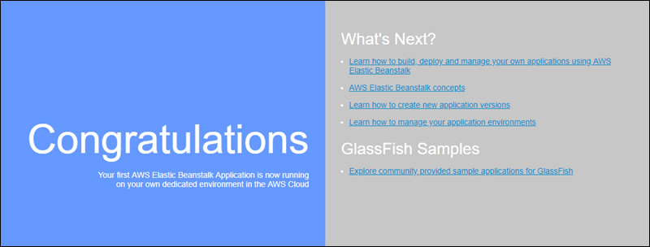

# Preconfigured Docker GlassFish containers on Elastic Beanstalk

###### Note

On [July 18, 2022](../relnotes/release-2022-07-18-linux-al1-retire.md "../relnotes/release-2022-07-18-linux-al1-retire.md"),
Elastic Beanstalk set the status of all platform branches based on Amazon Linux AMI (AL1) to **retired**.
For more information about migrating to a current and fully supported Amazon Linux 2023 platform branch, see [Migrating your Elastic Beanstalk Linux application to Amazon Linux 2023 or Amazon Linux 2](using-features.md "using-features.md").

The Preconfigured Docker GlassFish platform branch that runs on the Amazon Linux AMI (AL1) is no longer supported.
To migrate your GlassFish application to a supported Amazon Linux 2023 platform, deploy GlassFish and your application code to an Amazon Linux 2023 Docker image. For more
information, see the following topic, [Deploying a GlassFish application to the Docker platform: a migration path to Amazon Linux 2023](#docker-glassfish-tutorial "#docker-glassfish-tutorial").

This section shows you how to develop an example application locally and then deploy your application to Elastic Beanstalk with a preconfigured Docker
container.

### Set up your local development environment

For this walk-through we use a GlassFish example application.

###### To set up your environment

1. Create a new folder for the example application.

```
~$ `mkdir eb-preconf-example`
~$ `cd eb-preconf-example`
```

2. Download the example application code into the new folder.

```
~$ `wget https://docs.aws.amazon.com/elasticbeanstalk/latest/dg/samples/docker-glassfish-v1.zip`
~$ `unzip docker-glassfish-v1.zip`
~$ `rm docker-glassfish-v1.zip`
```

### Develop and test locally

###### To develop an example GlassFish application

1. Add a `Dockerfile` to your application’s root folder. In the file, specify the AWS Elastic Beanstalk Docker base image to be used to
   run your local preconfigured Docker container. You'll later deploy your application to an Elastic Beanstalk Preconfigured Docker GlassFish platform version.
   Choose the Docker base image that this platform version uses. To find out the current Docker image of the platform version, see the [Preconfigured Docker](../platforms/platforms-supported.md#platforms-supported.dockerpreconfig "../platforms/platforms-supported.md#platforms-supported.dockerpreconfig") section of the
   _AWS Elastic Beanstalk Supported Platforms_ page in the _AWS Elastic Beanstalk Platforms_ guide.

###### Example ~/Eb-preconf-example/Dockerfile

```
# For Glassfish 5.0 Java 8
FROM amazon/aws-eb-glassfish:5.0-al-onbuild-2.11.1
```

For more information about using a `Dockerfile`, see [Preparing your Docker image for deployment to Elastic Beanstalk](single-container-docker-configuration.md "single-container-docker-configuration.md"). 2. Build the Docker image.

```
~/eb-preconf-example$ `docker build -t my-app-image .`
```

3. Run the Docker container from the image.

###### Note

You must include the `-p` flag to map port 8080 on the container to the localhost port 3000. Elastic Beanstalk Docker containers always
expose the application on port 8080 on the container. The `-it` flags run the image as an interactive process. The `--rm`
flag cleans up the container file system when the container exits. You can optionally include the `-d` flag to run the image as a
daemon.

```
$ `docker run -it --rm -p 3000:8080 my-app-image`
```

4. To view the example application, type the following URL into your web browser.

```
http://localhost:3000
```



### Deploy to Elastic Beanstalk

After testing your application, you are ready to deploy it to Elastic Beanstalk.

###### To deploy your application to Elastic Beanstalk

1. In your application's root folder, rename the `Dockerfile` to `Dockerfile.local`. This step is required
   for Elastic Beanstalk to use the `Dockerfile` that contains the correct instructions for Elastic Beanstalk to build a customized Docker image on each
   Amazon EC2 instance in your Elastic Beanstalk environment.

###### Note

You do not need to perform this step if your `Dockerfile` includes instructions that modify the platform version's base
Docker image. You do not need to use a `Dockerfile` at all if your `Dockerfile` includes only a
`FROM` line to specify the base image from which to build the container. In that situation, the `Dockerfile` is
redundant. 2. Create an application source bundle.

```
~/eb-preconf-example$ `zip myapp.zip -r *`
```

3. Open the Elastic Beanstalk console with this preconfigured link: [console.aws.amazon.com/elasticbeanstalk/home#/newApplication?applicationName=tutorials&environmentType=LoadBalanced](https://console.aws.amazon.com/elasticbeanstalk/home#/newApplication?applicationName=tutorials&environmentType=LoadBalanced "https://console.aws.amazon.com/elasticbeanstalk/home#/newApplication?applicationName=tutorials&environmentType=LoadBalanced")
4. For **Platform**, under **Preconfigured – Docker**, choose **Glassfish**.
5. For **Application code**, choose **Upload your code**, and then choose **Upload**.
6. Choose **Local file**, choose **Browse**, and then open the application source bundle you just
   created.
7. Choose **Upload**.
8. Choose **Review and launch**.
9. Review the available settings, and then choose **Create app**.
10. When the environment is created, you can view the deployed application. Choose the environment URL that is displayed at the top of the console
    dashboard.

## Deploying a GlassFish application to the Docker platform: a migration path to Amazon Linux 2023

The goal of this tutorial is to provide customers using the Preconfigured Docker GlassFish platform (based on Amazon Linux AMI) with a migration path to Amazon Linux 2023.
You can migrate your GlassFish application to Amazon Linux 2023 by deploying GlassFish and your application code to an Amazon Linux 2023 Docker image.

The tutorial walks you through using the AWS Elastic Beanstalk Docker platform to deploy an application based on the [Java EE GlassFish application server](https://www.oracle.com/middleware/technologies/glassfish-server.html "https://www.oracle.com/middleware/technologies/glassfish-server.html") to an Elastic Beanstalk environment.

We demonstrate two approaches to building a Docker image:

- Simple – Provide your GlassFish application source code and let Elastic Beanstalk build and run a Docker image as part of
  provisioning your environment. This is easy to set up, at a cost of increased instance provisioning time.
- Advanced – Build a custom Docker image containing your application code and dependencies, and provide it to
  Elastic Beanstalk to use in your environment. This approach is slightly more involved, and decreases the provisioning time of instances in your environment.

### Prerequisites

This tutorial assumes that you have some knowledge of basic Elastic Beanstalk operations, the Elastic Beanstalk command line interface (EB CLI), and
Docker. If you haven't already, follow the instructions in [Learn how to get started with Elastic Beanstalk](GettingStarted.md "GettingStarted.md") to launch your first Elastic Beanstalk
environment. This tutorial uses the [EB CLI](eb-cli3.md "eb-cli3.md"), but you can also create environments and upload applications by using the
Elastic Beanstalk console.

To follow this tutorial, you will also need the following Docker components:

- A working local installation of Docker. For more information, see [Get Docker](https://docs.docker.com/install/ "https://docs.docker.com/install/") on the
  Docker documentation website.
- Access to Docker Hub. You will need to create a Docker ID to access the Docker Hub. For more information, see [Share the application](https://docs.docker.com/get-started/04_sharing_app/ "https://docs.docker.com/get-started/04_sharing_app/") on the Docker documentation website.

To learn more about configuring Docker environments on Elastic Beanstalk platforms, see [Preparing your Docker image for deployment to Elastic Beanstalk](single-container-docker-configuration.md "single-container-docker-configuration.md") in this same chapter.

### Simple example: provide your application code

This is an easy way to deploy your GlassFish application. You provide your application source code together with the `Dockerfile`
included in this tutorial. Elastic Beanstalk builds a Docker image that includes your application and the GlassFish software stack. Then Elastic Beanstalk runs the image on your
environment instances.

An issue with this approach is that Elastic Beanstalk builds the Docker image locally whenever it creates an instance for your environment. The image build
increases instance provisioning time. This impact isn't limited to initial environment creation—it happens during scale-out actions too.

###### To launch an environment with an example GlassFish application

1. Download the example `docker-glassfish-al2-v1.zip`, and then expand the `.zip` file into a directory in your
   development environment.

```
~$ `curl https://docs.aws.amazon.com/elasticbeanstalk/latest/dg/samples/docker-glassfish-al2-v1.zip --output docker-glassfish-al2-v1.zip`
~$ `mkdir glassfish-example`
~$ `cd glassfish-example`
~/glassfish-example$ `unzip ../docker-glassfish-al2-v1.zip`
```

Your directory structure should be as follows.

````
~/glassfish-example
|-- Dockerfile
|-- Dockerrun.aws.json
|-- glassfish-start.sh
|-- index.jsp
|-- META-INF
|   |-- LICENSE.txt
|   |-- MANIFEST.MF
|   `-- NOTICE.txt |-- robots.txt `-- WEB-INF `-- web.xml ``` The following files are key to building and running a Docker container in your environment: <br>• `Dockerfile` – Provides instructions that Docker uses to build an image with your application and required dependencies. <br>• `glassfish-start.sh` – A shell script that the Docker image runs to start your application. <br>• `Dockerrun.aws.json` – Provides a logging key, to include the GlassFish application server log in [log file requests](using-features.md "using-features.md"). If you aren't interested in GlassFish logs, you can omit this file. 2. Configure your local directory for deployment to Elastic Beanstalk. ``` ~/glassfish-example$ `eb init -p docker `glassfish-example`` ``` 3. (Optional) Use the **eb local run** command to build and run your container locally. ``` ~/glassfish-example$ `eb local run --port 8080` ``` ###### Note To learn more about the **eb local** command, see [eb local](eb3-local.md "eb3-local.md"). The command isn't supported on Windows. Alternatively, you can build and run your container with the **docker build** and **docker run** commands. For more information, see the [Docker documentation](https://docs.docker.com/ "https://docs.docker.com/"). 4. (Optional) While your container is running, use the **eb local open** command to view your application in a web browser. Alternatively, open [http://localhost:8080/](http://localhost:8080/ "http://localhost:8080/") in a web browser. ``` ~/glassfish-example$ `eb local open` ``` 5. Use the **eb create** command to create an environment and deploy your application. ``` ~/glassfish-example$ `eb create `glassfish-example-env`` ``` 6. After your environment launches, use the **eb open** command to view it in a web browser. ``` ~/glassfish-example$ `eb open` ``` When you're done working with the example, terminate the environment and delete related resources. ``` ~/glassfish-example$ `eb terminate --all` ``` ### Advanced example: provide a prebuilt Docker image This is a more advanced way to deploy your GlassFish application. Building on the first example, you create a Docker image containing your application code and the GlassFish software stack, and push it to Docker Hub. After you've done this one-time step, you can launch Elastic Beanstalk environments based on your custom image. When you launch an environment and provide your Docker image, instances in your environment download and use this image directly and don't need to build a Docker image. Therefore, instance provisioning time is decreased. ###### Notes <br>• The following steps create a publicly available Docker image. <br>• You will use Docker commands from your local Docker installation, along with your Docker Hub credentials. For more information, see the preceding *Prerequisites* section in this topic. ###### To launch an environment with a prebuilt GlassFish application Docker image 1. Download and expand the example `docker-glassfish-al2-v1.zip` as in the previous [simple example](#docker-glassfish-tutorial.simple "#docker-glassfish-tutorial.simple"). If you've completed that example, you can use the directory you already have. 2. Build a Docker image and push it to Docker Hub. Enter your Docker ID for `docker-id` to sign in to Docker Hub. ``` ~/glassfish-example$ `docker build -t `docker-id`/beanstalk-glassfish-example:latest .` ~/glassfish-example$ `docker push `docker-id`/beanstalk-glassfish-example:latest` ``` ###### Note Before pushing your image, you might need to run **docker login**. You will be prompted for your Docker Hub credentials if you run the command without parameters. 3. Create an additional directory. ``` ~$ `mkdir glassfish-prebuilt` ~$ `cd glassfish-prebuilt` ``` 4. Copy the following example into a file named `Dockerrun.aws.json`. ###### Example `~/glassfish-prebuilt/Dockerrun.aws.json` ``` { "AWSEBDockerrunVersion": "1", "Image": { "Name": "`docker-username`/beanstalk-glassfish-example" }, "Ports": [ { "ContainerPort": 8080, "HostPort": 8080 } ], "Logging": "/usr/local/glassfish5/glassfish/domains/domain1/logs" } ``` 5. Configure your local directory for deployment to Elastic Beanstalk. ``` ~/glassfish-prebuilt$ `eb init -p docker `glassfish-prebuilt$`` ``` 6. (Optional) Use the **eb local run** command to run your container locally. ``` ~/glassfish-prebuilt$ `eb local run --port 8080` ``` 7. (Optional) While your container is running, use the **eb local open** command to view your application in a web browser. Alternatively, open [http://localhost:8080/](http://localhost:8080/ "http://localhost:8080/") in a web browser. ``` ~/glassfish-prebuilt$ `eb local open` ``` 8. Use the **eb create** command to create an environment and deploy your Docker image. ``` ~/glassfish-prebuilt$ `eb create `glassfish-prebuilt-env`` ``` 9. After your environment launches, use the **eb open** command to view it in a web browser. ``` ~/glassfish-prebuilt$ `eb open` ``` When you're done working with the example, terminate the environment and delete related resources. ``` ~/glassfish-prebuilt$ `eb terminate --all` ```
````
