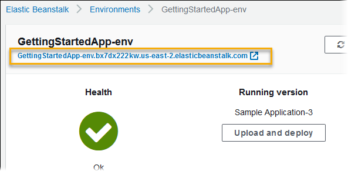

# Your Elastic Beanstalk environment's Domain name

By default, your environment is available to users at a subdomain of `elasticbeanstalk.com`. When you [create an environment](using-features.md "using-features.md"), you can choose a hostname for your application. The subdomain and domain are
autopopulated to ``region`.elasticbeanstalk.com`.

To route users to your environment, Elastic Beanstalk registers a CNAME record that points to your environment's load balancer. You can see URL of your
environment's application with the current value of the CNAME in the [environment overview](environments-dashboard.md "environments-dashboard.md") page of the Elastic Beanstalk
console.

Choose the URL on the overview page, or choose **Go to environment** on the navigation pane, to navigate to your application's web
page.

You can change the CNAME on your environment by swapping it with the CNAME of another environment. For instructions, see [Blue/Green deployments with Elastic Beanstalk](using-features.md "using-features.md").

If you own a domain name, you can use Amazon Route 53 to resolve it to your environment. You can purchase a domain name with Amazon Route 53, or use one that you
purchase from another provider.

To purchase a domain name with Route 53, see [Registering a New Domain](../../../Route53/latest/DeveloperGuide/domain-register.md "../../../Route53/latest/DeveloperGuide/domain-register.md") in the _Amazon Route 53
Developer Guide_.

To learn more about using a custom domain, see [Routing Traffic to an AWS Elastic Beanstalk
Environment](../../../Route53/latest/DeveloperGuide/routing-to-beanstalk-environment.md "../../../Route53/latest/DeveloperGuide/routing-to-beanstalk-environment.md") in the _Amazon Route 53 Developer Guide_.

###### Important

If you terminate an environment, you must also delete any CNAME mappings that you created, as other customers can reuse an available hostname. Be sure to
delete DNS records that point to your terminated environment to prevent a _dangling DNS entry_. A dangling DNS entry can expose internet
traffic destined for your domain to security vulnerabilities. It can also present other risks.

For more information, see [Protection from dangling
delegation records in Route 53](../../../Route53/latest/DeveloperGuide/protection-from-dangling-dns.md "../../../Route53/latest/DeveloperGuide/protection-from-dangling-dns.md") in the _Amazon Route 53 Developer Guide_. You can also learn more about dangling DNS entries in [Enhanced Domain Protections for Amazon CloudFront Requests](https://aws.amazon.com/blogs/security/enhanced-domain-protections-for-amazon-cloudfront-requests/ "https://aws.amazon.com/blogs/security/enhanced-domain-protections-for-amazon-cloudfront-requests/") in the _AWS Security Blog_.
