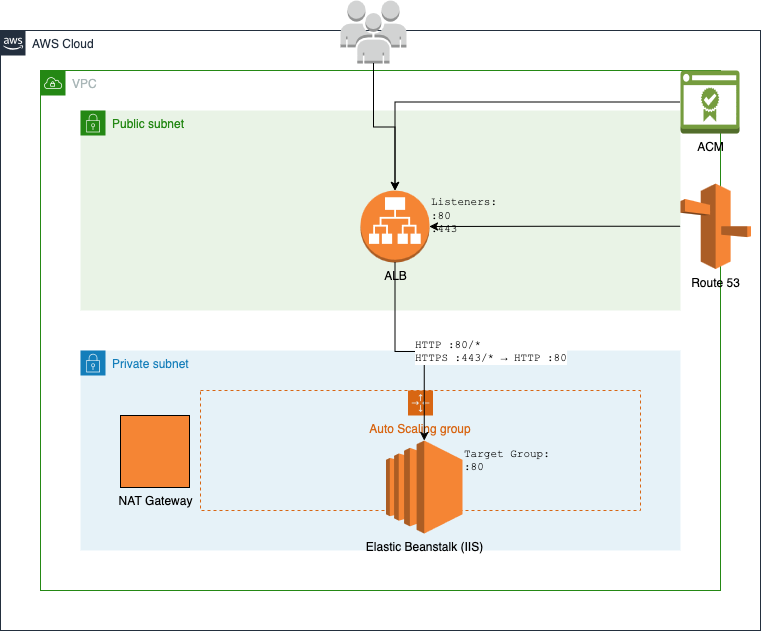
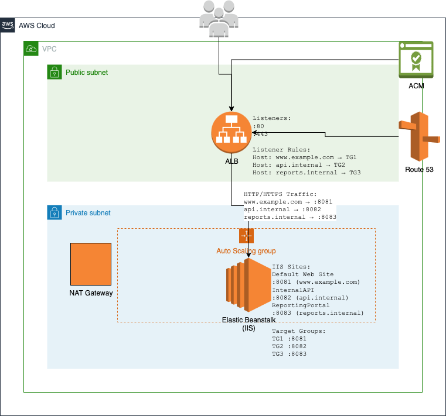

# Advanced migration scenarios

This section covers advanced migration scenarios for complex IIS deployments.

## Multi-site migrations with Application Request Routing (ARR)

The **eb migrate** command automatically detects and preserves ARR configurations during migration. When it identifies ARR settings in your IIS `applicationHost.config`, it generates the necessary PowerShell scripts to reinstall and configure ARR on the target EC2 instances.

### ARR configuration detection

The migration process examines three key configuration sections in IIS:

- `system.webServer/proxy`: Core ARR proxy settings
- `system.webServer/rewrite`: URL rewrite rules
- `system.webServer/caching`: Caching configuration

For example, consider a common ARR configuration where a `RouterSite` running on port 80 proxies requests to `APIService` and `AdminPortal` running on ports 8081 and 8082 respectively:

```
<!-- Original IIS ARR Configuration -->
<rewrite>
    <rules>
        <rule name="Route to API" stopProcessing="true">
            <match url="^api/(.*)$" />
            <action type="Rewrite" url="http://backend:8081/api/{R:1}" />
        </rule>
        <rule name="Route to Admin" stopProcessing="true">
            <match url="^admin/(.*)$" />
            <action type="Rewrite" url="http://backend:8082/admin/{R:1}" />
        </rule>
    </rules>
</rewrite>
```

The following diagram depicts how these rules are hidden behind port 80 in the IIS server and not exposed via the EC2 Security Groups. Only port 80 is accessible to the Application Load Balancer and all traffic from it is routed to the target group at port 80.



The following command can migrate this configuration:

```
`PS C:\migrations_workspace>` `eb migrate --sites "RouterSite,APIService,AdminPortal" `
 --copy-firewall-config`
```

### ARR migration process

The migration process preserves your ARR configuration through several steps.

Configuration export

The tool exports your existing ARR settings from the three key configuration sections into separate XML files stored in the `ebmigrateScripts` directory:

```
ebmigrateScripts\
├── arr_config_proxy.xml
├── arr_config_rewrite.xml
└── arr_config_caching.xml
```

Installation scripts

Two PowerShell scripts are generated to handle ARR setup:

1. `arr_msi_installer.ps1`: Downloads and installs the ARR module
2. `arr_configuration_importer_script.ps1`: Imports your exported ARR configuration

Deployment manifest integration

The scripts are integrated into the deployment process through entries in `aws-windows-deployment-manifest.json`:

```
{
    "manifestVersion": 1,
    "deployments": {
        "custom": [
            {
                "name": "WindowsProxyFeatureEnabler",
                "scripts": {
                    "install": {
                        "file": "ebmigrateScripts\\windows_proxy_feature_enabler.ps1"
                    }
                }
            },
            {
                "name": "ArrConfigurationImporterScript",
                "scripts": {
                    "install": {
                        "file": "ebmigrateScripts\\arr_configuration_importer_script.ps1"
                    }
                }
            }
        ]
    }
}
```

### Load balancer integration

The migration process translates your ARR rules into Application Load Balancer (ALB) listener rules where
possible. For example, the above ARR configuration results in ALB rules that route traffic
based on URL path patterns while maintaining internal routing on the EC2 instances.

The resulting environment maintains your ARR routing logic while taking advantage of
AWS's elastic infrastructure. Your applications continue to work as before, with ARR
handling internal routing while the Application Load Balancer manages external traffic distribution.

## Multi-site migrations without ARR using host-based routing

While Application Request Routing (ARR) is a common approach for managing multiple sites
in IIS, you can also migrate multi-site deployments directly to Elastic Beanstalk without ARR by
leveraging the Application Load Balancer's host-based routing capabilities. This approach can reduce complexity
and improve performance by eliminating an additional routing layer.

### Host-based routing overview

In this approach, each IIS site is exposed outside the EC2 instance, and the Application Load Balancer
routes traffic directly to the appropriate port based on the host header. This eliminates
the need for ARR while maintaining separation between your applications.

Consider a multi-site IIS configuration with three sites, each with its own hostname binding:

```
<sites>
    <site name="Default Web Site" id="1">
        <bindings>
            <binding protocol="http" bindingInformation="*:8081:www.example.com" />
        </bindings>
    </site>
    <site name="InternalAPI" id="2">
        <bindings>
            <binding protocol="http" bindingInformation="*:8082:api.internal" />
        </bindings>
    </site>
    <site name="ReportingPortal" id="3">
        <bindings>
            <binding protocol="http" bindingInformation="*:8083:reports.internal" />
        </bindings>
    </site>
</sites>
```

These sites are exposed at ports 8081, 8082, and 8083 via the EC2 Security Groups. The Application Load Balancer routes to them based on the Load Balancer listener rule configuration.



### Migration process

To migrate this configuration to Elastic Beanstalk without using ARR use the **eb migrate** command in the following example:

```
`PS C:\migrations_workspace>` `eb migrate --sites "Default Web Site,InternalAPI,ReportingPortal"`
```

The migration process automatically configures the Application Load Balancer with host-based routing rules that direct traffic to the appropriate target group based on the host header. Each target group forwards traffic to the corresponding port on your EC2 instances:

1. Host header www.example.com → Target Group on port 8081
2. Host header api.internal → Target Group on port 8082
3. Host header reports.internal → Target Group on port 8083

### SSL/TLS configuration

To secure your applications with SSL/TLS do the following steps:

1. Request certificates for your domains through AWS Certificate Manager(ACM).
2. Configure HTTPS listeners on your Application Load Balancer using these certificates.
3. Update your environment configuration to include HTTPS listeners with the following configuration option settings.

```
option_settings:
  aws:elb:listener:443:
    ListenerProtocol: HTTPS
    SSLCertificateId: arn:aws:acm:region:account-id:certificate/certificate-id
    InstancePort: 80
    InstanceProtocol: HTTP
```

With this configuration, SSL termination occurs at the load balancer, and traffic is forwarded to your instances over HTTP. This simplifies certificate management while maintaining secure connections with clients.

### Best practices

Security groups

Configure security groups to allow inbound traffic only on the ports used by your IIS sites (8081, 8082, 8083 in this example) from the Application Load Balancer security group.

Health checks

Configure health checks for each target group to ensure traffic is only routed to healthy instances. Create health check endpoints for each application if they don't already exist.

Monitoring

Set up CloudWatch alarms to monitor the health and performance of each target group separately. This allows you to identify issues specific to individual applications.

Scaling

Consider the resource requirements of all applications when configuring auto scaling policies. If one application has significantly different resource needs, consider migrating it to a separate environment.

## Virtual directory management

The **eb migrate** command preserves virtual directory structures while migrating your IIS applications to Elastic Beanstalk.

### Default permission configuration

When migrating virtual directories, **eb migrate** establishes a baseline set of permissions by granting ReadAndExecute access to:

- IIS_IUSRS
- IUSR
- Authenticated Users

For example, consider a typical virtual directory structure:

```
<site name="CorporatePortal">
    <application path="/" applicationPool="CorporatePortalPool">
        <virtualDirectory path="/" physicalPath="C:\sites\portal" />
        <virtualDirectory path="/shared" physicalPath="C:\shared\content" />
        <virtualDirectory path="/reports" physicalPath="D:\reports" />
    </application>
</site>
```

### Password-protected virtual directories

When **eb migrate** encounters password-protected virtual directories, it
issues warnings and requires manual intervention.

The following configuration example will cause the warning response that follows the
example.

```
<virtualDirectory path="/secure"
                 physicalPath="C:\secure\content"
                 userName="DOMAIN\User"
                 password="[encrypted]" />
```

```
[WARNING] CorporatePortal/secure is hosted at C:\secure\content which is password-protected and won't be copied.
```

To maintain password protection, create a custom deployment script like the
following:

```
# PS C:\migrations_workspace> cat secure_vdir_config.ps1

$vdirPath = "C:\secure\content"
$siteName = "CorporatePortal"
$vdirName = "secure"
$username = "DOMAIN\User"
$password = "SecurePassword"

# Ensure directory exists
if (-not (Test-Path $vdirPath)) {
    Write-Host "Creating directory: $vdirPath"
    New-Item -Path $vdirPath -ItemType Directory -Force
}

# Configure virtual directory with credentials
Write-Host "Configuring protected virtual directory: $vdirName"
New-WebVirtualDirectory -Site $siteName -Name $vdirName `
    -PhysicalPath $vdirPath -UserName $username -Password $password

# Set additional permissions as needed
$acl = Get-Acl $vdirPath
$rule = New-Object System.Security.AccessControl.FileSystemAccessRule(
    $username, "ReadAndExecute", "ContainerInherit,ObjectInherit", "None", "Allow"
)
$acl.AddAccessRule($rule)
Set-Acl $vdirPath $acl
```

Add this script to your deployment by including it in the manifest:

```
{
    "manifestVersion": 1,
    "deployments": {
        "custom": [
            {
                "name": "SecureVirtualDirectory",
                "scripts": {
                    "install": {
                        "file": "secure_vdir_config.ps1"
                    }
                }
            }
        ]
    }
}
```

### Custom permission management

The **eb migrate** command provides a framework for custom permission
scripts to accommodate applications that require permissions other than the defaults.

```
$paths = @(
    "C:\sites\portal\uploads",
    "C:\shared\content"
)

foreach ($path in $paths) {
    if (-not (Test-Path $path)) {
        Write-Host "Creating directory: $path"
        New-Item -Path $path -ItemType Directory -Force
    }

    $acl = Get-Acl $path

    # Add custom permissions
    $customRules = @(
        # Application Pool Identity - Full Control
        [System.Security.AccessControl.FileSystemAccessRule]::new(
            "IIS AppPool\CorporatePortalPool",
            "FullControl",
            "ContainerInherit,ObjectInherit",
            "None",
            "Allow"
        ),
        # Custom Service Account
        [System.Security.AccessControl.FileSystemAccessRule]::new(
            "NT SERVICE\CustomService",
            "Modify",
            "ContainerInherit,ObjectInherit",
            "None",
            "Allow"
        )
    )

    foreach ($rule in $customRules) {
        $acl.AddAccessRule($rule)
    }

    Set-Acl $path $acl
    Write-Host "Custom permissions applied to: $path"
}
```

### Best practices

Follow these best practices to plan, execute, monitor, and verify your migration.

Pre-migration planning

Document existing permissions and authentication requirements before migration. Test custom permission scripts in a development environment before deploying to production.

Shared content management

For shared content directories, ensure all necessary file system permissions are properly configured through custom scripts. Consider using [Amazon FSx for Windows File Server](https://aws.amazon.com/fsx/windows/ "https://aws.amazon.com/fsx/windows/") for shared storage requirements.

Monitoring and verification

Monitor application logs after migration to verify proper access to virtual
directories. Pay special attention to the following areas:

- Application pool identity access
- Custom service account permissions
- Network share connectivity
- Authentication failures

## Custom application pool settings

The **eb migrate** command does not copy over custom application pool
settings by default. To preserve custom application pool configurations, follow this procedure
to create and apply a custom manifest section.

1. Create an archive of your migration artifacts.

```
`PS C:\migrations_workspace>` `eb migrate --archive`
```

2. Create a custom PowerShell script to configure application pools.

```
# PS C:\migrations_workspace> cat .\migrations\latest\upload_target\customize_application_pool_config.ps1

$configPath = "$env:windir\System32\inetsrv\config\applicationHost.config"

[xml]$config = Get-Content -Path $configPath

$newPoolXml = @"
<!-- Original IIS Configuration -->
<applicationPools>
    <add name="CustomPool"
         managedRuntimeVersion="v4.0"
         managedPipelineMode="Integrated">
        <processModel identityType="SpecificUser"
                     userName="AppPoolUser"
                     password="[encrypted]" />
        <recycling>
            <periodicRestart time="00:00:00">
                <schedule>
                    <add value="02:00:00" />
                    <add value="14:00:00" />
                </schedule>
            </periodicRestart>
        </recycling>
    </add>
</applicationPools>
"@
$newPoolXmlNode = [xml]$newPoolXml

# Find the applicationPools section
$applicationPools = $config.SelectSingleNode("//configuration/system.applicationHost/applicationPools")

# Import the new node into the document
$importedNode = $config.ImportNode($newPoolXmlNode.DocumentElement, $true)
$applicationPools.AppendChild($importedNode)

# Save the changes
$config.Save($configPath)

Write-Host "ApplicationHost.config has been updated successfully."
```

3. Update the `aws-windows-deployment-manifest.json` file to include your custom script.

```
{
    "manifestVersion": 1,
    "deployments": {
        ...
        "custom": [
            ...,
            {
                "name": "ModifyApplicationPoolConfig",
                "description": "Modify application pool configuration from source machine to remove",
                "scripts": {
                    "install": {
                        "file": "customize_application_pool_config.ps1"
                    },
                    "restart": {
                        "file": "ebmigrateScripts\\noop.ps1"
                    },
                    "uninstall": {
                        "file": "ebmigrateScripts\\noop.ps1"
                    }
                }
            }
        ]
    }
}
```

4. Create an environment with the updated archive directory.

```
`PS C:\migrations_workspace>` `eb migrate `
 --archive-dir '.\migrations\latest\upload_target\'`
```

The `--archive-dir` argument tells **eb migrate** to use the source code that it previously created, avoiding the creation of new archives.

## Deploying previous versions

The **eb migrate** maintains a history of your migrations through
timestamped directories and application versions in Elastic Beanstalk. Each migration creates a unique zip
file that can be deployed if needed.

```
`PS C:\migrations_workspace>` `ls .\migrations\`
`Mode LastWriteTime Length Name
---- ------------- ------ ----
d----l 3/18/2025 10:34 PM latest
d----- 3/16/2025 5:47 AM migration_1742104049.479849
d----- 3/17/2025 9:18 PM migration_1742246303.18056
d----- 3/17/2025 9:22 PM migration_1742246546.565739
...
d----- 3/18/2025 10:34 PM migration_1742337258.30742`
```

The `latest` symbolic link always points to the most recently created migration artifact directory. In addition to relevant application and error logs, each migration artifact directory also contains a `upload_target.zip` file which you can deploy to Elastic Beanstalk.

```
`PS C:\migrations_workspace>` `ls .\migrations\latest\`
`Mode LastWriteTime Length Name
---- ------------- ------ ----
d----- 3/18/2025 10:34 PM upload_target
-a---- 3/18/2025 10:34 PM 13137 application.log
-a---- 3/18/2025 10:34 PM 0 error.log
-a---- 3/18/2025 10:34 PM 1650642 upload_target.zip`
```

You can deploy the `upload_target.zip` file using **eb migrate**:

```
`PS C:\migrations_workspace>` `eb migrate --zip .\migrations\latest\upload_target.zip`
```
